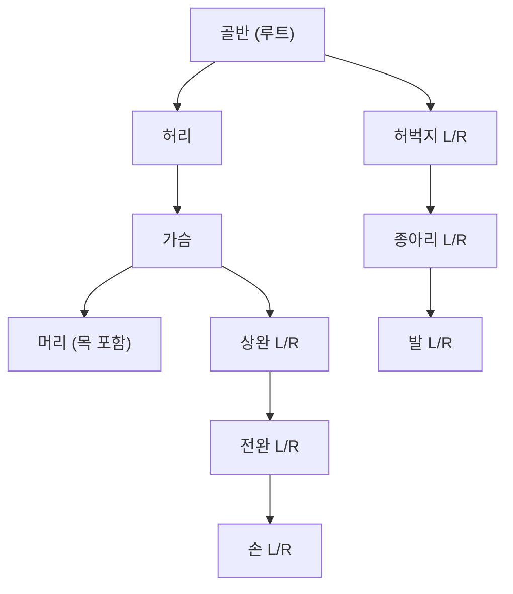
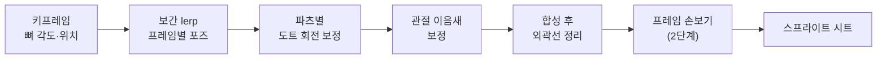

# 도트 캐릭터 제작 툴 설계 문서

작성일: 2026-09-24 · 갱신: 2026-09-25 (코드와 대조해 맞춤, 아래 "(미구현)"은 아직 없는 기능) · 원본: [Claude Docs 설계 문서](https://claude.ai/code/artifact/651dc701-1608-4ddf-b6b5-7c77f4473e03)

2026-09-25 갱신 요약: 선택 파츠(눈) 추가, 반측면(3/4) 방향을 선택 기능으로 추가([계획](plan-three-quarter-view.md), ①~④ 완료), 파일 형식 버전 규칙, 새로 만들기의 동작 고르기, 실제 파일 구조(6절), 구현되지 않은 항목 표시.

## 1. 개요

4등신 도트 캐릭터를 파츠와 스켈레톤으로 조립하고, 도트를 찍는 즉시 결과를 보여주는 데스크톱 프로그램이다. 윈도우를 먼저 지원하고 맥·리눅스로 확장한다.
캐릭터는 정면·좌측면·우측면·후면 4방향으로 그리고, 기본 애니메이션 템플릿 위에서 사용자가 직접 동작을 추가할 수 있다.

- 대상: 게임용 도트 캐릭터 스프라이트를 만드는 개인 제작자
- 기본 규격: 4등신, 캔버스 128×160 px (새 프로젝트, 96×128 마네킹 둘레에 여백) · 편집 → 캔버스 크기로 바꿈
- 결과물: 방향별·동작별 스프라이트 시트 PNG와 프로젝트 파일(`.dotchar`)

## 2. 요구사항

| # | 요구사항 | 해석 |
| --- | --- | --- |
| 1 | 윈도우 프로그램 (나중에 맥·리눅스) | 데스크톱 앱, 설치 없이 실행 |
| 2 | 몸체를 파츠별로 나누고 연결부위(관절)를 만든다 | 파츠 = 스켈레톤의 뼈 1개 |
| 3 | 스켈레톤처럼 부분별로 회전한다 | 부모가 돌면 자식도 함께 돈다 |
| 4 | 처음에 템플릿을 보여준다 | 4등신 마네킹이 기본으로 로드됨 |
| 5 | 실시간으로 도트를 찍으며 결과물을 본다 | 편집 캔버스와 미리보기가 동시에 갱신 |
| 6 | 정면, 좌·우측면, 후면을 그린다 | 방향마다 파츠 이미지를 따로 둠 |
| 7 | 사용자가 직접 도트를 찍는다 | 도트 편집기 내장 |
| 8 | 애니메이션: 기본 템플릿 포함, 직접 추가 가능 | 뼈 회전 키프레임 방식 |
| 9 | 애니메이션 결과물은 프레임을 격자로 배치한 이미지 시트 한 장 | 타일맵처럼 칸 단위로 잘라 사용 |
| 10 | 회전은 이미지를 겹쳐 돌리는 것이 아니라 보정된 새 도트로 만든다 | 4.4 애니메이션 출력 참고 |

## 3. 제작 과정 (2단계)

| 단계 | 작업 대상 | 하는 일 | 결과 |
| --- | --- | --- | --- |
| 1. 템플릿으로 캐릭터 만들기 | 파츠 이미지 + 스켈레톤 | 파츠별 도트, 관절 설정, 키프레임 애니메이션 | 보정된 애니메이션 시트 |
| 2. 애니메이션 디테일 수정 | 시트의 프레임 픽셀 | 프레임 선택 후 직접 도트 수정 | 최종 스프라이트 시트 |

- 2단계에서 고친 픽셀은 시트 위 **덮어쓰기 레이어**에 저장한다.
- 1단계로 돌아가 프레임을 다시 만들어도 손본 내용은 유지된다. 손본 프레임은 ✎로 표시되고, 필요 없으면 지운다.

## 4. 상세 설계

### 4.1 캔버스·템플릿 규격

| 항목 | 값 |
| --- | --- |
| 기본 캔버스 | 128×160 px — 96×128 마네킹 템플릿 둘레에 좌우 16·위 24·아래 8px 여백 (점프·든 팔·모자·꼬리). 3단계에서 64×128 → 96×128, 2026-09-25에 128×160. 편집 → **캔버스 크기**로 여백을 더하거나 줄임 (그림은 자르지 않고 자리만 옮김, 손본 픽셀도 함께, 되돌리기). 편집 → **해상도 2배**로 캔버스·그림·관절·동작 몸 이동·손본 픽셀을 모두 2배 (그대로 2×2 또는 Scale2x, 되돌리기 — [계획](plan-resolution-scale.md)) |
| 비율 | 기본(4등신 치비): 머리 1 : 몸통 1.4 : 다리 1.6 (머리 약 30 px). 새로 만들기에서 **5~8등신**을 고르면 비율 표로 만든 마네킹 (아래 "체형") |
| 여백 | 위 4 px, 아래 3 px, 좌우는 머리카락·망토·무기용 여유 공간 |
| 원점(기준점) | 두 발 사이 바닥 중앙 |
| 방향 | 정면, 좌측면, 우측면, 후면. 선택: 반측면 4방향(앞·뒤 × 좌·우) — 편집 → 반측면 추가, 단축키 5~8 — 새로 만들기에서 "반측면 포함"을 켜면 반측면 마네킹으로 시작 ([계획](plan-three-quarter-view.md): ①~④ 완료) |
| 템플릿 | 16개 파츠로 나뉜 마네킹이 기본 캐릭터로 로드됨 (`Assets/Templates/chibi96`: 정면·좌측면·후면 파츠 PNG + `skeleton.json`, 앞·뒤 반측면 파츠 PNG는 "반측면 포함"으로 만들 때만 사용). 그 위에 바로 그린다 |
| 체형 (등신) | 4등신은 위 손그림 템플릿, 5~8등신은 `Core/Rigging/Body`가 만든다: `BodyProportions`(등신별 목·몸통·다리 비율 표를 보간, 너비·굵기는 등신에 대한 식 — 표에 한 줄 더하면 새 체형) → `MannequinBuilder`(3D 관절을 방향 각도 0°·45°·90°·135°·180°로 투영해 같은 16개 파츠를 그림). 캔버스는 팔을 든 동작이 들어가게 몸과 팔 길이로 정하고 기본 여백을 더한다 (5등신 160×182 … 8등신 184×221). 기본 동작의 몸 이동은 키 비율로 늘린다 ([계획](plan-body-proportions.md)) |

우측면은 좌측면을 좌우 반전해 자동 생성하는 것이 기본이다. 비대칭 디자인을 위해 파츠별로 반전을 끄고 따로 그릴 수 있다.

### 4.2 파츠·스켈레톤 구조

몸은 16개 파츠로 나뉘고, 골반을 루트로 하는 트리로 연결된다. 각 파츠는 부모와 만나는 관절을 축으로 회전하고, 자식 파츠는 부모를 따라 움직인다.



L/R 노드는 좌우 한 쌍이다 (골반·허리·가슴·머리 4개 + 좌우 6쌍 = 16개).

선택 파츠: **눈 R·눈 L**(`eye_r`·`eye_l`)을 머리의 자식으로 추가·삭제할 수 있다 (파츠 창, 되돌리기 가능). 눈은 **세부 파츠**라 머리의 외곽선을 따르고, 머리와 만나는 곳에 경계선이 생기지 않는다. 위치·크기는 머리 크기에서 계산하고 방향마다 옮길 수 있으며(파츠 창 위치 X/Y, 되돌리기 가능), 방향별 기본 눈은 정면 두 눈, 측면 가까운 눈 하나, 후면 없음, 앞 반측면은 얼굴 쪽으로 옮기고 먼 눈을 좁게, 뒤 반측면 없음.

선택 파츠: **가슴 볼륨**(`bust`, 여성 캐릭터용)을 가슴의 세부 자식으로 추가·삭제할 수 있다 (소·중·대, 되돌리기 가능). 쇄골부터 갈비뼈까지의 물방울 모양 시작 그림을 방향마다 만들고, 가슴과 외곽선·명암을 공유한다 ([계획](plan-bust-part.md)). 포즈 모드에서 세부 파츠(눈·가슴 볼륨)를 잡아 돌리면 부모가 돈다.

그리는 순서: 파츠마다 방향별 `order`(작을수록 뒤). 파츠 창에서 방향별로 맨 뒤·뒤로·앞으로·맨 앞 (세부 파츠는 부모와 함께, 반전 방향은 원래 방향을 바꿈), 그리고 포즈마다 "이 파츠를 ○○ 앞/뒤로" (`PoseData.Order`, 키에 저장, 키 사이는 앞 키의 순서) ([계획](plan-draw-order.md)).

임의 파츠: 머리카락 가닥·꼬리·망토 자락·장신구를 고른 파츠의 자식으로 추가한다 (`custom: true`, 마디 1~4의 사슬, 부모 앞·뒤·등 쪽 배치, 종류별 회전형 흔들림, 부모의 주 색으로 시작 그림). 추가한 파츠만 지울 수 있고(아래 마디까지), 위치 X/Y로 방향마다 옮긴다 ([계획](plan-custom-parts.md)).

| 파츠 속성 | 내용 |
| --- | --- |
| 이름·부모 | 트리 연결 정보 |
| 관절 위치 | 부모 이미지 안의 연결점 (px) |
| 피벗 | 자기 이미지 안의 회전축 (px) |
| 방향별 이미지 | 정면·좌측면·후면 3장 (우측면은 좌측면 반전, 파츠별로 따로 그린 이미지 가능). 반측면을 켜면 앞·뒤 반측면 2장 추가 (오른쪽을 향한 둘은 반전) |
| 세부 파츠 여부 | 눈처럼 부모 위에 그려지는 파츠. 부모와의 경계선을 긋지 않음 |
| 그리기 순서 | 방향별 z순서 (예: 측면에서 먼 쪽 팔은 몸 뒤) |
| 회전 범위 | 최소·최대 각도 (관절이 꺾이지 않게), 파츠마다 선택 — 포즈 편집 시 적용, `skeleton.json`의 `limit` |
| 각도별 교체 이미지 | 특정 각도 구간에서 회전 대신 사용할 직접 그린 이미지 (작은 파츠용) |

- 관절 원(구체 인형 관절) 표시는 옵션으로 켜고 끌 수 있다.

### 4.3 애니메이션

파츠별 회전 각도와 위치를 키프레임으로 저장하고, 프레임 사이를 보간해 만든다. 도트를 다시 그리지 않아도 모든 동작에 같은 캐릭터 그림이 적용된다.

| 동작 | 프레임 | 반복 | 설명 |
| --- | --- | --- | --- |
| 대기 (Idle) | 4 | 예 | 숨쉬기, 상체 1 px 상하 |
| 걷기 (Walk) | 8 | 예 | 팔·다리 교차 |
| 달리기 (Run) | 6 | 예 | 상체 앞으로 기울기 |
| 점프 (Jump) | 5 | 아니오 | 웅크리기 → 상승 → 착지 |
| 공격 (Attack) | 5 | 아니오 | 한 팔 휘두르기 |
| 피격 (Hit) | 3 | 아니오 | 뒤로 젖히기 |

- 사용자 추가: 새 애니메이션 만들기, 기본 템플릿 복제 후 수정, 다른 프로젝트에서 가져오기
- 방향: 애니메이션마다 방향별 키프레임을 따로 둔다 (저장되는 트랙은 정면·좌측면·후면, 우측면은 좌측면 반전). 반측면 트랙은 선택이며, 비어 있으면 앞 반측면은 정면, 뒤 반측면은 후면 트랙을 재생. "반측면 동작 초안"으로 빈 반측면 트랙을 채울 수 있음 (팔은 측면 키, 나머지는 정면·후면과 측면의 중간)
- 2차 모션: 파츠마다 흔들림(변형형·회전형)을 켜면 키 없이 반 박자 늦게 따라오는 움직임을 프레임을 만들 때 더함 — 미리보기·내보내기에 반영 ([계획](plan-secondary-motion.md))
- 프레임 속도: 기본 10 fps, 동작마다 fps 하나. 프레임마다 길이를 칸 단위(×1~×16, 1칸 = 1/fps초)로 늘릴 수 있음 — 재생·GIF·시트 JSON `durationMs`에 반영
- 새로 만들기: 기본 동작 6종 중 만들 동작을 골라 시작 (하나도 안 고르면 빈 동작 1개). "반측면 포함"(기본 끔)을 켜면 마네킹 반측면 파츠와 기본 동작의 반측면 트랙(초안 규칙으로 만든 것)도 함께 — 버전 2 파일
- 보간: 이징 / 선형 / 계단. 기본은 이징, 키마다 바꿀 수 있음
- 모든 프레임은 바닥 원점이 고정되어 게임 엔진에서 흔들리지 않는다

### 4.4 애니메이션 출력 (베이크)

최종 결과물은 프레임을 격자로 배치한 스프라이트 시트 PNG 한 장이다. 스켈레톤은 제작용 도구일 뿐이고, 게임에는 완성된 프레임 이미지만 들어간다.

파츠 이미지를 그대로 돌려 겹치면 각진 픽셀 자체가 기울어지고, 외곽선이 끊기거나 두 겹이 되며 관절에 틈이 생긴다.
그래서 프레임마다 "관절을 기준으로 N도 돌면 이 파츠가 어떻게 보일지"를 예측해, 수평·수직 픽셀 격자에 맞는 새 도트로 다시 그린다.
살이 접히는 듯한 관절 변형은 범위에서 뺀다.



| 단계 | 하는 일 | 이유 |
| --- | --- | --- |
| 포즈 보간 | 키프레임 사이 각도·위치를 lerp(각도는 가까운 방향으로), 위치는 정수 px로 맞춤 | 반 픽셀 위치에서 생기는 떨림 방지 |
| 도트 회전 보정 | 관절(피벗) 기준 회전 결과를 픽셀 격자에 다시 그림. RotSprite 방식(Scale2x ×3 = 8배 확대 → 회전 → 축소) + 선 두께 1 px 유지, 팔레트 색만 사용 | 기울어진 픽셀 없이 격자에 맞는 도트, 새 색이나 끊긴 선 없음 |
| 관절 이음새 보정 | 부모·자식 파츠 사이 빈틈을 메우고 겹친 부분 정리 | 팔꿈치·무릎이 끊어져 보이는 문제 방지 |
| 외곽선 정리 | 자동 외곽선을 켜면 합성 후 실루엣 가장자리를 외곽선 색, 파츠가 겹치는 경계를 경계선 색으로 다시 칠함. 세부 파츠(눈)와 부모 사이에는 경계선을 긋지 않음. 끄면 파츠를 그린 그대로 (엔진 셰이더로 외곽선을 넣는 경우) | 회전해도 1 px 선이 끊기지 않게 |
| 프레임 손보기 | 포즈와 애니메이션을 모두 확정한 뒤 마지막 단계에서 진행. 만들어진 프레임에 직접 도트 수정 | 자동 결과가 어색한 프레임만 손으로 고침 |

스프라이트 시트 배치:

| 항목 | 값 |
| --- | --- |
| 칸 크기 | 캔버스와 같음 (새 프로젝트 128×160 px), 칸 사이 간격 0 px (옵션) |
| 행 | 방향 4개 (정면, 좌측면, 우측면, 후면). 반측면이 있고 "반측면도 내보내기"를 켜면 동작마다 기존 4줄 뒤에 앞 반측면 (좌)·(우), 뒤 반측면 (좌)·(우)를 붙여 8줄 (기본 4방향, 명령줄 `--directions 8`) |
| 열 | 프레임 순서 |
| 파일 단위 | 내보낼 때 선택: 애니메이션별 시트 (걷기 8프레임 = 768×512 px) 또는 전체 동작 통합 시트 |
| 원점 | 모든 칸에서 바닥 중앙 위치 동일 |

프로토타입: [`mannequin/arm_wave.py`](../mannequin/arm_wave.py) — 팔 템플릿으로 손을 들고 흔드는 8프레임을 단순 회전과 보정 방식으로 비교.

### 4.5 도트 편집 기능

도트는 회전하지 않은 원본 파츠 이미지에 찍고, 회전·합성된 결과는 미리보기에 즉시 반영한다.

| 도구 | 단축키 | 설명 |
| --- | --- | --- |
| 연필 | B | 1 px 단위 그리기, 픽셀 퍼펙트 선 보정 |
| 지우개 | E | 투명으로 지우기 |
| 채우기 | G | 같은 색 영역 채우기 |
| 스포이드 | I | 색 추출 |
| 선·사각형·원 | L / U | 도형 그리기 |
| 선택·이동 | M | 영역 선택, 이동, 복사 |
| 대칭 편집 | S | 정면·후면에서 좌우 파츠 동시 편집 |

- 팔레트: 인덱스 팔레트(색 번호로 저장), 색 수 제한 없음. 팔레트만 바꿔 색 변형 캐릭터를 만들 수 있다
- 외곽선·명암: 자동 외곽선, 자동 명암 (빛 왼쪽 위/오른쪽 위, 두께 1~3px, 팔레트의 한 단계 어두운 색) — 둘 다 그릴 때마다 계산, 파츠 이미지는 그대로
- 되돌리기: 파츠 편집, 포즈, 키프레임 변경을 하나의 히스토리로 관리 (Ctrl+Z / Ctrl+Y)
- 어니언 스킨: 애니메이션 편집 시 앞뒤 프레임을 반투명으로 표시

### 4.6 화면 구성

프로그램을 열면 4등신 마네킹 템플릿이 정면으로 로드된다. 모든 창은 유니티처럼 떼어내거나 옮길 수 있고, 아래는 기본 배치다.

| 위치 | 창 | 내용 |
| --- | --- | --- |
| 왼쪽 | 파츠 트리 | 스켈레톤 계층, 파츠 선택, 파츠 안 레이어 보이기·숨기기, 눈·가슴 볼륨 파츠 추가·삭제, 임의 파츠(머리카락·꼬리·망토·장신구) 추가·삭제, 파츠 숨기기(편집 캔버스만)·잠금 (저장 안 하는 편집 보조) |
| 가운데 | 편집 캔버스 | 확대(×4~×32), 픽셀 격자, 반투명 템플릿, 관절 핸들 |
| 오른쪽 위 | 실시간 미리보기 | 실제 크기(×1)와 ×2, 4방향 동시 보기 |
| 오른쪽 위 | 애니메이션 미리보기 | 보정된 애니메이션 재생 |
| 오른쪽 아래 | 팔레트 · 기록 (탭) | 색 선택 · 되돌리기 목록 (고른 시점으로 이동) |
| 아래 | 타임라인·프레임 바 | 애니메이션 선택, 프레임 썸네일, 키프레임, 재생 |

편집 캔버스 모드:

- 그리기 모드: 선택한 파츠의 원본 이미지에 도트를 찍음. 돌아간 상태에서 찍어도 원본 좌표로 역변환됨. 다른 파츠는 흐리게 표시(H)
- 포즈 모드(P): 파츠를 끌어 관절 기준으로 회전(Shift = 15° 단위). 각도는 파츠 창에서 숫자로도 입력 가능
- 프레임 수정 모드(2단계): 시트의 선택한 프레임에 직접 도트를 찍음

## 5. 기능 목록

### 5.1 필수 기능

| # | 기능 | 내용 |
| --- | --- | --- |
| 1 | 도킹 창 UI | 유니티처럼 창을 떼어내고 붙이고 크기 조절, 배치 저장 |
| 2 | 도트 편집 창 | 확대 캔버스에서 도트 찍기 |
| 3 | 파츠별 작업 | 파츠 하나를 골라 그 파츠만 편집 |
| 4 | 실시간 미리보기 창 | 도트를 찍는 즉시 합성 결과 표시 |
| 5 | 애니메이션 미리보기 창 | 보정된 애니메이션 재생 |
| 6 | 프레임 바 | 프레임 썸네일을 가로로 나열, 클릭해서 선택 |
| 7 | 프레임 직접 수정 | 선택한 프레임을 시트에서 바로 수정, 애니메이션 창에 즉시 반영 |
| 8 | 저장 | Ctrl+S |
| 9 | 다른 이름으로 저장 | Ctrl+Shift+S |
| 10 | 불러오기 | Ctrl+O, 최근 파일 목록 |

### 5.2 추가 기능 (우선순위 순)

| 우선 | 기능 | 이유 |
| --- | --- | --- |
| 높음 | 되돌리기·다시하기 (Ctrl+Z / Ctrl+Y), 기록 창 (팔레트 옆 탭, 고른 시점으로 이동) | 도트 작업의 기본 |
| 높음 | 내보내기 (시트 PNG, GIF, JSON) | 저장(프로젝트)과 결과물 출력은 별개 |
| 높음 | 자동 저장·백업, 비정상 종료 후 복구 | 작업 손실 방지 |
| 높음 | 저장 안 한 변경 표시(제목 옆 `*`), 종료 시 확인 | 실수로 닫기 방지 |
| 높음 | 확대·이동 (휠, 스페이스+드래그), 픽셀 격자 켜기·끄기 | 편집 편의 |
| 높음 | 재생 제어: 재생·정지, 반복, 속도(fps), 한 프레임씩 이동 | 애니메이션 확인 |
| 보통 | 어니언 스킨 (2단계 수정 때 앞뒤 프레임 반투명 표시) | 프레임 간 연결 맞추기 |
| 보통 | 프레임 복사·붙여넣기·추가·삭제·순서 변경 | 2단계에서 타이밍 조절 |
| 보통 | 실제 크기 미리보기 (×1 / ×2 / ×4), 배경색·체커보드 전환 | 게임 화면에서 보이는 모습 확인 |
| 보통 | 팔레트 불러오기·내보내기, 팔레트 교체 미리보기 | 색 변형 캐릭터 |
| 보통 | 창 배치 초기화, 단축키 목록·변경 | 도킹 UI의 기본 |
| 낮음 | 참고 이미지 불러오기 (반투명 밑그림) | 디자인 참고 |
| 낮음 | 장착점 표시 (무기·이펙트를 붙일 손 위치 등, JSON에 포함) | 게임에서 쓰기 편함 |
| 낮음 | 애니메이션·스켈레톤을 다른 캐릭터에 재사용 | 두 번째 캐릭터부터 시간 절약 |

## 6. 데이터·파일 포맷

프로젝트는 압축 파일 하나(`.dotchar`, 내부는 zip)로 저장한다. 안에 JSON과 PNG를 넣어 사람도 열어볼 수 있게 한다.

실제 구조 (2026-09-25 코드 기준 — 처음 설계의 파츠별 폴더·동작별 파일·`edits/` 폴더 대신 아래처럼 구현됨):

```
my_character.dotchar
├─ project.json        formatVersion(1 또는 2), 팔레트(0번 투명 제외), 자동 외곽선 설정, 자동 명암 설정(켰을 때만)
├─ skeleton.json       캔버스 크기, 파츠 목록(이름·표시 이름·부모·세부 파츠 여부·회전 범위),
│                      방향별 뷰(위치·관절·그리기 순서·이미지·각도 이미지·장착점·레이어)
├─ parts/
│  ├─ front/  left/  back/          방향별 파츠 이미지: forearm_l.png
│  │                                레이어: forearm_l.layer1.png · 각도 이미지: forearm_l@90.png
│  ├─ right/                        우측면을 따로 그린 파츠만
│  └─ frontleft/  backleft/  (frontright/  backright/)   반측면을 켠 경우만 (형식 2)
└─ animations.json     동작 목록: 이름·프레임 수·fps·반복, 방향별 키프레임(front·left·back,
                       반측면 트랙은 키가 있을 때만), 손본 픽셀(touchups),
                       늘린 프레임 길이(holds, 있을 때만)
```

| 형식 버전 | 언제 | 읽을 수 있는 프로그램 |
| --- | --- | --- |
| 1 | 반측면 데이터가 없을 때 (지금까지의 모든 파일, 눈 파츠 포함) | 모든 버전 |
| 2 | 반측면 뷰·트랙·손본 픽셀이 있을 때 | 반측면 ①단계 이후 버전. 이전 버전은 "새 버전" 오류로 거절 |

| 내보내기 | 내용 |
| --- | --- |
| 스프라이트 시트 PNG | 행 = 방향, 열 = 프레임 (기본 결과물) |
| 시트 메타데이터 JSON | 선택 사항. 프레임 좌표, 원점, 지속시간을 담은 범용 형식 |
| 개별 PNG | 프레임마다 파일 하나, `이름_동작_방향_번호.png` (번호는 1부터), 시트와 같은 방향 수. 명령줄 `--frames` |
| GIF | 미리보기·공유용, 배율 선택 |

## 7. 기술 스택

**결정: C# .NET 8 + Avalonia UI 12, 도킹 창은 Dock.Avalonia** (윈도우·맥·리눅스 공통)

맥·리눅스 지원을 위해 WPF 대신 Avalonia를 쓴다. 캔버스가 96×128 수준이라 성능은 언어 선택의 기준이 아니다.

| 후보 | 윈도우/맥/리눅스 | 도킹 창 | 개발 속도 | 비고 |
| --- | --- | --- | --- | --- |
| **C# .NET 8 + Avalonia UI (채택)** | 모두 | Dock.Avalonia | 빠름 | WPF와 같은 방식, Skia로 렌더링 |
| C++ + Qt 6 | 모두 | 기본 + Advanced Docking System | 느림 | 가장 성숙, 코드량 많음, LGPL |
| C++ + Dear ImGui (docking) | 모두 | 기본 내장 | 보통 | 한글 IME·파일 대화상자 약함 |
| C# + WPF (이전 안) | 윈도우만 | AvalonDock | 빠름 | 맥·리눅스 불가 |

프로젝트 구조:

| 프로젝트 | 역할 |
| --- | --- |
| `src/PixelAniMaker.Core` | UI와 무관한 로직: 인덱스 이미지, 팔레트, 도구, 되돌리기 |
| `src/PixelAniMaker.App` | Avalonia 앱: 도킹 창, 캔버스, 팔레트, 미리보기 |
| `tests/PixelAniMaker.Core.Tests` | Core 단위 테스트 (xUnit) |

## 8. 개발 계획

첫 버전 범위는 1~5단계(캐릭터 하나를 끝까지 만들어 내보내기)다.

| 단계 | 내용 | 확인 가능한 결과 |
| --- | --- | --- |
| 1. 도트 편집기 기초 | 캔버스, 확대·격자, 연필·지우개·채우기, 팔레트, 되돌리기 | 한 장짜리 도트 그리기 |
| 2. 파츠·스켈레톤 | 템플릿을 16개 파츠로 분해, 관절·회전, 합성 미리보기 | 마네킹 팔을 돌리며 도트 찍기 |
| 3. 4방향 | 방향별 파츠 이미지, z순서, 좌우 반전 | 4방향 동시 미리보기 |
| 4. 애니메이션 | 타임라인, 키프레임, 기본 템플릿 6종, 어니언 스킨, 프레임 생성(보간·회전 보정) | 걷기 재생 |
| 5. 저장·내보내기 | `.dotchar` 저장·열기, 스프라이트 시트, GIF | 게임 엔진에 넣어 보기 |
| 6. 다듬기 | 프레임 손보기 도구, 회전 품질, 단축키, 자동 외곽선·음영, 배포 파일 | 배포판 |

## 9. 결정 사항

- [x] 기술 스택: C# .NET 8 + Avalonia UI, 도킹 창은 Dock.Avalonia (맥·리눅스 지원을 위해 WPF에서 변경)
- [x] 회전 방식: 자유 각도 + 픽셀 격자 보정(RotSprite 방식). 작은 파츠(손 등)는 각도별 교체 이미지를 우선 사용
- [x] 우측면: 좌측면 반전 자동 생성이 기본, 파츠별로 따로 그리기 가능
- [x] 캔버스 크기: 기본 128×160 (64×128은 팔을 옆으로 벌리면 잘려서 3단계에서 96×128로, 96×128은 점프·공격이 잘려서 128×160으로). 캔버스 크기 바꾸기 기능
- [x] 2단계 손본 픽셀: 덮어쓰기 레이어에 저장, 프레임을 다시 만들어도 항상 유지 (✎ 표시와 "손본 내용 지우기"로 관리 — 6단계에서 "물어봄"에서 변경)
- [x] 파츠 안 레이어(피부·옷·머리카락 교체): 향후 버전에서 추가
- [x] 색 제한: 없음. 팔레트는 색을 모아두고 바꾸기 위한 도구로만 씀
- [x] 내보내기 대상: 특정 엔진에 맞추지 않음. 칸 크기 고정·바닥 중앙 원점 고정인 시트 PNG 한 장이 기본
- [x] 첫 버전 범위: 개발 계획 1~5단계
- [x] 프로그램 언어: 한국어 기본, 화면 문자열은 따로 분리해 나중에 영어 추가 가능
- [x] 설정 저장: 창 배치·최근 파일·단축키를 %AppData%에 저장
- [x] 파일 포맷 버전: `.dotchar`의 project.json에 버전 번호를 넣어 예전 파일도 열 수 있게 함
- [x] 배포: OS별로 설치 없이 실행되는 단일 실행 파일 (.NET 런타임 포함)
- [x] 팔 테스트 반영: 각도별 교체 이미지 기능, 관절 원 표시 켜기·끄기 옵션
- [x] 자동 외곽선: 켜기·끄기 선택 (엔진 셰이더로 외곽선을 넣는 경우 끔)
- [x] 기본 보간: 이징 (키마다 변경 가능)
- [x] 키프레임: 방향별로 따로 잡음, 기본 동작 6종은 세 방향 모두 제공
- [x] 눈 파츠: 선택 파츠로 추가 (세부 파츠 — 부모와 경계선 없음). 파일 형식은 1 그대로, 이전 버전은 `detail` 표시를 무시 (눈 둘레에 경계선이 보일 뿐)
- [x] 반측면: 캐릭터별 선택 기능. 방향 값은 열거형 끝에 추가해 기존 순서 유지, 빠진 그림·트랙은 정면·후면으로 대체
- [x] 파일 형식 버전: 반측면 데이터가 있을 때만 2로 저장, 없으면 1 (이전 버전과 계속 주고받을 수 있게). 프로그램은 2까지 읽고, 더 높으면 "새 버전" 오류
- [x] 새로 만들기: 만들 기본 동작을 고르는 창 (프로그램 시작 시에는 6종 모두), "반측면 포함" 선택 (기본 끔, 프로그램 시작 시에도 반측면 없음)
