# PixelAniMaker 사용 설명서

작성: 2026-09-25 · 대상: 작업 브랜치 `claude/work-environment-setup-a3u93e`의 현재 기능

마네킹 한 명을 처음부터 **만들기 → 그리기 → 파츠 추가 → 포즈·애니메이션 → 다듬기 → 저장·내보내기** 순서로 작업하며 찍은 화면이다. 각 절은 이 순서를 따른다.

## 차례

1. [새 프로젝트 만들기](#1-새-프로젝트-만들기)
2. [화면 구성](#2-화면-구성)
3. [그리기](#3-그리기)
4. [포즈 만들기](#4-포즈-만들기)
5. [애니메이션 키 찍기](#5-애니메이션-키-찍기)
6. [방향마다 그리기 (반측면 포함)](#6-방향마다-그리기-반측면-포함)
7. [파츠 창](#7-파츠-창)
8. [파츠 추가 (눈·가슴 볼륨·머리카락·꼬리·망토·장신구)](#8-파츠-추가)
9. [자동 외곽선·명암과 보기 옵션](#9-자동-외곽선명암과-보기-옵션)
10. [프레임 손보기](#10-프레임-손보기)
11. [기록 (되돌리기 목록)](#11-기록-되돌리기-목록)
12. [저장](#12-저장)
13. [내보내기](#13-내보내기)
14. [명령줄 일괄 내보내기](#14-명령줄-일괄-내보내기)
15. [단축키와 언어](#15-단축키와-언어)
16. [메뉴 한눈에 보기](#16-메뉴-한눈에-보기)
17. [자주 묻는 것](#17-자주-묻는-것)

---

## 1. 새 프로젝트 만들기

**파일 → 새로 만들기** (`Ctrl+N`). 만들 기본 동작(대기·걷기·달리기·점프·공격·피격)을 고른다. 고르지 않은 동작은 나중에 **파일 → 다른 프로젝트에서 동작 가져오기**로 가져오거나 새로 만들 수 있다.

**반측면 포함**을 켜면 정면·측면·후면에 더해 앞·뒤 반측면(3/4) 마네킹과 동작이 함께 만들어진다 (8방향). 나중에 **편집 → 반측면 추가**로 켤 수도 있다.

새 프로젝트의 캔버스는 **128×160 px**이다 (96×128 마네킹 둘레에 점프·든 팔·모자·꼬리를 위한 여백). 이 설명서의 스크린샷은 여백을 넣기 전의 96×128로 찍었다. 크기는 **편집 → 캔버스 크기**로 바꾼다 ([16절](#16-메뉴-한눈에-보기)).

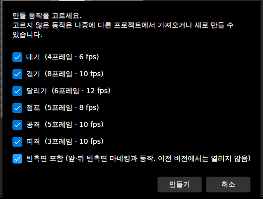

> **파일 → 새로 만들기 (관절 원 없는 마네킹)**: 관절에 원이 없는 매끈한 마네킹으로 시작한다.

## 2. 화면 구성

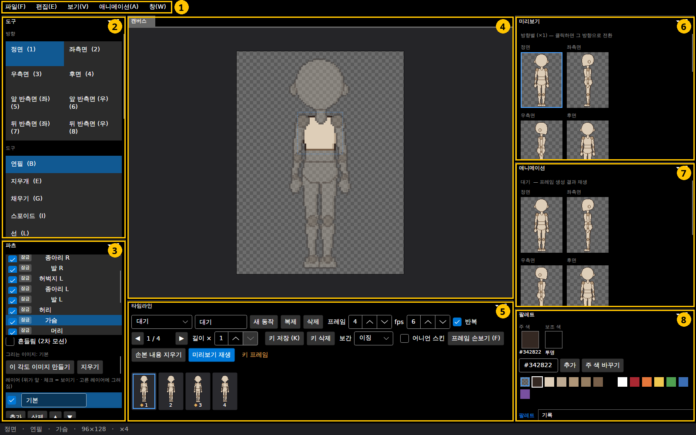

| 번호 | 창 | 하는 일 |
| --- | --- | --- |
| 1 | 메뉴 | 파일·편집·보기·애니메이션·창 |
| 2 | 도구 | **방향**(정면 1 ~ 뒤 반측면 우 8), **도구**(연필 B, 지우개 E, 채우기 G, 스포이드 I, 선 L, 사각형 U, 원 Shift+U, 선택·이동 M), 아래로 내리면 대칭·격자·자동 외곽선 등 옵션 ([9절](#9-자동-외곽선명암과-보기-옵션)) |
| 3 | 파츠 | 스켈레톤 파츠 목록(보이기·잠금), 고른 파츠의 회전·흔들림·레이어·장착점, 파츠 추가 |
| 4 | 캔버스 | 고른 파츠에 그리는 곳. 고른 파츠는 또렷하게, 나머지는 흐리게 보임 (H로 전환) |
| 5 | 타임라인 | 동작 고르기·만들기, 프레임 수·fps·반복, 키 저장·삭제, 보간, 프레임별 길이, 어니언 스킨, 프레임 손보기, 프레임 목록 |
| 6 | 미리보기 | 방향별 현재 모습 (×1). 누르면 그 방향으로 바뀜 |
| 7 | 애니메이션 | 현재 동작을 방향별로 재생 (흔들림 포함) |
| 8 | 팔레트 / 기록 | 주 색·보조 색, 색 추가, 주 색 바꾸기 / 되돌리기 목록 ([11절](#11-기록-되돌리기-목록)) |

- 창은 끌어서 옮기거나 크기를 바꿀 수 있고, 다음 실행 때 그대로 열린다. 처음 배치로 돌리려면 **창 → 창 배치 초기화**.
- 캔버스: 휠 = 확대·축소, 휠 클릭 또는 Space+드래그 = 화면 이동.
- 아래 상태 줄: 방향 · 도구 · 고른 파츠 · 캔버스 크기 · 배율.

## 3. 그리기

1. 파츠 창에서 그릴 파츠를 고른다 (예: 가슴). **그림은 고른 파츠에만 찍힌다.**
2. 팔레트에서 색을 누른다. 왼쪽 클릭 = 주 색, 오른쪽 클릭 = 보조 색.
3. 도구를 고르고 캔버스에 그린다. 왼쪽 버튼 = 주 색, 오른쪽 버튼 = 보조 색.

아래는 가슴을 빨강으로 **채우기(G)** 한 뒤 흰색 **연필(B)** 로 줄을 그은 모습. 오른쪽 미리보기에도 바로 반영된다.

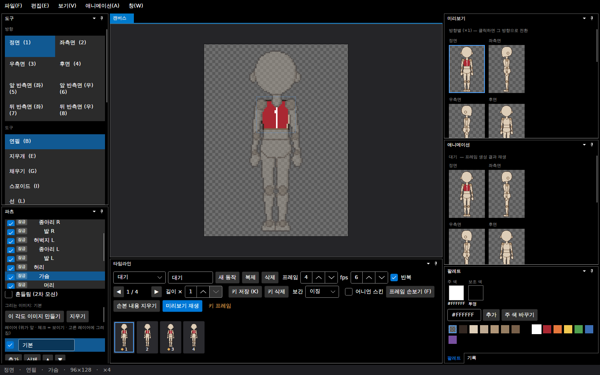

| 도구 | 쓰는 법 |
| --- | --- |
| 연필 B | 한 픽셀씩. **픽셀 퍼펙트 연필**을 켜면 대각선의 계단 모서리를 자동으로 정리 |
| 지우개 E | 투명으로 |
| 채우기 G | 같은 색으로 이어진 영역 |
| 스포이드 I | 캔버스의 색을 주 색으로 |
| 선 L · 사각형 U · 원 Shift+U | 끌어서 모양 |
| 선택·이동 M | 끌어서 영역 선택 → 영역 안을 끌면 이동, Delete = 지우기, Esc = 해제 |
| 대칭 그리기 S | 좌우 대칭으로 함께 찍힘 |

팔레트: `#RRGGBB`를 입력하고 **추가**로 색을 넣는다. **주 색 바꾸기**는 주 색을 입력한 색으로 바꾼다. 그 색을 쓰는 모든 픽셀이 함께 바뀐다 (되돌리기 가능). **파일 → 팔레트 불러오기**는 .gpl/.hex/.png 팔레트를 읽어 색 번호대로 교체한 모습을 미리 보여 주고 적용하며, **내보내기 → 팔레트**로 내보낸다.

## 4. 포즈 만들기

**포즈 모드**(P)를 켜면 뼈대(노란 선과 관절)가 보인다. 파츠를 잡고 끌면 그 파츠가 관절을 중심으로 돈다.

- Shift+드래그: 15° 단위로 회전
- Alt+드래그: 파츠 창에서 고른 파츠를 돌림 (다른 파츠에 가려 잡기 어려울 때)
- 세부 파츠(눈·가슴 볼륨)를 잡고 돌리면 부모(머리·가슴)가 돈다

포즈가 저장된 키와 다르면 타임라인에 **"포즈가 키와 다름 — K로 저장"** 이 뜬다.

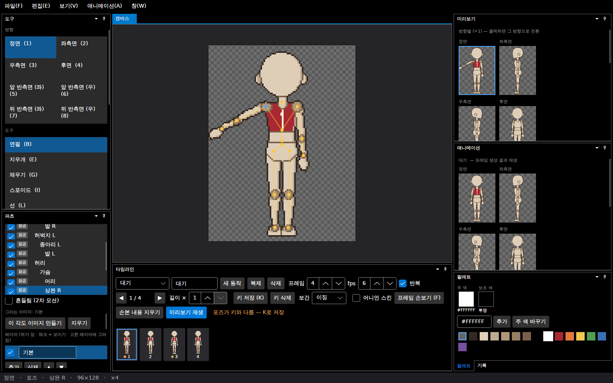

> 팁: 캔버스 밖으로 나간 부분은 잘린다 (위 그림은 여백이 없던 96×128이라 손끝이 잘림). 모자·무기·큰 동작이 잘리면 **편집 → 캔버스 크기**로 여백을 늘린다.

## 5. 애니메이션 키 찍기

1. 타임라인 위쪽에서 동작을 고른다 (**새 동작·복제·삭제**로 관리, 이름은 옆 칸에서 바꿈).
2. 프레임을 고른다 (프레임 목록 클릭, `,` `.`로 이전·다음).
3. 포즈를 잡고 **키 저장**(K). 키가 있는 프레임은 ◆로 표시된다.
4. 키 사이 프레임은 자동으로 만들어진다. 보간은 **이징 / 선형 / 계단** 중에서 고른다.

아래는 1프레임과 3프레임에 팔 각도를 다르게 키로 저장하고 **어니언 스킨**(O)을 켠 모습. 앞 프레임이 흐리게 겹쳐 보인다.

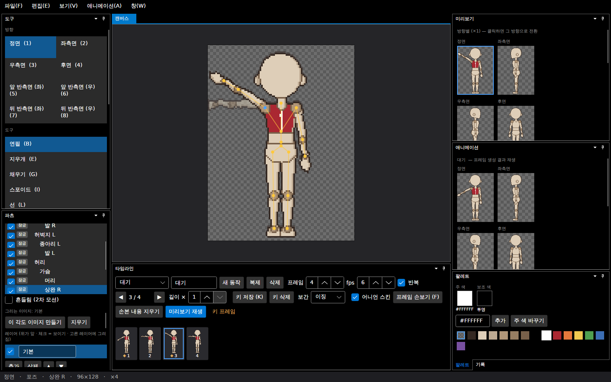

| 칸 | 뜻 |
| --- | --- |
| 프레임 | 동작의 프레임 수 |
| fps | 초당 프레임 |
| 반복 | 끝에서 처음으로 이어짐 (걷기·대기) |
| 길이 × | 고른 프레임을 몇 배 오래 보여 줄지 (×1~×16). 재생·GIF·JSON에 반영 |
| 미리보기 재생 | 애니메이션 창에서 재생 |

- 키는 **방향마다 따로** 저장된다 (정면 포즈와 측면 포즈가 다름). 우측면은 좌측면을 좌우 반전해 쓴다.
- **애니메이션 → 반측면 동작 초안**: 비어 있는 반측면 트랙을 정면·후면과 측면 키의 중간으로 채운다.

## 6. 방향마다 그리기 (반측면 포함)

방향(1~8)을 바꾸면 그 방향의 그림에 그린다. 방향마다 그림이 따로라서, 정면에서 칠한 빨간 가슴이 앞 반측면(5)에는 없다. 방향마다 칠해 준다.

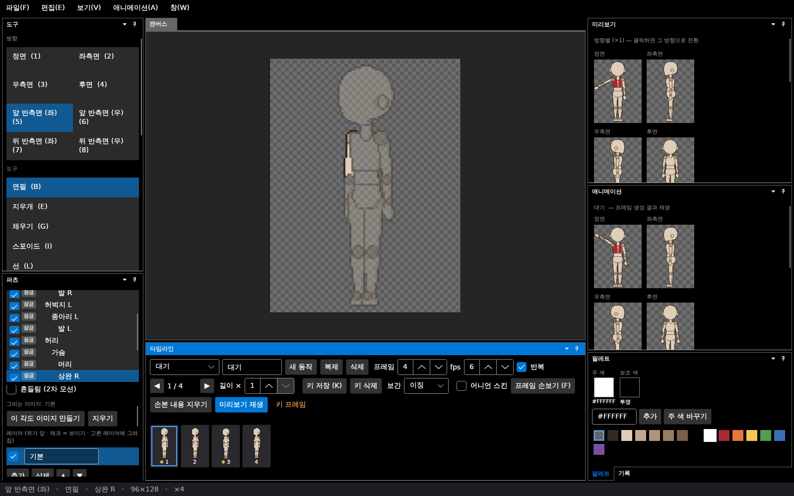

- 우측면(3)과 오른쪽 반측면(6, 8)은 기본적으로 왼쪽을 **좌우 반전**해 쓴다. 비대칭 디자인이면 파츠 창의 **반전 끊고 따로 그리기**를 켜서 따로 그린다.
- **보기 → 참고 이미지 불러오기**: 방향마다 밑그림을 깔아 두고 따라 그릴 수 있다 (프로젝트에는 저장되지 않음).

## 7. 파츠 창

위쪽 목록에서 파츠를 고르고, 아래에서 그 파츠를 설정한다.

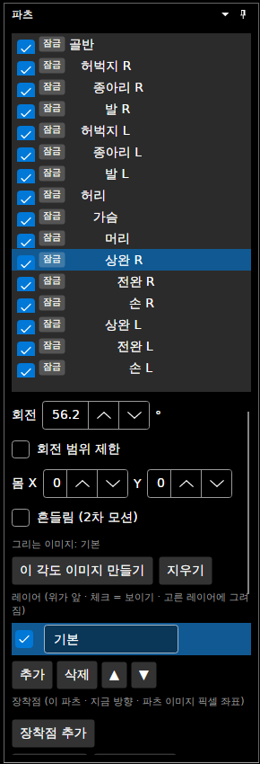

| 항목 | 내용 |
| --- | --- |
| 체크 (보이기) | 끄면 편집 캔버스에서만 숨김 (미리보기·내보내기에는 나옴) |
| 잠금 | 그리기·회전·위치 옮기기를 막음 (고르기는 됨) |
| 회전 / 회전 범위 제한 | 지금 포즈의 각도. 범위를 켜면 최소~최대 안에서만 돎 (팔꿈치·무릎) |
| 몸 X/Y | 지금 포즈의 몸 전체 위치 (점프 등) |
| 흔들림 (2차 모션) | 켜면 몸이 움직일 때 늦게 따라오는 흔들림을 자동으로 더함. 프리셋(가슴 볼륨·머리카락·천·꼬리), 주기·감쇠·세기·최대 |
| 이 각도 이미지 만들기 | 지금 회전에 가까운 45° 각도용 그림을 따로 만들어 다듬음 (손처럼 작은 파츠가 돌면 뭉개질 때) |
| 레이어 | 파츠 안의 그림 층. 추가·삭제·순서, 체크로 보이기 |
| 장착점 | 무기·이펙트 위치. 파츠를 따라 움직이고, 시트 JSON에 프레임마다 기록됨 |
| 이 파츠 0° / 포즈 초기화 | 회전을 0으로 |

## 8. 파츠 추가

파츠 창을 아래로 내리면 파츠를 추가하는 곳이 있다. **지금 고른 파츠에 붙는다.**

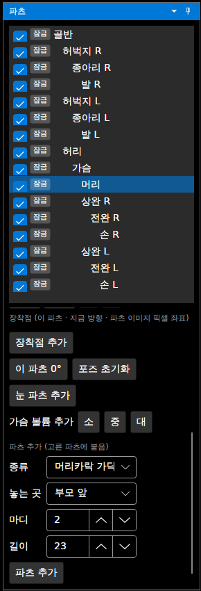

| 버튼 | 내용 |
| --- | --- |
| 눈 파츠 추가 | 머리에 눈 R·눈 L. 얼굴과 따로 그리고 바꿀 수 있음 |
| 가슴 볼륨 추가 (소·중·대) | 가슴에 물방울 모양 볼륨 (여성 캐릭터용). 흔들림이 켜진 채 추가 |
| 파츠 추가 | **종류**(머리카락 가닥·꼬리·망토 자락·장신구), **놓는 곳**(부모 앞·부모 뒤·등 쪽), **마디**(1~4), **길이**를 고르고 추가 |

- 종류를 바꾸면 놓는 곳·마디·길이가 그 종류의 기본값으로 바뀐다 (꼬리 = 등 쪽·3마디).
- **등 쪽**: 정면·측면에서는 몸 뒤에, 후면에서는 맨 앞에 그려진다 (망토·꼬리·뒷머리).
- 마디가 여럿이면 마디마다 파츠가 생기고(꼬리 1 → 1-2 → 1-3), 흔들림이 마디마다 늦게 따라간다.
- 추가한 파츠는 **위치 X/Y**로 방향마다 옮긴다. 첫 마디를 옮기면 아래 마디도 함께 옮겨진다.
- 추가한 파츠는 **이 파츠 삭제**로 지운다 (아래 마디까지). 템플릿 파츠는 지울 수 없다.

아래는 머리에 머리카락 가닥(부모 앞, 2마디), 눈, 허리에 꼬리(등 쪽, 3마디)를 추가하고 좌측면을 본 모습. 시작 그림은 부모의 주 색으로 된 간단한 모양이라, 그 위에 다시 그린다.

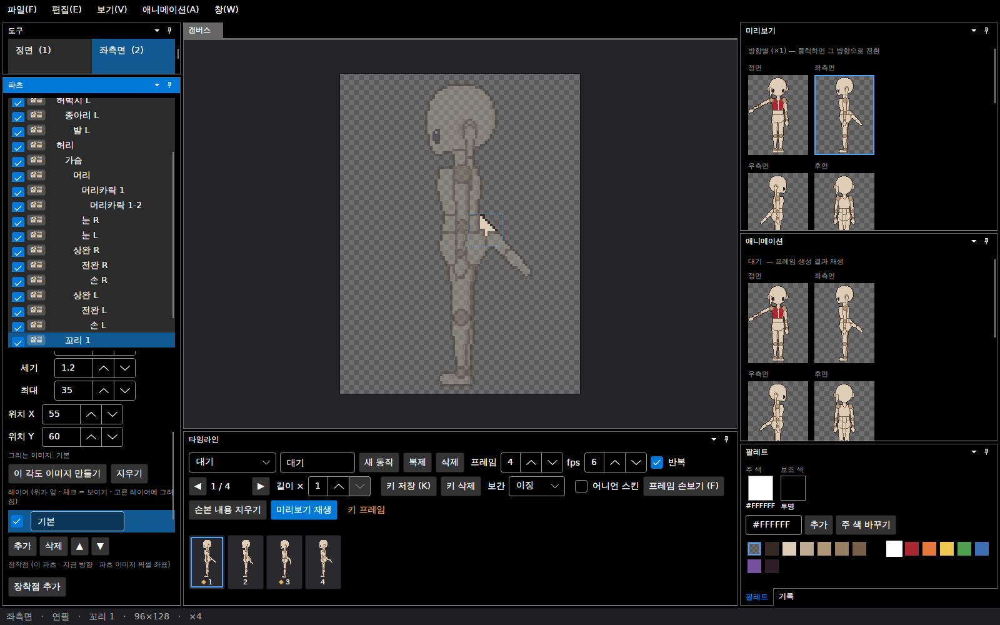

## 9. 자동 외곽선·명암과 보기 옵션

도구 창을 아래로 내리면 옵션이 있다.

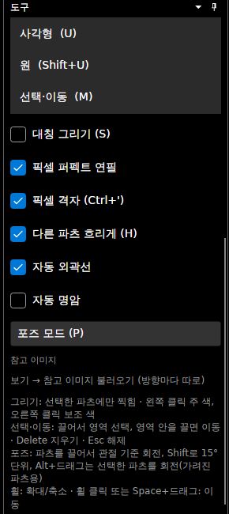

| 옵션 | 내용 |
| --- | --- |
| 대칭 그리기 (S) | 좌우 대칭 |
| 픽셀 퍼펙트 연필 | 대각선 계단 정리 |
| 픽셀 격자 (Ctrl+') | 확대했을 때 격자 |
| 다른 파츠 흐리게 (H) | 고른 파츠만 또렷하게 |
| 자동 외곽선 | 파츠마다 바깥 선과, 파츠가 겹치는 곳의 안쪽 선을 자동으로 (색은 프로젝트에 저장) |
| 자동 명암 | 빛 반대쪽 가장자리를 팔레트의 한 단계 어두운 색으로 (빛 방향·폭 선택) |
| 포즈 모드 (P) | [4절](#4-포즈-만들기) |

자동 명암을 켜고 흐리게를 끈 모습:

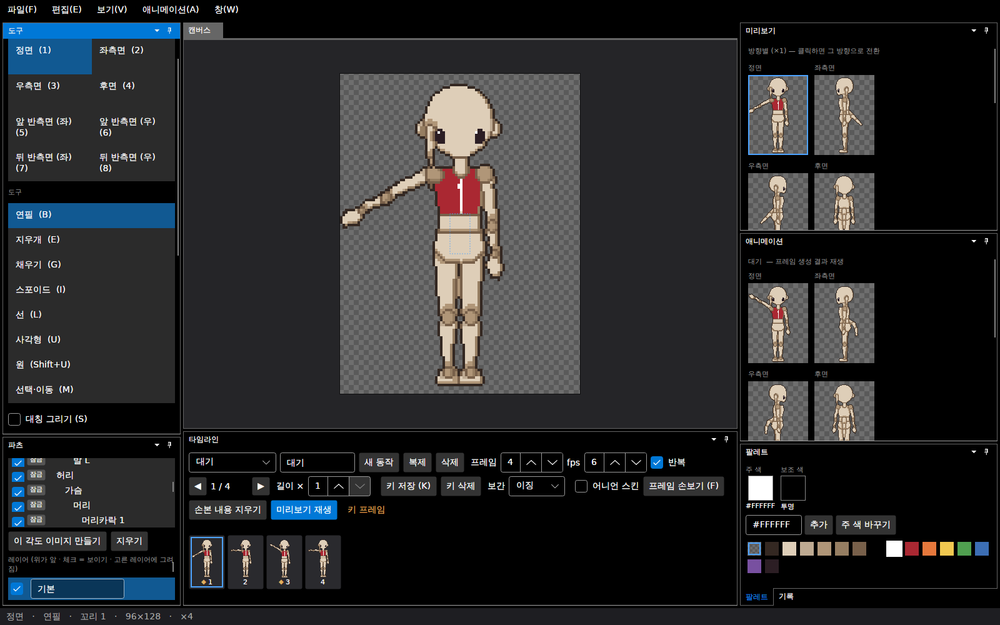

**보기 → 캔버스에 2차 모션 보기**를 켜면 편집 캔버스에도 흔들림이 보인다 (기본은 꺼짐: 키로 잡은 포즈 그대로 편집).

## 10. 프레임 손보기

자동으로 만들어진 프레임을 **그 프레임만** 손으로 고친다. **프레임 손보기**(F)를 켜고 그리면, 파츠 그림은 그대로 두고 완성된 프레임 위에 덧칠한다.

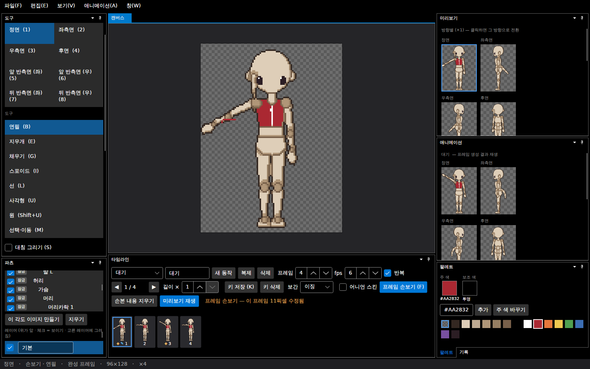

- 손본 프레임은 프레임 목록에 ✎ 표시, 타임라인에 "이 프레임 N픽셀 수정됨".
- **손본 내용 지우기**: 현재 프레임의 덧칠을 지운다.

## 11. 기록 (되돌리기 목록)

팔레트 옆 **기록** 탭에 한 일이 차례로 쌓인다. 줄을 누르면 그 시점으로 돌아간다. 흐린 줄은 다시 하기(Ctrl+Y)로 갈 수 있는 작업이다. 저장한 시점에는 "저장됨"이 붙는다.

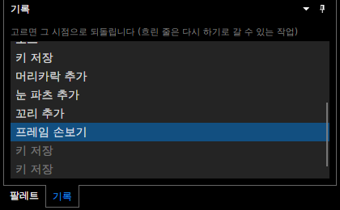

되돌리기 Ctrl+Z, 다시 하기 Ctrl+Y (또는 Ctrl+Shift+Z).

## 12. 저장

**파일 → 저장**(Ctrl+S) / **다른 이름으로 저장**(Ctrl+Shift+S). 프로젝트는 `.dotchar` 파일 하나로 저장된다 (파츠 그림, 스켈레톤, 동작, 팔레트, 설정).

- 제목 줄에 `*`가 있으면 저장 안 한 변경이 있다. 닫거나 새로 만들 때 저장할지 묻는다.
- **자동 저장**: 2분마다 복구용 사본을 따로 저장한다. 비정상 종료 뒤 다시 켜면 복구할지 묻는다.
- **파일 → 최근 파일**로 다시 연다.

## 13. 내보내기

**파일 → 내보내기**.

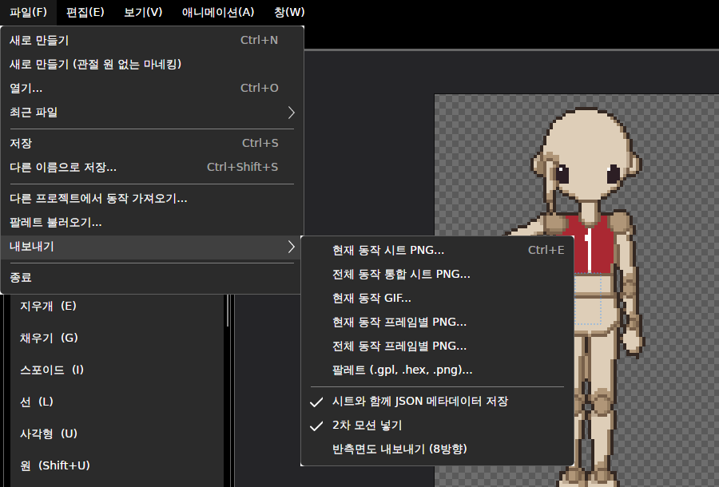

| 항목 | 결과 |
| --- | --- |
| 현재 동작 시트 PNG (Ctrl+E) | 한 동작의 모든 방향·프레임을 한 장에 |
| 전체 동작 통합 시트 PNG | 모든 동작을 한 장에 (동작마다 방향 줄) |
| 현재 동작 GIF | 방향을 나란히 놓은 움직이는 그림 |
| 현재 / 전체 동작 프레임별 PNG | 프레임마다 파일 하나: `이름_동작_방향_번호.png` |
| 팔레트 | .gpl, .hex, .png |
| 시트와 함께 JSON 메타데이터 저장 | 칸 크기, 동작·방향·프레임 위치, 프레임 길이, 장착점 |
| 2차 모션 넣기 | 흔들림 포함 여부 (엔진에서 물리를 따로 쓸 때 끔) |
| 반측면도 내보내기 (8방향) | 반측면 줄을 함께 |

전체 동작 통합 시트의 대기 부분 (8방향 × 4프레임, 2배 확대):

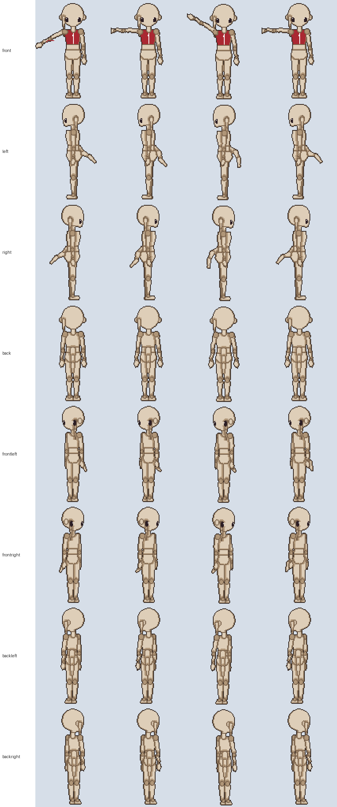

현재 동작 GIF (정면·좌측면·후면·앞 반측면, 2배 확대). 팔 키 두 개 사이를 자동으로 채우고, 꼬리와 머리카락이 흔들림으로 늦게 따라온다.

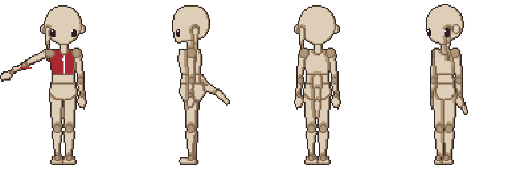

## 14. 명령줄 일괄 내보내기

앱을 띄우지 않고 저장한 프로젝트를 한 번에 내보낸다.

```
PixelAniMaker --export 캐릭터.dotchar --out 출력폴더 [--directions 8] [--frames]
```

| 옵션 | 뜻 |
| --- | --- |
| `--export 파일` | 내보낼 프로젝트 |
| `--out 폴더` | 결과를 둘 폴더 |
| `--directions 8` | 반측면 포함 8방향 (없으면 4방향) |
| `--frames` | 프레임별 PNG도 |

결과: `이름_all.png`(통합 시트), `이름_all.json`, 동작마다 `이름_동작.gif`, (`--frames`면) 프레임별 PNG.

- `PixelAniMaker 캐릭터.dotchar`처럼 파일만 주면 앱이 그 파일을 열고 켜진다.
- 리눅스에서는 명령줄 내보내기도 화면(X 디스플레이)이 있어야 실행된다.

## 15. 단축키와 언어

**창 → 단축키 설정**에서 모든 단축키를 바꾼다. 겹치는 키는 알려 주고, **기본값**·**모두 기본값으로**로 되돌린다. 바꾼 키는 메뉴와 도구 창 표시에도 반영된다.

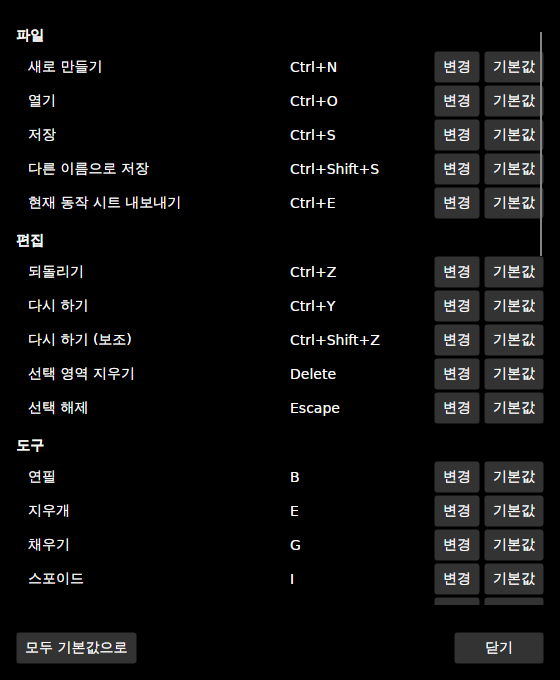

| 분류 | 기본 단축키 |
| --- | --- |
| 파일 | 새로 만들기 Ctrl+N · 열기 Ctrl+O · 저장 Ctrl+S · 다른 이름으로 저장 Ctrl+Shift+S · 시트 내보내기 Ctrl+E |
| 편집 | 되돌리기 Ctrl+Z · 다시 하기 Ctrl+Y / Ctrl+Shift+Z · 선택 영역 지우기 Delete · 선택 해제 Esc |
| 도구 | 연필 B · 지우개 E · 채우기 G · 스포이드 I · 선 L · 사각형 U · 원 Shift+U · 선택·이동 M · 대칭 S |
| 방향 | 정면 1 · 좌측면 2 · 우측면 3 · 후면 4 · 앞 반측면 좌/우 5/6 · 뒤 반측면 좌/우 7/8 |
| 보기 | 픽셀 격자 Ctrl+' · 다른 파츠 흐리게 H · 포즈 모드 P · 확대 Ctrl++ · 축소 Ctrl+- |
| 애니메이션 | 키 저장 K · 이전/다음 프레임 `,` `.` · 어니언 스킨 O · 프레임 손보기 F |

**창 → 언어 / Language**: 한국어 / English (다시 시작하면 적용).

## 16. 메뉴 한눈에 보기

| 편집 | 보기 | 애니메이션 |
| --- | --- | --- |
| 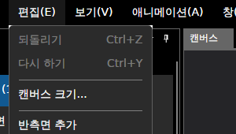 | 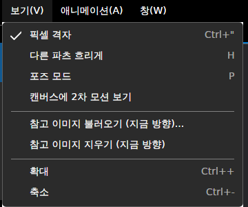 | 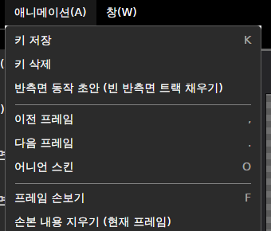 |

- **편집 → 캔버스 크기**: 캔버스 둘레에 위·아래·왼쪽·오른쪽 여백을 더하거나(양수) 줄인다(음수). **기본 여백** 버튼은 좌우 16 · 위 24 · 아래 8. 그림은 자르지 않고 캔버스 위 자리만 옮겨지며, 손본 픽셀도 함께 옮겨진다 (되돌리기 가능).

  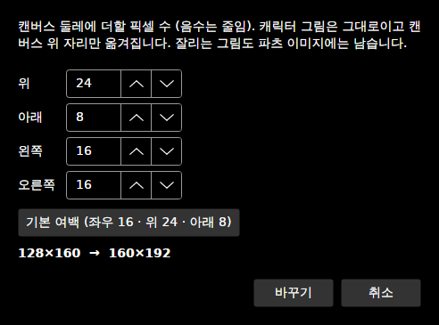

- **편집 → 반측면 추가 / 지우기**: 반측면(3/4) 방향을 켜고 끈다. 켜면 모든 파츠의 정면·후면 그림이 반측면으로 복사되어 다시 그릴 수 있다. 끄면 반측면 그림과 반측면 키가 지워진다 (되돌리기 가능).
- **파일 → 다른 프로젝트에서 동작 가져오기**: 다른 `.dotchar`의 동작을 골라 가져온다.

## 17. 자주 묻는 것

| 질문 | 답 |
| --- | --- |
| 점프·무기·모자가 캔버스 끝에서 잘린다 | **편집 → 캔버스 크기**로 여백을 늘린다 (새 프로젝트는 기본 128×160) |
| 그렸는데 안 찍힌다 | 파츠 창에서 고른 파츠에만 찍힌다. 다른 파츠 위라면 그 파츠를 고른다. 잠금이 켜져 있어도 안 찍힌다 |
| 우측면이 좌측면과 똑같다 | 기본은 좌우 반전. **반전 끊고 따로 그리기**를 켠다 |
| 포즈를 바꿨는데 재생에 안 나온다 | 키 저장(K)을 안 했다. 타임라인에 "포즈가 키와 다름"이 뜬다 |
| 돌린 손이 뭉개진다 | **이 각도 이미지 만들기**로 그 각도용 그림을 따로 다듬는다 |
| 흔들림이 편집 캔버스에 안 보인다 | 기본은 애니메이션 창·내보내기에만. **보기 → 캔버스에 2차 모션 보기** |
| 타블렛 펜 | 펜촉 = 왼쪽 클릭으로 그리기·포즈 모두 된다. 필압은 쓰지 않는다. 펜 뒤쪽 지우개는 아직 지우개로 인식하지 않는다 |
