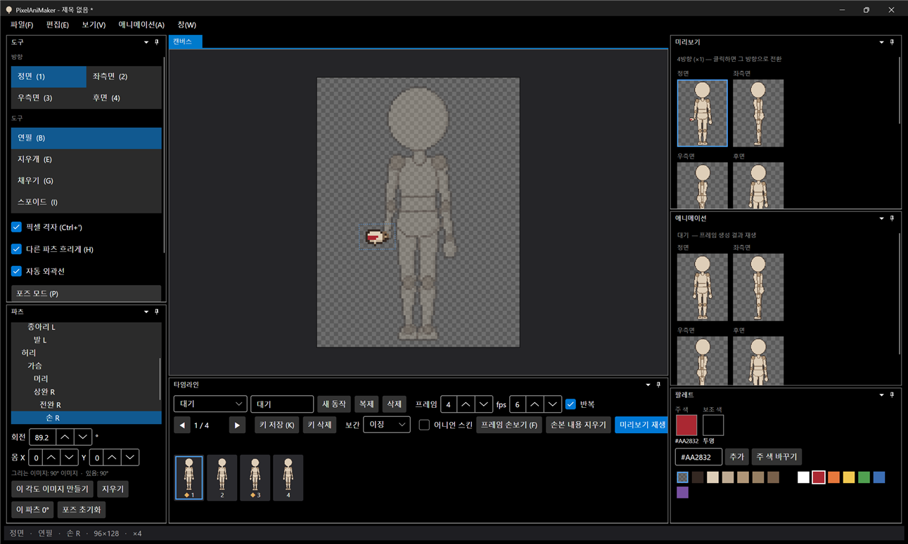
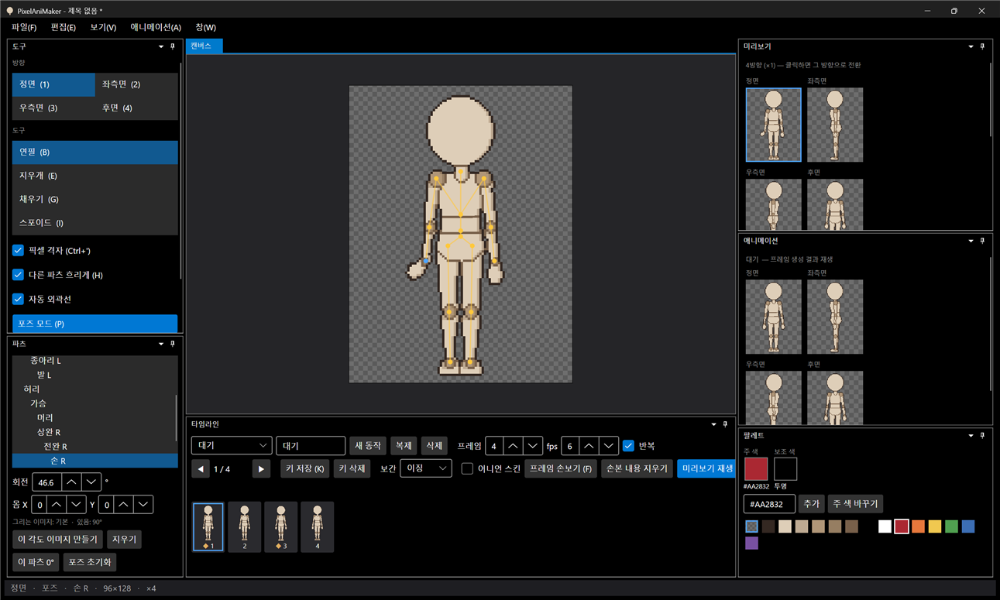
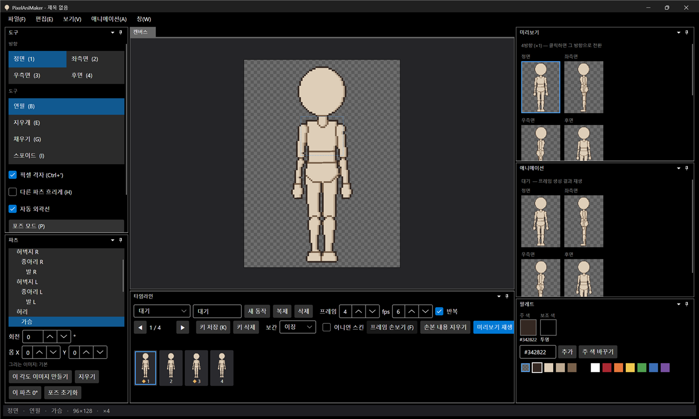
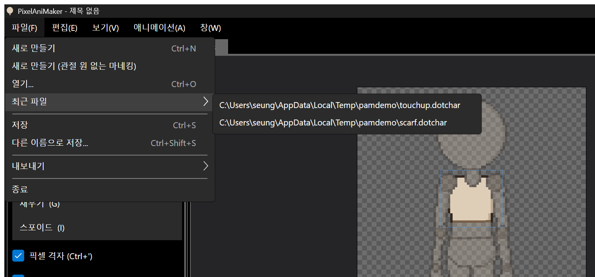

# 패치노트 — 6단계 ⑥: 회전 품질 (각도별 교체 이미지, 관절 원 없는 마네킹)

날짜: 2026-09-24 · 브랜치: `feature/angle-variants`

손처럼 작은 파츠가 크게 돌 때 모양이 뭉개지는 문제를 해결하려고, 파츠마다 45° 단위의 **각도별 교체 이미지**를 둘 수 있게 했다. 관절 원이 눈에 띄는 문제에 대해서는 **관절 원 없는 마네킹**으로 새로 만들 수 있게 했다. 이번 확인 중 파일 메뉴를 열면 앱이 종료되던 5단계의 버그도 찾아 고쳤다.

## 스크린샷

오른손(화면 왼쪽)을 90° 돌리고 "이 각도 이미지 만들기"를 누른 뒤 빨간 점을 찍은 결과. 파츠 창에 "그리는 이미지: 90° 이미지 · 있음: 90°".

약 77°로 돌리면 90° 이미지를 남은 13°만큼만 돌려 쓴다 (빨간 점이 그대로 보임).

약 47°로 돌리면 범위(±22.5°)를 벗어나 기본 이미지로 돌아간다 (빨간 점 없음, "그리는 이미지: 기본").

파일 → 새로 만들기 (관절 원 없는 마네킹).

고친 파일 메뉴와 최근 파일 목록.

## 추가된 기능

| 영역 | 내용 |
| --- | --- |
| 각도별 교체 이미지 | 파츠·방향마다 45° 단위(45, 90, 135, 180, -45, -90, -135). 파츠가 그 각도 ±22.5° 안이면 교체 이미지를 남은 각도만큼만 돌려서 그림 |
| 만들기 | 파츠 창 "이 각도 이미지 만들기": 현재 회전에 가장 가까운 45° 각도로, 기본 이미지를 그 각도로 돌린 결과를 출발점으로 만듦 |
| 그리기 | 교체 이미지 각도에 있을 때 캔버스에 그리면 교체 이미지가 수정됨 (점선 범위도 교체 이미지를 따름) |
| 지우기 | 파츠 창 "지우기": 지금 쓰이는 교체 이미지 삭제 |
| 되돌리기·저장 | 만들기·지우기·그리기 모두 되돌리기 가능. `.dotchar`에 `parts/<방향>/<파츠>@<각도>.png`로 저장 |
| 관절 원 없는 마네킹 | 파일 → 새로 만들기 (관절 원 없는 마네킹). 템플릿 `chibi96_plain` (기본 동작은 같은 것을 사용) |

## 구조

| 위치 | 내용 |
| --- | --- |
| `Core/Imaging/RotSprite` | 8배 Scale2x 샘플러(합성과 교체 이미지 생성이 공유), 이미지 회전 |
| `Core/Rigging/AngleVariants` | 각도별 이미지, 가까운 각도 고르기, `VariantChange`(되돌리기), 기본 이미지로부터 만들기 |
| `Core/Rigging/PartTransform` | 실제로 그리는 이미지·관절 위치·남은 각도를 직접 고름 → 합성·그리기·범위 표시가 자동으로 따름 |
| `Core/Rigging/CharacterTemplate`, `Project/ProjectFile` | 교체 이미지 저장·읽기 |
| `App/Services/EditorSession` | 회전으로 그리는 이미지가 바뀌면 편집 대상도 바꿈, 만들기·지우기 |
| `mannequin/make_chibi_parts.py` | 관절 원 없는 템플릿도 생성 |
| 테스트 | 77개 통과 (각도 고르기, 남은 각도, 90° 회전 이미지, 합성, 되돌리기, 저장 왕복 10개 추가) |

## 수정한 문제

- **파일 메뉴를 열면 앱이 종료됨** (5단계부터): "최근 파일" 하위 항목용 스타일이 "최근 파일" 메뉴 자신에게도 적용되어, 파일 경로 대신 뷰모델이 명령 인자로 넘어감 → 최근 파일 항목을 코드에서 직접 만들도록 수정. 5단계 확인 중 화면이 검게 캡처됐던 것도 같은 원인으로 보임
- 최근 파일 경로의 `_`가 사라져 보이던 문제 (단축 글자 표시로 해석됨) → 이스케이프
- 90° 회전 이미지 크기가 부동소수점 오차로 1px 커지던 문제 → 허용 오차 적용

## 알려진 제한

- 교체 이미지는 45° 단위만 지원
- 정면 교체 이미지는 정면에만, 좌측면(= 우측면) 교체 이미지는 좌·우측면에만 쓰임
