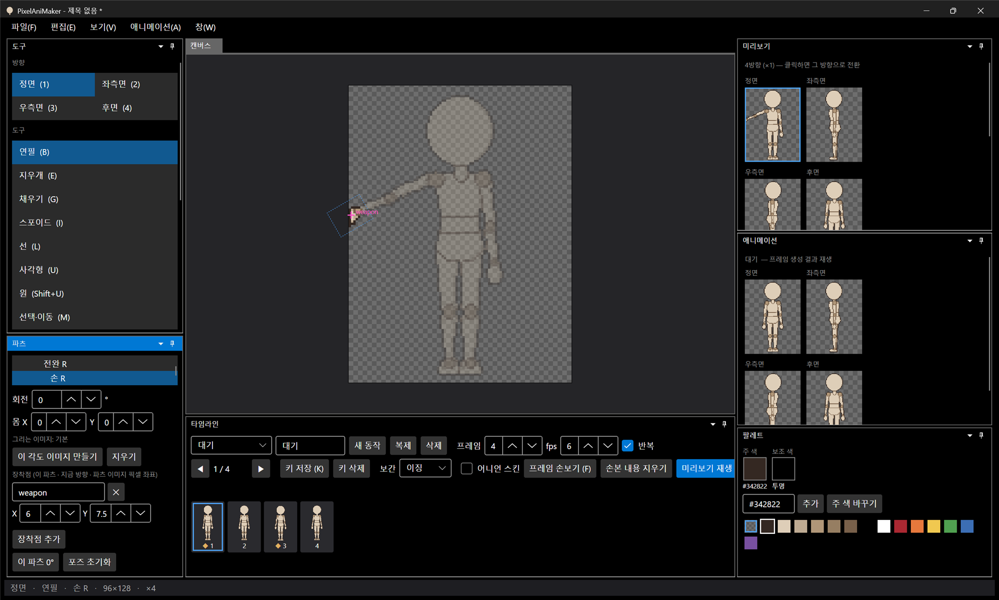

# 패치노트 — 백로그 ⑥: 장착점

날짜: 2026-09-24 · 브랜치: `feature/attachment-points`

무기·이펙트를 붙일 위치를 파츠에 이름으로 찍어 두면, 파츠를 따라 움직이고 시트 JSON에 프레임마다 위치·각도로 기록된다. 엔진에서 칼이나 이펙트를 그 좌표에 붙이면 된다.

## 스크린샷

손 R에 `weapon` 장착점을 만들고 상완 R을 60° 돌린 화면. 분홍 십자가 손을 따라가고, 선택한 파츠의 장착점에는 이름이 붙는다. 파츠 창에 장착점 목록(이름, X·Y, 삭제)과 "장착점 추가"가 생겼다.



## 기능

| 항목 | 내용 |
| --- | --- |
| 추가 | 파츠 창 "장착점 추가" → 관절 위치에 `point`, `point2` … 생성 |
| 편집 | 이름(다른 칸으로 가면 적용, 이미 있는 이름은 무시), X·Y(파츠 이미지 픽셀 좌표), ✕ 삭제. 모두 되돌리기 가능 |
| 방향 | 방향마다 따로 (정면에서 만든 점은 정면에만). 우측면은 좌측면 점을 반전해 씀 — 우측면을 따로 그리는 파츠는 좌측면 점을 복사해 시작 |
| 표시 | 모든 장착점을 십자로, 선택한 파츠의 점은 굵게 + 이름. 손보기 모드에서는 숨김 |
| 저장 | `skeleton.json` 파츠 뷰의 `attachments: [{name, x, y}]` |
| 시트 JSON | 프레임마다 `attachments: [{part, name, x, y, angle}]` — 칸 안 좌표(0.1px), 파츠 누적 회전(도, 화면 기준 시계 방향). 점이 없는 프레임은 생략 |

예 (대기 동작 정면 1·2프레임):

```json
"attachments": [ { "part": "hand_r", "name": "weapon", "x": 33, "y": 79.5, "angle": 0 } ]
"attachments": [ { "part": "hand_r", "name": "weapon", "x": 32, "y": 79.4, "angle": 1.5 } ]
```

## 버그 수정: 글자 입력 중 단축키가 동작함

이름 칸에 `weapon`을 치자 e(지우개)·p(포즈 모드)·o(어니언 스킨)가 실행되고 글자는 "wan"만 들어갔다. 팔레트 색 입력칸·동작 이름칸도 같은 문제가 있었다 (예: `#e0c0a0` 입력 시 지우개로 바뀜). 이제 글 입력칸에 커서가 있으면 Ctrl·Alt 없는 단축키(B, E, Delete, Esc …)는 동작하지 않는다. Ctrl+S 같은 조합키는 그대로 동작한다.

## 구조

| 위치 | 내용 |
| --- | --- |
| `Core/Rigging/Attachments` | `AttachmentPoints`(파츠 뷰별), `AttachmentChange`(되돌리기), `Attachments.Place`(포즈 → 화면 좌표·각도, 우측면 반전) |
| `Core/Rigging/CharacterSpec`, `RightViewChange` | 저장·불러오기, 우측면 분리 시 복사 |
| `Core/Export/SpriteSheet` | 프레임별 `attachments` |
| `App/ViewModels/AttachmentItem`, 파츠 창 | 목록 편집 (편집 중인 칸은 다시 만들지 않아 커서 유지) |
| `App/Controls/PixelCanvas` | 십자·이름 표시 |
| `App/Services/GuardedCommand`, `MainWindow` | 입력 중 단축키 막기 |
| 테스트 | 111개 통과 (회전 따라가기, 우측면 반전, 되돌리기·이름 바꾸기, 저장·불러오기 + 시트 JSON) |

## 검증

- 앱 자동 조작: 손 R 장착점 추가 → 이름 `weapon` 입력(단축키 안 먹힘 확인) → Y 이동 → 상완 R 60° → 점이 손을 따라감
- 저장한 파일을 `--export`로 내보내 JSON 확인: 정면 프레임마다 `weapon` 위치·각도가 달라짐, 우측면에는 없음(정면에만 만들었으므로)
