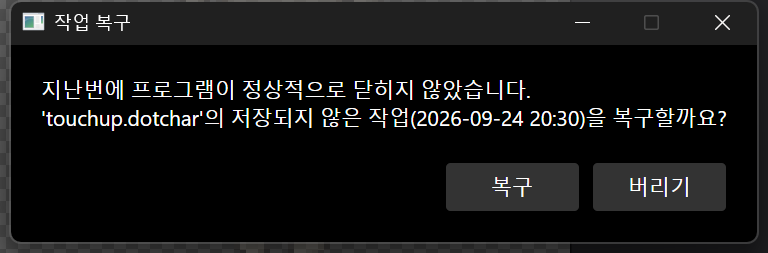
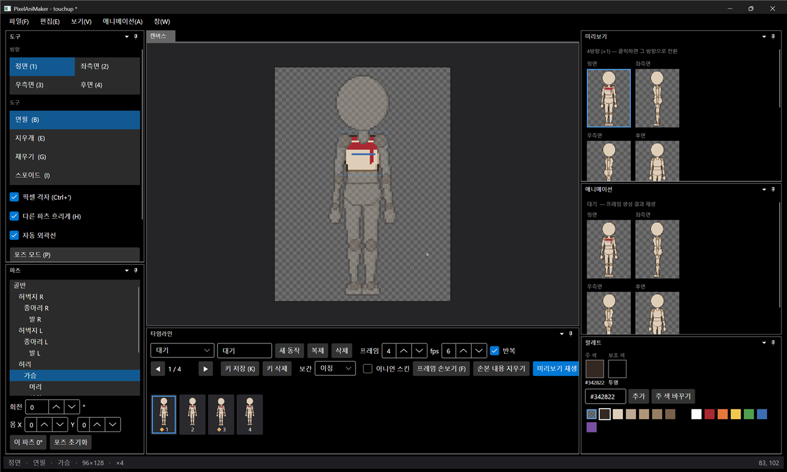

# 패치노트 — 6단계 ②: 자동 저장·복구

날짜: 2026-09-24 · 브랜치: `feature/autosave`

저장하지 않은 작업이 있으면 2분마다 복구용 사본을 따로 저장한다. 프로그램이 비정상으로 꺼지면 다음 실행 때 복구할지 묻는다. 사용자의 원래 파일은 건드리지 않는다.

## 스크린샷

작업 도중 프로그램이 강제로 종료된 뒤 다시 실행했을 때 뜨는 창.

"복구"를 누른 결과. 강제 종료 전에 그린 파란 선이 되살아나고, 원래 파일(`touchup`)의 저장 안 된 변경(`*`)으로 열린다.

## 동작

| 상황 | 동작 |
| --- | --- |
| 저장 안 한 변경이 있음 | 설정 간격(기본 120초)마다 `%AppData%/PixelAniMaker/autosave/<세션>.dotchar`와 메타 정보(원래 파일 경로, 시각) 저장 |
| 저장·새로 만들기·열기 | 복구 사본 삭제 |
| 정상 종료 | 복구 사본 삭제 |
| 시작 시 사본이 남아 있음 | 지난번 비정상 종료로 보고 가장 최근 사본을 "복구 / 버리기"로 물음. 복구하면 원래 파일 경로로, 저장 안 됨 상태로 열림. 어느 쪽이든 남은 사본은 모두 정리 |
| 간격 설정 | `settings.json`의 `AutosaveSeconds` (0이면 끔) |

자동 저장은 임시 파일에 쓴 뒤 교체하고, 실패해도 작업을 방해하지 않는다.

## 구조

| 위치 | 내용 |
| --- | --- |
| `App/Services/AutosaveService` | 주기 저장, 사본 찾기·삭제, 세션별 파일 이름(여러 창을 띄워도 겹치지 않음) |
| `App/Services/ProjectService` | `WriteCopy`(문서 상태를 바꾸지 않는 저장, `Save`와 공유), `OpenRecovery`, `IsRecovered`, `DocumentReset` 이벤트 |
| `App/ViewModels/MainWindowViewModel` | 시작 시 복구 확인(`StartAsync`) → 없으면 명령줄 파일 열기, 정상 종료 시 사본 정리 |

## 검증 (앱 자동 조작)

1. 간격을 5초로 줄이고 `touchup.dotchar`에 파란 선을 그림 → 8초 뒤 복구 사본 생성 확인
2. 프로세스 강제 종료 → 다시 실행 → 복구 창 표시
3. 복구 → 파란 선 복원, 제목 `touchup *`, 이전 사본 삭제
4. Ctrl+S → 사본 0개, Alt+F4로 정상 종료 → 사본 0개
5. 간격을 120초로 되돌림
