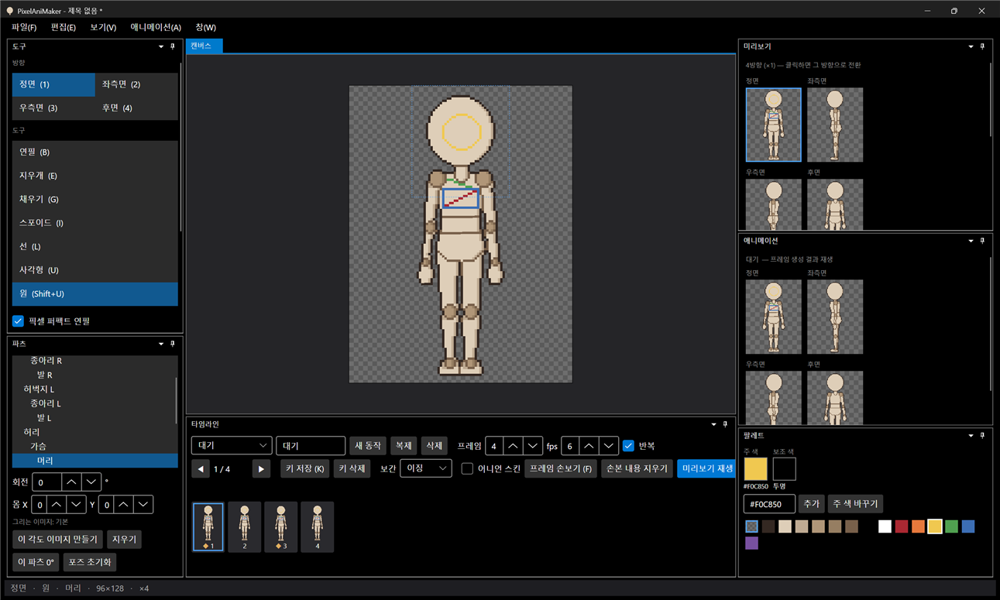
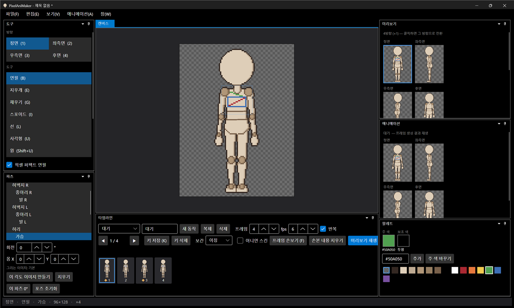
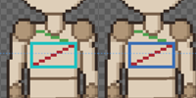

# 패치노트 — 백로그 ①: 편집 도구

날짜: 2026-09-24 · 브랜치: `feature/edit-tools`

선·사각형·원 도구와 픽셀 퍼펙트 연필을 추가하고, "주 색 바꾸기"를 되돌릴 수 있게 했다.

## 스크린샷

가슴 파츠에 사각형(파랑)·선(빨강)·픽셀 퍼펙트 연필(초록)을 그리고, 머리 파츠에 원(노랑)을 그린 결과. 도구 창에 선(L)·사각형(U)·원(Shift+U)과 "픽셀 퍼펙트 연필" 체크가 추가됐다.

"주 색 바꾸기"로 파랑을 청록으로 바꾼 뒤(왼쪽) Ctrl+Z로 되돌린 결과(오른쪽).

## 추가된 기능

| 도구 | 단축키 | 내용 |
| --- | --- | --- |
| 선 | L | 끄는 동안 미리보기, 놓으면 확정 (Bresenham) |
| 사각형 | U | 두 꼭짓점을 잇는 테두리 |
| 원 | Shift+U | 드래그한 사각형에 내접하는 타원 테두리 (정수 중점 알고리즘 — 닫혀 있고 상하좌우 대칭) |
| 픽셀 퍼펙트 연필 | 도구 창 체크 (기본 켬) | 자유 곡선의 L자 모서리 픽셀을 빼서 1px 선 유지. 원래 있던 픽셀은 지우지 않고 복원 |
| 주 색 바꾸기 되돌리기 | Ctrl+Z | 팔레트 색 교체도 되돌리기 히스토리에 기록 |

오른쪽 버튼으로 그리면 보조 색으로 그려진다 (모든 도구 공통). 도형 도구는 손보기 모드(F)에서도 쓸 수 있다.

## 구조

| 위치 | 내용 |
| --- | --- |
| `Core/Editing/Tools` | `ShapeTool`(선·사각형·원 — 도형 함수만 다름), `PencilTool` 픽셀 퍼펙트 옵션 (`PixelPerfectPencil` 인스턴스) |
| `Core/Editing/Raster` | `Rectangle`, `Ellipse` |
| `Core/Editing/PixelEdit` | `Original`(원래 값), `RevertAll`(미리보기 되돌리기) |
| `Core/Imaging/PaletteChange` | 색 교체 되돌리기 |
| `App/Services/EditorSession` | `PixelPerfect`, `ActiveTool`(선택 도구 + 픽셀 퍼펙트 적용) |
| `scripts/close-test-app.ps1` | 테스트로 띄운 앱 종료 + 자동 저장 사본 정리 |
| 테스트 | 85개 통과 (픽셀 퍼펙트 2, 선 미리보기, 사각형, 원 대칭·닫힘 3, 색 교체 되돌리기 추가) |

## 검증 (앱 자동 조작)

- 사각형·선·픽셀 퍼펙트 연필·원을 그려 결과 확인 (선은 마지막 미리보기만 남음, 연필 선에 계단 모서리 없음)
- 주 색 바꾸기 → Ctrl+Z로 원래 색 복원
