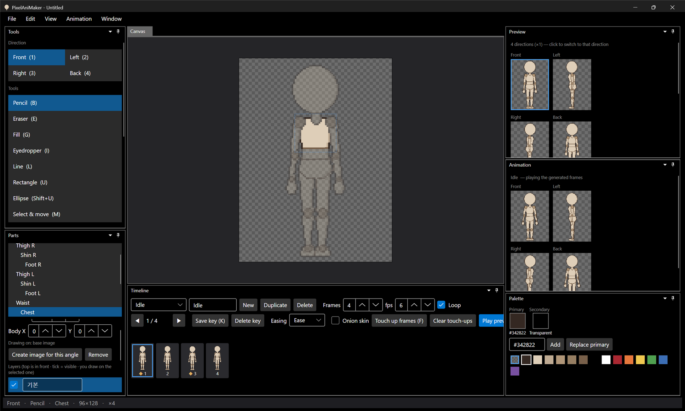
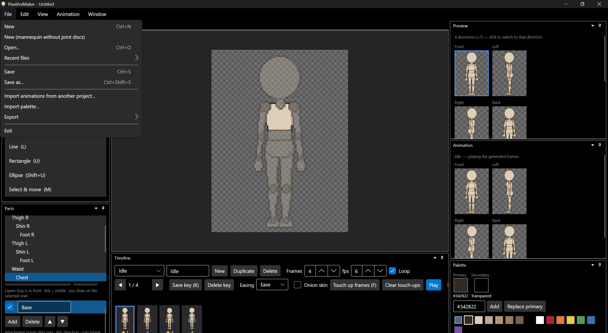

# 패치노트 — 백로그 ⑨: 영어 UI

날짜: 2026-09-24 · 브랜치: `feature/english-ui`

창 → 언어 / Language에서 영어를 고르면 다음 실행부터 모든 화면이 영어로 나온다.

## 스크린샷

영어로 실행한 화면. 메뉴·창 제목·도구·파츠 이름·상태 표시줄·기본 동작 이름(Idle)이 영어로 나온다.

파일 메뉴와 레이어 이름(`Base`).

## 사용법

창 → 언어 / Language → 한국어 / English. 설정에 저장되고 **다시 시작하면** 적용된다 (알림 창으로 안내).

## 방식

화면 코드는 그대로 한국어로 쓰고, 영어일 때만 **글자가 화면에 나오는 순간** 번역표(`Assets/Lang/en.json`, 한국어 → 영어)에서 찾아 바꾼다.

- 대상: 모든 `TextBlock`(버튼·체크박스·메뉴·툴팁 글자 포함), 인라인 `Run`, 창 제목, 파일 선택 창 제목·형식 이름
- 조합된 문장은 `{0}`, `{1}`이 들어간 패턴으로 찾고, 채워진 부분도 다시 번역한다 (예: 상태 표시줄 `정면 · 연필 · 가슴` → `Front · Pencil · Chest`, 오류 창 `저장하지 못했습니다.\n\n…`)
- 앞뒤 공백은 두고 가운데만 번역 (파츠 목록의 들여쓰기)
- 번역이 없는 글자는 한국어 그대로 → 빠진 것이 있어도 깨지지 않음
- 글 입력칸(`TextBox`)은 번역하지 않는다 — 사용자가 쓴 이름을 바꾸지 않기 위해

데이터 이름: 새로 만드는 프로젝트의 기본 동작 이름, 새 동작·복제·새 레이어 이름은 만들 때 선택한 언어로 정해진다. 이미 저장된 이름은 그대로이고, 기본 레이어 이름 `기본`은 칸에 `Base`로 보인다.

## 구조

| 위치 | 내용 |
| --- | --- |
| `App/Services/Localizer` | 번역표 읽기, 정확히 일치 → 패턴 순으로 찾기, 표시 속성 후킹(`SetCurrentValue`라 바인딩 유지) |
| `App/Assets/Lang/en.json` | 약 240개 항목 |
| `App/Services/AppSettings.Language` | `ko`(기본) / `en` |
| `App` | 창 메뉴 언어 선택, 알림 창(`ShowMessageAsync`), 기본 데이터 이름 번역 |
| `scripts/check-translations.py` | 소스의 한국어 문자열 중 번역표에 없는 것 찾기 (조합 문장의 조각으로 나오는 9개는 조합 키로 처리됨) |

## 검증 (앱 자동 조작)

- 창 → 언어 → English → 알림 → settings.json에 `"Language": "en"` 저장 확인
- 다시 실행 → 화면 전체 영어 확인 (메뉴, 패널, 도구, 파츠, 타임라인, 팔레트, 상태 표시줄, 창 제목)
- 검증 후 설정은 한국어로 되돌려 둠

## 백로그 완료

이 항목으로 `doc/progress.md`의 백로그 ①~⑨가 모두 끝났다.
