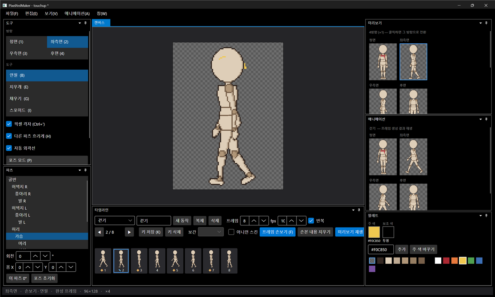

# 패치노트 — 6단계 ①: 프레임 손보기

날짜: 2026-09-24 · 브랜치: `feature/frame-touchup`

제작 과정 2단계(애니메이션 디테일 수정)를 넣었다. 자동으로 만들어진 프레임을 골라 그 위에 직접 도트를 찍으면, 바뀐 픽셀만 **덮어쓰기 레이어**에 저장된다. 프레임을 다시 만들어도 손본 픽셀은 그 위에 다시 덮이고, 시트·GIF 내보내기에도 들어간다.

## 스크린샷

걷기 · 좌측면 · 2번 프레임에서 프레임 손보기(F)를 켜고 노란 땀방울과 머리 하이라이트를 찍은 결과. 캔버스는 파츠가 아니라 완성 프레임을 보여주고(흐리게 표시 없음), 프레임 바의 2번에 ✎ 표시가 생긴다. 상태줄은 "손보기 · 연필 · 완성 프레임".

## 추가된 기능

| 영역 | 내용 |
| --- | --- |
| 프레임 손보기 모드 (F) | 타임라인 버튼·애니메이션 메뉴·단축키 F. 현재 동작·방향·프레임의 완성 프레임(외곽선·기존 손본 내용 포함)에 연필·지우개·채우기·스포이드 사용 |
| 덮어쓰기 레이어 | 생성된 프레임과 다른 픽셀만 저장 (색 또는 지움). 4방향 각각 따로 — 우측면도 좌측면과 별개로 손볼 수 있음 |
| 다시 만들 때 | 포즈·파츠를 고쳐 프레임이 다시 만들어져도 손본 픽셀이 그대로 덮임 |
| 표시 | 프레임 바에 ✎, 타임라인에 "이 프레임 N픽셀 수정됨" |
| 손본 내용 지우기 | 현재 방향·프레임의 손본 픽셀 전체 삭제 (되돌리기 가능) |
| 되돌리기 | 한 번 긋기 = 한 단계, 파츠 편집·포즈·키와 같은 히스토리 |
| 저장·내보내기 | `animations.json`의 동작별 `touchups`(방향, 프레임, [x, y, 색 번호])로 저장. 시트·GIF·애니메이션 재생·어니언 스킨에 반영 |

## 설계 변경

설계 문서에는 "프레임을 다시 만들 때 손본 내용을 유지할지 물어봄"이라고 되어 있었지만, **항상 유지 + ✎ 표시 + 지우기 버튼**으로 바꿨다. 포즈나 파츠를 고칠 때마다 확인 창이 뜨면 작업 흐름이 끊기고, 손본 픽셀은 바뀐 픽셀만 저장하므로 유지해도 안전하다. 필요 없어지면 "손본 내용 지우기"로 지운다.

## 구조

| 위치 | 내용 |
| --- | --- |
| `Core/Animation/FrameTouchups` | `PixelOverrides`, 방향·프레임별 덮어쓰기, `Diff`(생성 프레임 ↔ 수정 이미지), `TouchupChange`(되돌리기) |
| `Core/Animation/SpriteBaker` | 생성 후 덮어쓰기 적용 (`touchups: false`로 원본 프레임) |
| `Core/Animation/AnimationJson` | `touchups` 저장·읽기, null 값 생략 |
| `App/Services/TouchupSession` | 손보기 캔버스: 완성 프레임 복사본에 기존 도구로 그리고, 한 번 긋기가 끝나면 차이를 덮어쓰기로 기록 |
| `App/Services/AnimationSession` | 생성 원본 프레임 보관, 표시용 프레임에 덮어쓰기 적용, `ClearTouchup` |
| `App/Controls/CanvasInteractions` | `TouchupInteraction` (화면에 보이는 좌표 그대로 — 우측면도 반전하지 않음) |
| 테스트 | 67개 통과 (프레임·방향별 적용, 차이 계산, 되돌리기, JSON 왕복 4개 추가) |

## 검증

- 앱: 걷기·좌측면·2번 프레임에서 손보기 → ✎ 표시 → Ctrl+Z 세 번으로 모두 사라지고 제목의 `*`도 저장 시점으로 돌아옴 → Ctrl+Y → Ctrl+S
- 저장 파일: `touchups` = 좌측면 2번 프레임 13픽셀
- 명령줄 내보내기 후 시트 검사: 노란 픽셀이 좌측면 2번 프레임에만 13개, 좌측면 1번·우측면 2번·정면 2번에는 0개

## 알려진 제한

- 한 번 긋기를 끝낸 직후(약 0.1초 안)에 바로 다시 그리면, 프레임 재생성과 겹쳐 그 획이 끊길 수 있음
- 손보기 모드의 타임라인 상태 문구는 창이 좁으면 잘려 보임
