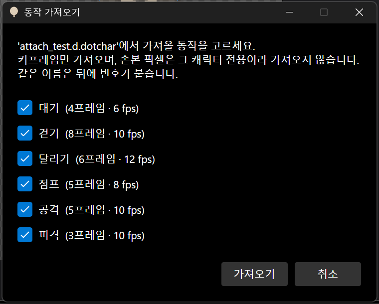
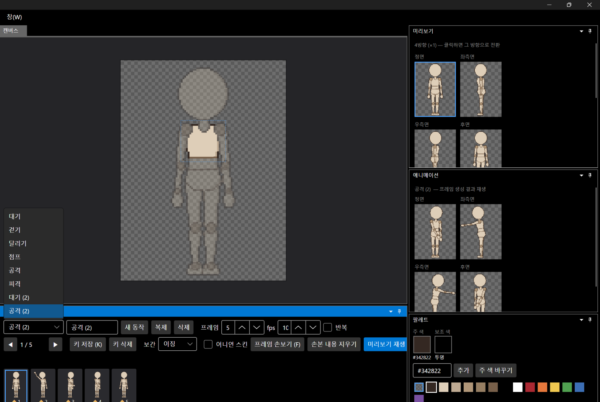

# 패치노트 — 백로그 ⑦: 다른 프로젝트에서 동작 가져오기

날짜: 2026-09-24 · 브랜치: `feature/import-clips`

다른 캐릭터 프로젝트(.dotchar)에서 만들어 둔 동작을 골라 지금 캐릭터로 가져온다. 모든 캐릭터가 같은 16파츠 뼈대를 쓰므로 키프레임을 그대로 다시 쓸 수 있다.

## 스크린샷

파일 → 다른 프로젝트에서 동작 가져오기 → 파일을 고르면 동작 목록이 나온다 (처음엔 모두 체크).

대기·공격만 골라 가져온 결과. 이름이 겹쳐 `대기 (2)`, `공격 (2)`로 추가되고, 가져온 공격 동작이 바로 재생된다.

## 동작

| 항목 | 내용 |
| --- | --- |
| 가져오는 것 | 동작 이름·프레임 수·fps·반복, 방향별 키프레임(회전·몸 위치·보간) |
| 가져오지 않는 것 | 손본 픽셀(프레임 손보기) — 그 캐릭터의 그림에 맞춘 것이라 새 캐릭터엔 맞지 않음 |
| 이름 겹침 | 뒤에 ` (2)`, ` (3)` … |
| 없는 파츠 | 지금 캐릭터에 없는 파츠를 돌리는 키가 있으면 알려 주고, 그 회전은 무시 |
| 저장 | 동작 목록이 바뀌어 저장 필요(*) 표시. 되돌리기 대상은 아님 (동작 추가·삭제와 같음) |

"스켈레톤 재사용"은 뼈대가 템플릿으로 고정되어 있어 동작 재사용으로 충족된다. 뼈대 자체를 편집하는 기능이 생기면 다시 다룬다.

## 구조

| 위치 | 내용 |
| --- | --- |
| `Core/Animation/ClipImport` | 복사, 이름 겹침 처리, 없는 파츠 보고 |
| `Core/Animation/AnimationClip.CopyAs` | 설정·키 복사 (동작 복제도 이것을 씀 — 중복 코드 제거) |
| `App` | 파일 메뉴 항목, 체크 목록 창(`PickItemsAsync`), `ProjectService.ReadClips` |
| 테스트 | 114개 통과 (설정·키 복사 + 손본 픽셀 제외, 이름 번호, 없는 파츠) |

## 검증 (앱 자동 조작)

- 앞 단계에서 저장한 파일에서 6개 중 대기·공격만 체크해 가져오기 → 목록에 `대기 (2)`, `공격 (2)` 추가, 재생 확인, 제목에 * 표시
