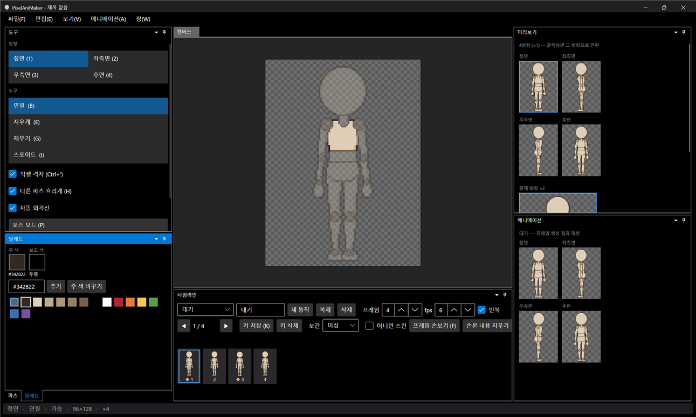

# 패치노트 — 6단계 ④: 창 배치 저장

날짜: 2026-09-24 · 브랜치: `feature/layout-persistence`

창을 옮기거나 크기를 바꾼 배치가 다음 실행 때 그대로 복원된다. 메인 창의 위치·크기·최대화 여부도 기억한다.

## 스크린샷

왼쪽 영역을 넓히고 팔레트 창을 파츠 창 옆 탭으로 옮긴 뒤, 앱을 닫았다가 다시 켠 화면. 넓힌 폭과 팔레트 위치(왼쪽 아래 "파츠 | 팔레트" 탭)가 그대로 복원된다.

## 동작

| 항목 | 내용 |
| --- | --- |
| 저장 시점 | 정상 종료할 때 `settings.json`에 저장 |
| 저장 내용 | 각 영역의 크기 비율, 각 창이 들어 있는 영역, 메인 창 위치·크기·최대화 |
| 복원 | 시작할 때 기본 배치를 만든 뒤 저장된 크기·창 위치를 적용. 저장된 게 없으면 최대화된 기본 배치 |
| 창 → 창 배치 초기화 | 기본 배치로 돌아가고 저장된 배치를 지움 |

## 구조

| 위치 | 내용 |
| --- | --- |
| `App/Services/LayoutState` | 배치 캡처·적용 (영역·창을 Id로 찾음), `WindowPlacement` |
| `App/Services/AppSettings` | `Layout`, `Window` 항목 |
| `App/ViewModels/MainWindowViewModel` | 시작 시 저장된 배치로 만들기, 종료 시 저장, 초기화 |
| `App/Views/MainWindow` | 창 위치·크기 복원·저장 |

Dock 라이브러리의 자체 저장 기능은 창 내용(뷰모델)을 스스로 만들어 넣는 구조라, 세션을 넘겨받는 지금 구조와 맞지 않는다. 그래서 필요한 정보(크기, 창 위치)만 직접 저장한다.

## 검증 (앱 자동 조작)

1. 왼쪽 영역 경계를 끌어 넓히고, 팔레트 탭을 파츠 영역에 끌어 붙임
2. Alt+F4 → `settings.json`에 팔레트 = `LeftBottomDock` 저장 확인
3. 다시 실행 → 넓힌 폭과 팔레트 위치 복원 확인
4. 창 → 창 배치 초기화 → 기본 배치로 돌아가고 저장된 배치 삭제 확인

## 알려진 제한

- 창을 끌어 **새로 만든 분할 영역**이나 **떠 있는 창**은 복원되지 않고 기본 위치로 돌아감 (기존 영역 안의 이동과 크기만 복원)
- 비정상 종료 때는 배치를 저장하지 않음
