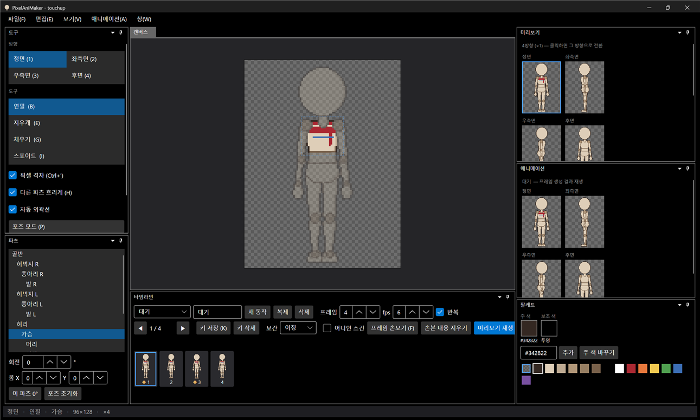

# 패치노트 — 6단계 ③: 배포

날짜: 2026-09-24 · 브랜치: `feature/packaging`

설치 없이 실행되는 exe 파일 하나를 만드는 publish 스크립트를 추가했다. .NET이 없는 PC에서도 실행된다. 앱 아이콘과 버전 정보(0.1.0)도 넣었다.

## 스크린샷

배포용 `publish/win-x64/PixelAniMaker.exe`로 `touchup.dotchar`를 연 화면. 제목 표시줄 왼쪽에 마네킹 머리 아이콘이 보인다.



## 추가된 것

| 항목 | 내용 |
| --- | --- |
| `scripts/publish.ps1` | 단일 파일, .NET 런타임 포함, 압축, 네이티브 디버그 파일 제거. 기본 `win-x64`, `-Runtime osx-arm64` / `linux-x64` 등 선택 |
| 결과 | `publish/win-x64/PixelAniMaker.exe` 44.6 MB (파일 하나) |
| 앱 아이콘 | 템플릿 머리로 만든 `Assets/app.ico` (16~256px), 실행 파일·창 아이콘 |
| 버전 정보 | 제품 이름 PixelAniMaker, 버전 0.1.0 (+ 커밋 해시) |

사용법:

```bash
powershell -ExecutionPolicy Bypass -File scripts/publish.ps1
```

## 검증

- exe로 `--export` 실행: 종료 코드 0, 시트·JSON·GIF 8개 파일 생성
- exe로 프로젝트 파일 열기: 화면·아이콘 정상, 메모리 약 215 MB
- 파일 속성: ProductName PixelAniMaker, ProductVersion 0.1.0

## 알려진 제한

- `.dotchar` 더블클릭으로 열기(파일 연결)는 아직 없음. 레지스트리를 바꾸는 작업이라 설치 프로그램이나 사용자 선택 메뉴로 따로 넣어야 함. 명령줄 열기(`PixelAniMaker.exe 파일.dotchar`)는 준비됨
- 맥·리눅스용은 스크립트로 빌드할 수 있지만 해당 OS에서 실행해 보지는 않음 (맥은 서명·공증이 필요할 수 있음)
- exe는 저장소에 올리지 않음 (`publish/`는 git 제외). 배포하려면 GitHub Releases에 따로 올려야 함
