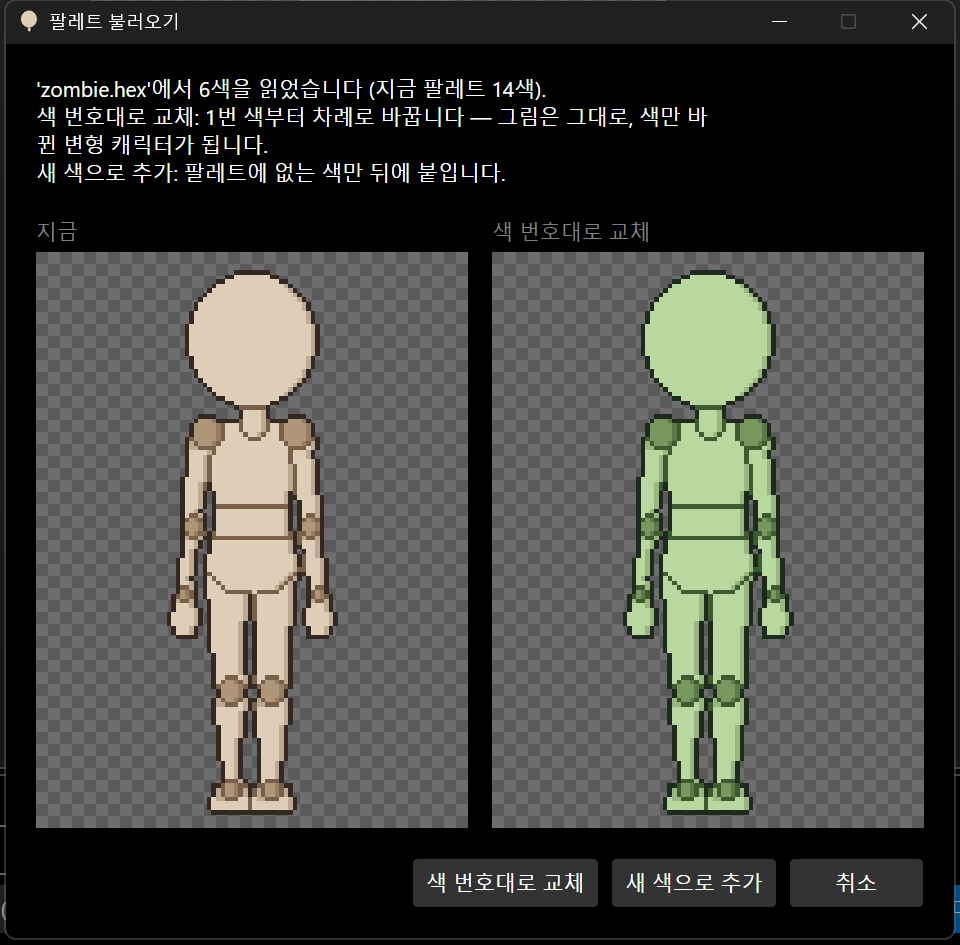
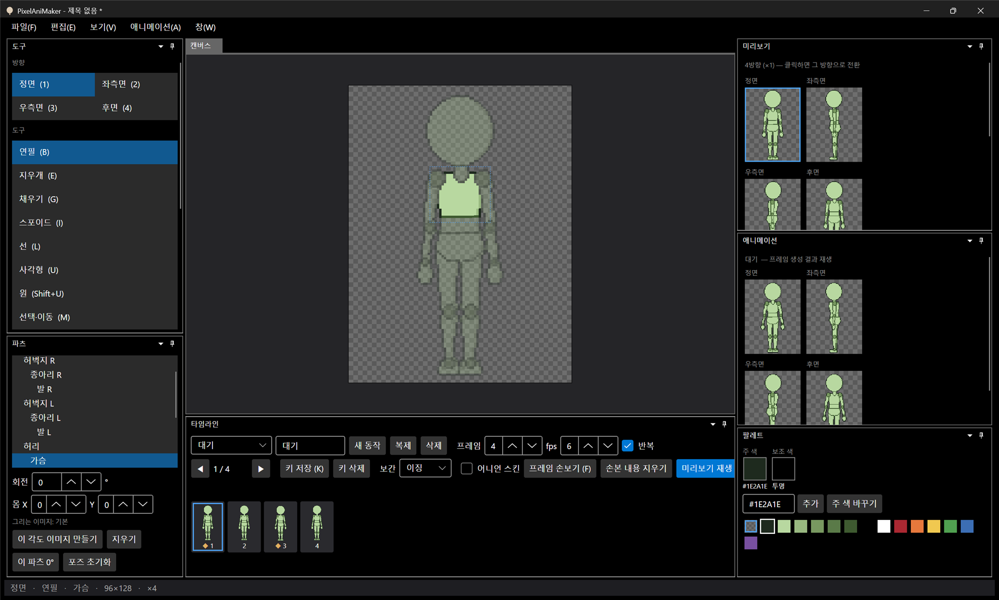

# 패치노트 — 백로그 ④: 팔레트 불러오기·내보내기

날짜: 2026-09-24 · 브랜치: `feature/palette-io`

다른 도트 툴(Aseprite, GIMP, Lospec)과 팔레트를 주고받고, 팔레트만 바꿔 색 변형 캐릭터를 만들 수 있게 했다. 적용 전에 바뀐 모습을 미리 본다.

## 스크린샷

파일 → 팔레트 불러오기로 6색짜리 `.hex`를 읽은 화면. 왼쪽이 지금, 오른쪽이 색 번호대로 교체했을 때의 미리보기.

"색 번호대로 교체"를 누른 결과 — 그림은 그대로, 1~6번 색만 바뀌었다. 7번 이후 색은 그대로 남는다. Ctrl+Z로 한 번에 원래 색으로 돌아간다.

## 기능

| 메뉴 | 내용 |
| --- | --- |
| 파일 → 팔레트 불러오기... | `.gpl`(GIMP·Aseprite), `.hex`(Lospec, 한 줄에 RRGGBB), `.png`(그림 속 서로 다른 불투명 색을 읽는 순서대로) |
| └ 색 번호대로 교체 | 불러온 색 i번째 → 팔레트 i번. 모자라면 남은 색 유지, 넘치면 뒤에 추가. 색 변형 캐릭터용 |
| └ 새 색으로 추가 | 팔레트에 없는 색만 뒤에 붙임 |
| 파일 → 내보내기 → 팔레트... | 저장 창에서 `.gpl` / `.hex` / `.png` 중 선택. 투명은 빼고 1번 색부터 |

- 교체·추가 모두 되돌리기 한 번에 취소. 추가를 되돌려 팔레트가 줄면 선택된 주/보조 색은 남은 마지막 색으로 옮겨진다.

## 구조

| 위치 | 내용 |
| --- | --- |
| `Core/Imaging/PaletteFile` | 세 형식 읽기·쓰기 |
| `Core/Imaging/PaletteSwap` | 교체·추가 계산, 미리보기용 복사본, 되돌리기 동작 |
| `Core/Imaging/Palette.ReplaceAll`, `ColorSelection` | 팔레트 통째 교체, 범위 밖 선택 보정 |
| `App` | `FileType` 확장자 여러 개, `MessageDialog`에 추가 내용(미리보기 그림), 메뉴 두 개 |
| 테스트 | 107개 통과 (세 형식 왕복, gpl 주석·이름, 잘못된 파일, 교체·추가·되돌리기, 미리보기) |

## 검증

- 앱 자동 조작: 불러오기 → 미리보기 창 → 교체 적용 → Ctrl+Z 복원
- 내보내기는 단위 테스트(세 형식 왕복)로만 확인했다 (앱에서 저장 창 조작은 하지 않음)
