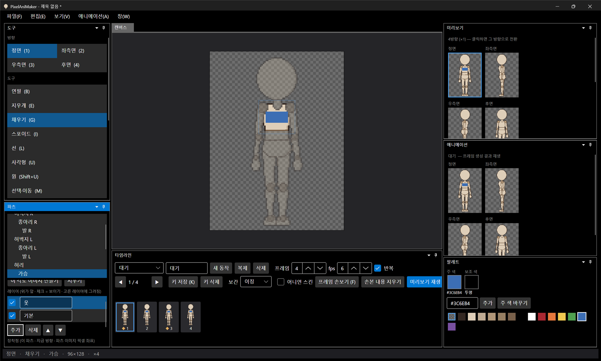
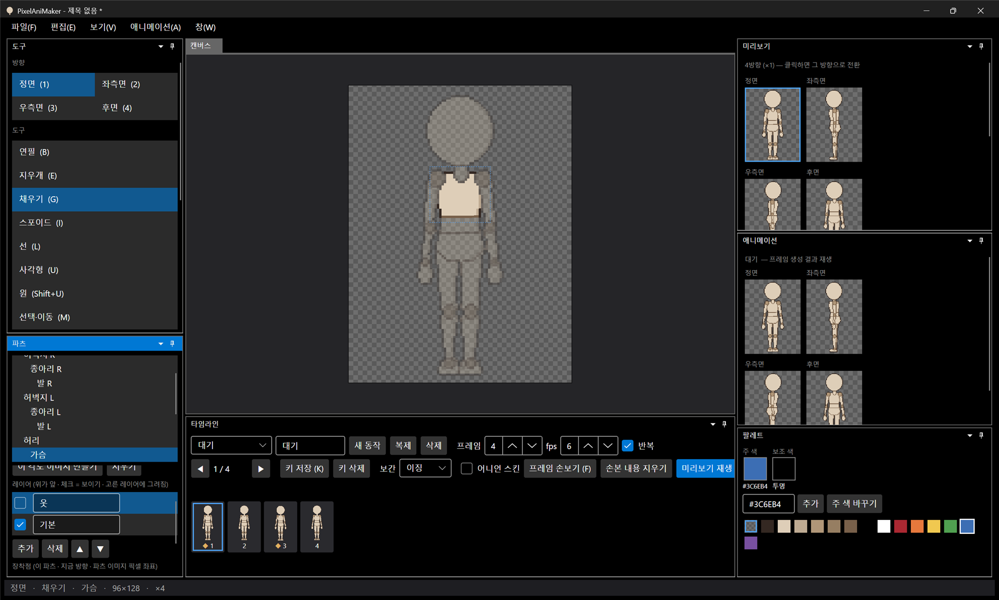

# 패치노트 — 백로그 ⑧: 파츠 안 레이어

날짜: 2026-09-24 · 브랜치: `feature/part-layers`

파츠 그림을 피부·옷·머리카락 같은 레이어로 나눠 그릴 수 있게 했다. 옷 레이어만 지우고 다시 그리거나, 숨겨서 맨몸을 확인할 수 있다.

## 스크린샷

가슴 파츠에 레이어를 추가해 이름을 `옷`으로 바꾸고 파란 옷을 그린 화면. 파츠 창에 레이어 목록(위가 앞)과 추가·삭제·▲·▼가 생겼다.



`옷` 레이어의 체크를 끈 화면 — 아래 `기본` 레이어(피부)가 그대로 남아 있다. Ctrl+Z로 다시 보인다.



## 기능

| 항목 | 내용 |
| --- | --- |
| 그리기 | 목록에서 고른 레이어에만 그려진다 (파츠를 바꿔도 같은 번째 레이어 유지, 그 파츠에 없으면 가장 가까운 레이어) |
| 추가 | 고른 레이어 바로 위에 빈 레이어 (`레이어`, `레이어 2` …) |
| 삭제 | 고른 레이어 삭제. 마지막 하나는 지울 수 없음 |
| ▲ ▼ | 앞/뒤 순서 바꾸기 |
| 보이기 | 체크 해제 시 화면·미리보기·애니메이션·내보내기 모두에서 빠짐 |
| 이름 | 칸에서 바꾸고 다른 곳을 누르면 적용 |
| 되돌리기 | 추가·삭제·순서·이름·보이기 모두 |

- 레이어는 파츠·방향마다 따로다. 우측면을 따로 그리면 좌측면 레이어를 복사해 시작한다.
- 대칭 그리기는 짝 파츠의 같은 번째 레이어에 그린다.
- **각도 이미지**(45° 교체 이미지)는 레이어가 없는 한 장짜리다. 만들 때는 보이는 레이어를 합친 모습에서 시작하고, 그 각도에서는 레이어 선택과 상관없이 각도 이미지에 그려진다.
- 합치기: 위 레이어의 투명하지 않은 칸이 아래를 덮는다. 레이어가 하나면 합치지 않고 그대로 쓴다 (기존과 동일한 동작·속도).

## 저장 형식

형식 버전은 그대로 1. 레이어가 하나뿐이고 이름이 `기본`이면 이전과 똑같이 저장된다.

```json
"front": { ..., "image": "front/chest.png",
  "layers": [ { "name": "기본", "image": "front/chest.png", "visible": true },
              { "name": "옷",   "image": "front/chest.layer1.png", "visible": true } ] }
```

## 구조

| 위치 | 내용 |
| --- | --- |
| `Core/Rigging/PartLayers` | `PartLayer`, `PartLayers.Flattened`(레이어 버전이 바뀔 때만 다시 합침), `LayerChange`(되돌리기) |
| `Core/Rigging/Part` | `PartView`가 레이어를 가짐, `Image`는 합친 결과 |
| `Core/Rigging/PartTransform.EditImage` | 그릴 대상: 각도 이미지 또는 고른 레이어 |
| `Core/Rigging/CharacterSpec`, `RightViewChange`, `Symmetry` | 저장·불러오기, 우측면 복사, 대칭 대상 |
| `App` | `EditorSession.ActiveLayer`와 레이어 조작, 파츠 창 레이어 목록(`LayerItem`) |
| `App` 파츠 창 | 설정 영역이 길어져 파츠 목록과 설정 사이에 크기 조절 막대를 두고 설정은 스크롤되게 바꿈 |
| 테스트 | 121개 통과 (한 장일 때 그대로, 덮기·숨기기·나중 편집 반영, 되돌리기·최소 1장, 합성, 저장·불러오기, 우측면 복사, 그릴 대상) |

## 검증 (앱 자동 조작)

- 가슴에 레이어 추가 → 사각형+채우기로 옷 → 이름 `옷`(붙여넣기) → 숨기기 → 피부 확인 → Ctrl+Z로 다시 보임
