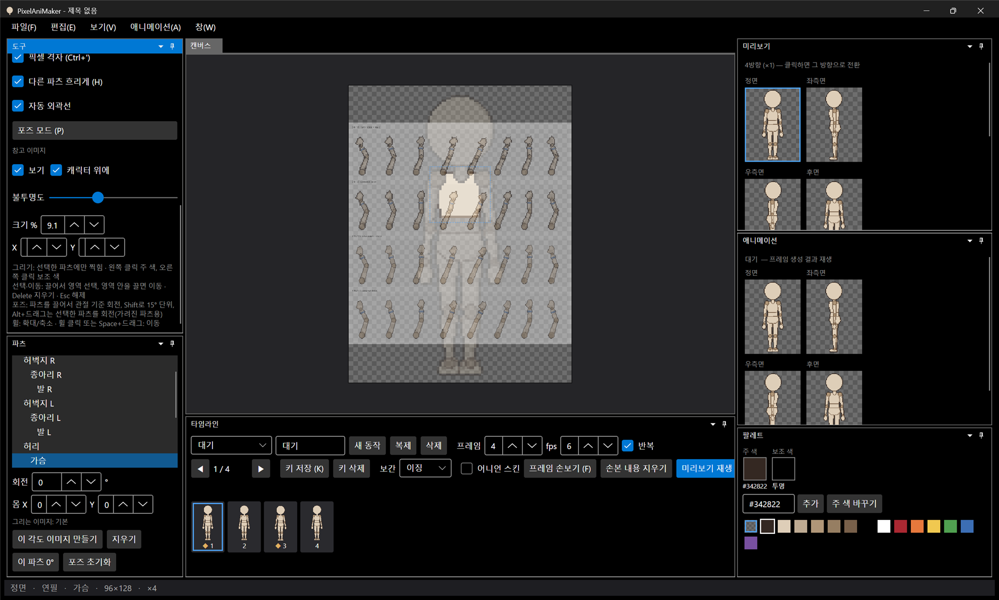
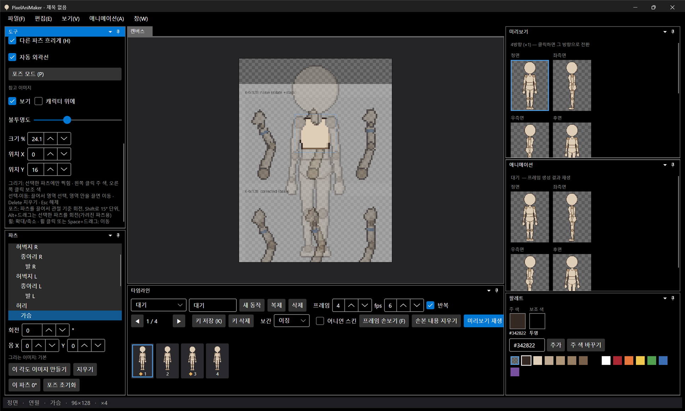

# 패치노트 — 백로그 ⑤: 참고 이미지

날짜: 2026-09-24 · 브랜치: `feature/reference-image`

원화·스케치를 캔버스에 반투명하게 깔고 그 위에서 도트를 찍을 수 있게 했다.

## 스크린샷

보기 → 참고 이미지 불러오기로 그림을 불러오고 "캐릭터 위에"를 켠 화면. 불러오면 캔버스에 맞게 줄여 가운데 놓인다. 도구 창에 참고 이미지 설정이 생겼다.

크기를 24.1%로 키우고 캐릭터 아래에 둔 화면. 캔버스 밖은 잘려 보인다.

## 기능

| 항목 | 내용 |
| --- | --- |
| 불러오기·지우기 | 보기 메뉴. PNG·JPG·BMP. **지금 방향**에만 적용 — 정면 원화, 측면 원화를 방향마다 따로 둘 수 있다 |
| 보기 | 켜기·끄기 |
| 캐릭터 위에 | 끄면 캐릭터 아래(밑그림), 켜면 위(윤곽 맞춰 보기) |
| 불투명도 | 5~100% (기본 40%) |
| 크기 %, 위치 X·Y | 캔버스 픽셀 단위. 불러올 때 캔버스에 맞게 자동 설정 |

- 작업 보조용이라 **프로젝트에 저장하지 않고**, 미리보기·애니메이션·내보내기 결과에도 들어가지 않는다.
- 우측면의 참고 이미지는 화면에 보이는 그대로 놓인다 (반전하지 않음).

## 구조

| 위치 | 내용 |
| --- | --- |
| `App/Services/ReferenceLayer` | 방향별 참고 그림, 표시 설정, 변경 이벤트 |
| `App/Services/EditorSession` | `Reference`, 방향 전환 연동 |
| `App/Controls/PixelCanvas` | 캐릭터 아래/위에 반투명으로 그림, 캔버스 영역으로 자름 |
| `App` | 보기 메뉴 두 항목, 도구 창 설정 |

UI 전용 기능이라 새 단위 테스트는 없다 (107개 그대로 통과).

## 검증 (앱 자동 조작)

- 불러오기 → 캔버스에 맞게 표시, 캐릭터 아래
- "캐릭터 위에" 켜기 → 캐릭터 위로
- 좌측면으로 전환 → 참고 이미지 없음 (방향별)
- 크기 ▲ 세 번 → 9.1% → 24.1%로 커짐, 캔버스 밖은 잘림
- 도구 창 좁은 폭에서 X·Y 값이 잘려 보여 두 줄로 나눔
