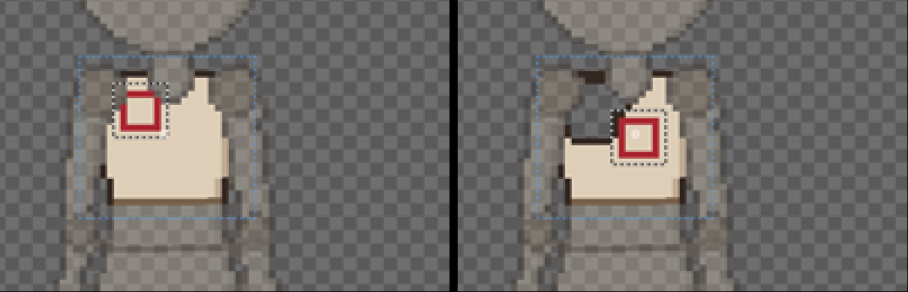
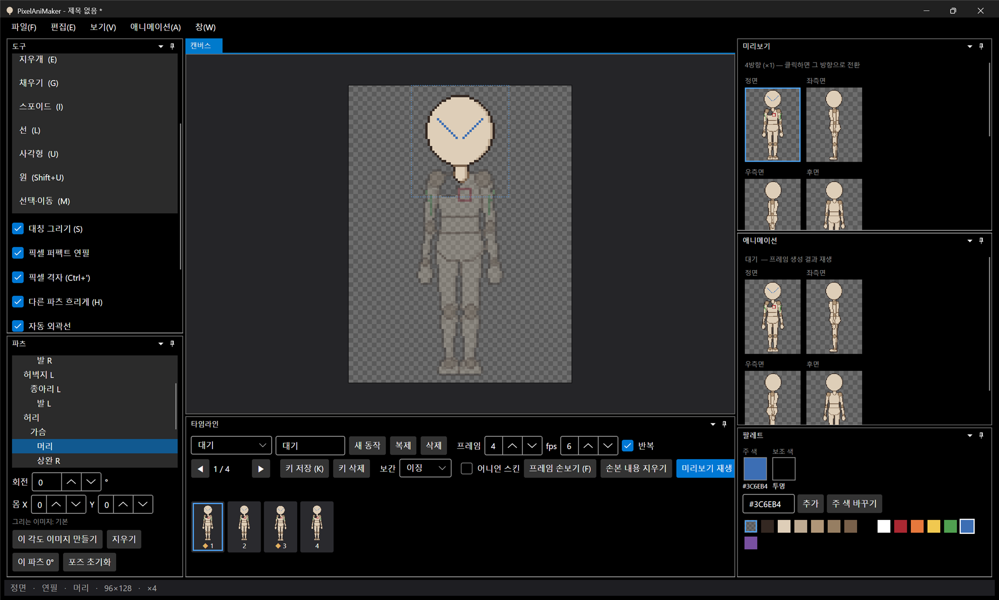

# 패치노트 — 백로그 ②: 선택·이동과 대칭 그리기

날짜: 2026-09-24 · 브랜치: `feature/selection-symmetry`

영역을 골라 옮기거나 지우는 선택·이동 도구와, 정면·후면에서 좌우를 한 번에 그리는 대칭 그리기를 추가했다.

## 스크린샷

선택·이동(M): 가슴 파츠에서 영역을 끌어 선택하면(왼쪽, 흰 점선) 영역 안을 끌어 옮길 수 있다(오른쪽). 옮긴 자리의 원래 칸은 투명해진다.

대칭 그리기(S): 상완 R에 그은 초록 선이 상완 L에도, 머리에 그은 파란 선이 몸 중심선 반대쪽에도 그려진다. 도구 창에 "대칭 그리기 (S)" 체크가 추가됐다.

## 추가된 기능

| 기능 | 단축키 | 내용 |
| --- | --- | --- |
| 선택·이동 | M | 선택 영역 밖에서 끌면 사각형 선택, 안에서 끌면 픽셀 이동(투명 칸은 옮기지 않음), 제자리 클릭은 선택 해제. 파츠가 돌아가 있어도 파츠 이미지 기준으로 선택되고 테두리도 같이 돈다 |
| 선택 영역 지우기 | Delete | 선택한 픽셀을 투명하게 |
| 선택 해제 | Esc | |
| 대칭 그리기 | S / 도구 창 체크 | 정면·후면에서 캔버스 중심선 기준으로 반대편에도 같이 그림. `_r`/`_l` 파츠는 짝 파츠에, 머리·가슴 같은 가운데 파츠는 자기 자신에. 연필·지우개·채우기·선·사각형·원 모두 적용, 선택·이동에는 적용 안 함. 측면에서는 꺼진 것처럼 동작 |

- 대칭으로 그린 양쪽은 **되돌리기 한 번**에 함께 되돌아간다.
- 손보기 모드(F)에서도 선택·이동·Delete를 쓸 수 있다 (대칭은 파츠 편집에서만).
- 중심선을 가로지르는 선·도형 미리보기도 흔적 없이 다시 그려진다.

## 구조

| 위치 | 내용 |
| --- | --- |
| `Core/Editing/PixelRect` | 선택 사각형 (양 끝 포함), 자르기·이동 |
| `Core/Editing/EditorDocument` | `Selection`, `SelectionChanged`, `DeleteSelection`, `Mirror` |
| `Core/Editing/Tools` | `SelectMoveTool` — 선택 획 / 이동 획 |
| `Core/Editing/PixelEdit` | `PixelMirror` — 한 편집이 대칭 위치(같은 이미지 또는 짝 파츠 이미지)에도 기록. 같은 이미지는 한 변경 목록에 넣어 미리보기 되돌리기가 겹치지 않게 함 |
| `Core/Rigging/Symmetry` | 짝 파츠 찾기, 파츠 픽셀 → 캔버스 → 중심선 반사 → 짝 파츠 픽셀 매핑 (포즈가 바뀌면 다시 계산) |
| `App` | 도구 목록·단축키(M, S, Delete, Esc), 캔버스 선택 테두리, 도구 창 체크 |
| 테스트 | 95개 통과 (선택·클릭 해제·이동+되돌리기·지우기·자르기, 다른 이미지 대칭 되돌리기, 같은 이미지 대칭 미리보기, 짝 파츠 3) |

## 검증 (앱 자동 조작)

- 가슴에 사각형을 그리고 선택 → 끌어서 이동, 원래 자리 투명 확인
- 대칭 켜고 상완 R·머리에 그리기 → 상완 L·머리 반대쪽에 같은 모양 확인
- Ctrl+Z 한 번에 양쪽이 같이 사라지고 Ctrl+Y로 복원 확인
