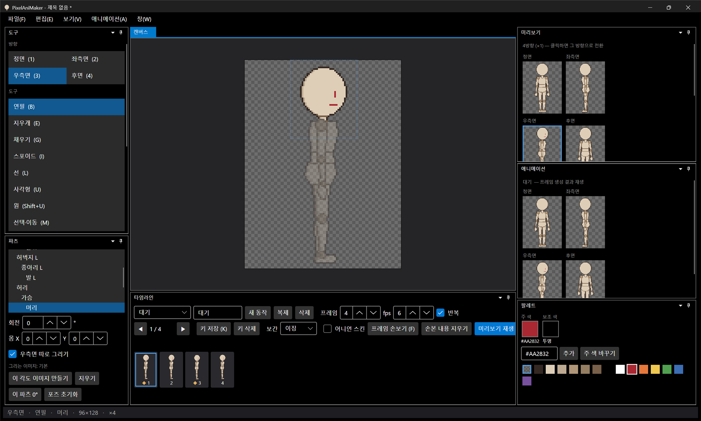
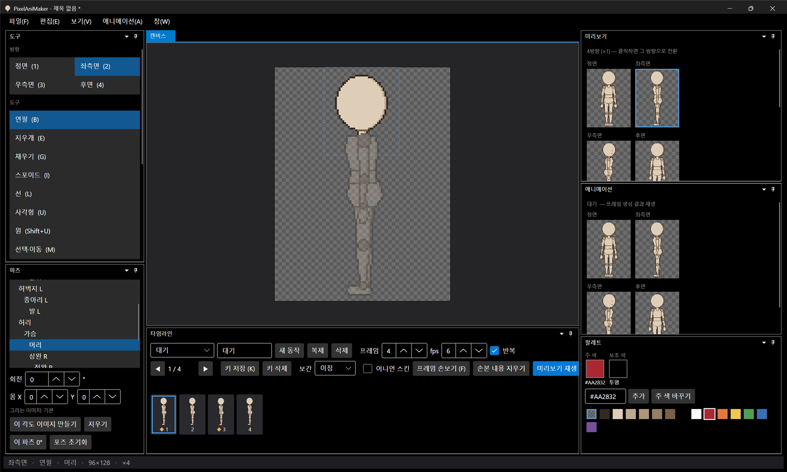

# 패치노트 — 백로그 ③: 우측면 따로 그리기

날짜: 2026-09-24 · 브랜치: `feature/separate-right-view`

우측면은 좌측면을 반전해 쓰는 것이 기본인데, 이제 파츠별로 반전을 끊고 우측면을 따로 그릴 수 있다 (비대칭 디자인용 — 한쪽 눈가리개, 한쪽 어깨 장식 등).

## 스크린샷

우측면(3)에서 머리를 고르고 파츠 창의 **우측면 따로 그리기**를 켠 뒤 눈·입을 그린 결과. 미리보기·애니메이션 창의 우측면에만 얼굴이 보인다.

같은 상태의 좌측면 — 그대로다.

## 동작

| 항목 | 내용 |
| --- | --- |
| 켜기 | 우측면에서 파츠를 고르고 파츠 창의 "우측면 따로 그리기" 체크 (우측면일 때만 보임). 좌측면 이미지·각도 이미지를 복사해 시작 |
| 끄기 | 체크 해제 → 다시 좌측면 반전 사용. 따로 그린 이미지는 버려짐 (Ctrl+Z로 되살릴 수 있음) |
| 포즈·키프레임 | 그대로 좌측면과 공유 (반전). 따로 그리는 것은 그림뿐 |
| 저장 | `skeleton.json`의 파츠 `views`에 `"right"`가 생기고 `parts/right/<파츠>.png`로 저장. 반전 파츠는 이전처럼 저장하지 않음 (기존 파일과 호환, 형식 버전 그대로 1) |
| 이미지 방향 | 우측면 이미지는 좌측면과 같은 방향(반전 전)으로 저장된다 — 관절 위치·각도 이미지를 좌측면과 그대로 맞추기 위함. 화면과 결과물에서는 반전되어 보인다 |

## 구조

| 위치 | 내용 |
| --- | --- |
| `Core/Rigging/Part` | `HasOwnRight`, `View(Right)`는 자체 우측면이 있으면 그것, 없으면 좌측면 |
| `Core/Rigging/RightViewChange` | 따로 그리기 켜기/끄기 (되돌리기 가능, 좌측면 복사로 시작) |
| `Core/Rigging/CharacterSpec` | `"right"` 뷰 읽기·쓰기 |
| `App/Services/EditorSession` | `SetOwnRight`, 우측면 클릭 판정을 우측면 합성 결과로 (이전엔 좌측면) |
| `App` 파츠 창 | 체크박스 |
| 테스트 | 99개 통과 (반전→분리→되돌리기, 우측면에만 반영, 저장·불러오기, 반전 파츠는 우측면 이미지 저장 안 함) |

## 검증 (앱 자동 조작)

- 우측면에서 머리 "따로 그리기" 켜고 눈·입 그리기 → 우측면 캔버스·미리보기·애니메이션에만 표시, 좌측면 그대로
- Ctrl+Z 세 번 → 그림 두 획과 따로 그리기가 차례로 취소, 체크 해제 확인
