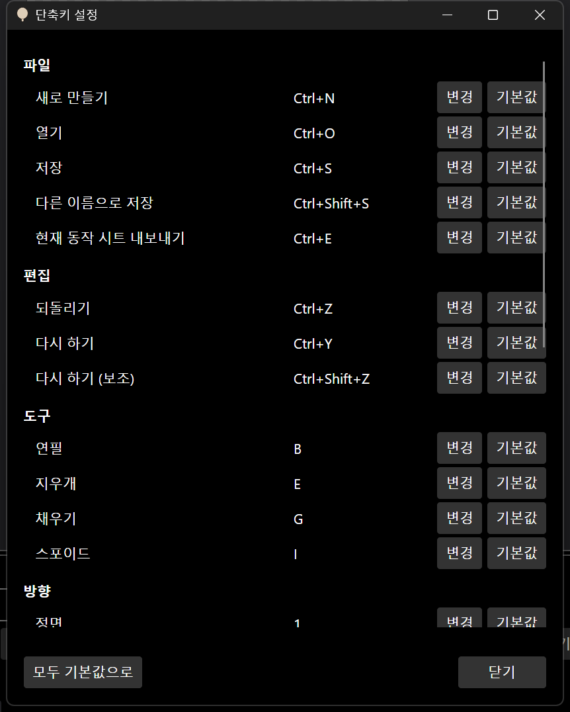
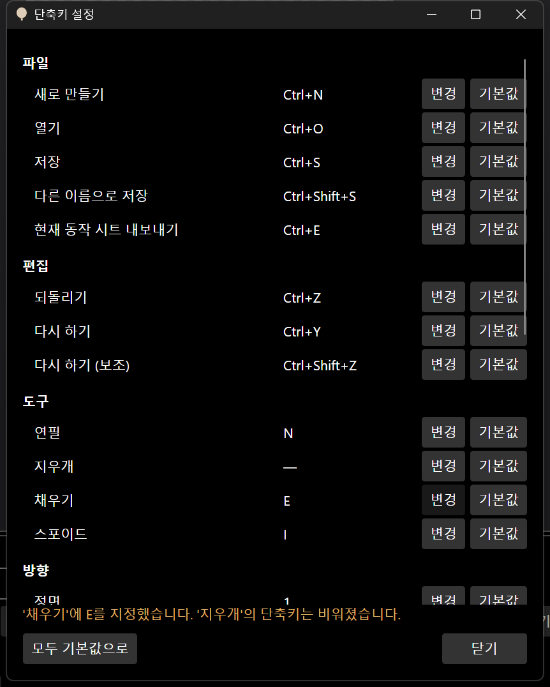
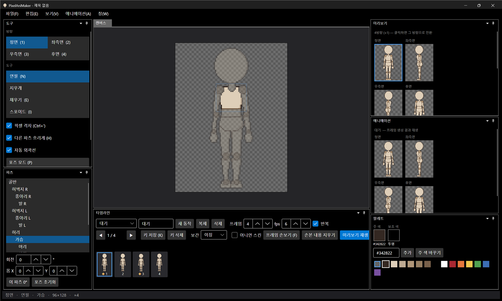

# 패치노트 — 6단계 ⑤: 단축키 목록·변경

날짜: 2026-09-24 · 브랜치: `feature/shortcuts`

모든 단축키를 한눈에 보고 바꿀 수 있다. 바꾼 단축키는 메뉴·도구 창·타임라인 표시와 실제 키 동작에 바로 반영되고, 다음 실행에도 유지된다.

## 스크린샷

창 → 단축키 설정. 파일·편집·도구·방향·보기·애니메이션 26개 항목.

연필을 N으로, 채우기를 E로 바꾼 결과. E는 지우개가 쓰던 키라서 지우개의 단축키가 비워졌다는 안내가 뜬다.

도구 창 표시가 "연필 (N)", "지우개", "채우기 (E)"로 바뀌었다. 이 상태에서 E를 누르면 채우기가 선택된다.

## 동작

| 항목 | 내용 |
| --- | --- |
| 변경 | "변경"을 누르고 원하는 키 조합을 누름. Esc 취소, Delete는 단축키 없음 |
| 겹침 | 다른 기능이 쓰던 키를 지정하면 그 기능의 단축키는 비워지고 안내가 뜸 |
| 기본값 | 항목별 "기본값", 전체 "모두 기본값으로" |
| 반영 | 창의 키 연결, 메뉴의 단축키 표시, 도구·방향 목록, 격자·흐리게·포즈 체크, 타임라인 버튼 |
| 저장 | 기본값과 다른 항목만 `settings.json`의 `Shortcuts`에 저장 |

## 구조

| 위치 | 내용 |
| --- | --- |
| `App/Services/Shortcuts` | `ShortcutCatalog`(기본 키를 정의하는 유일한 곳), `ShortcutMap`(현재 키, 겹침 처리, 저장용 변경분) |
| `App/Views/MainWindow` | XAML에 고정돼 있던 키 연결을 제거하고 `ShortcutMap`으로 실행 중에 만듦 |
| `App/ViewModels/MainWindowViewModel` | 단축키 id → 명령 연결, 단축키 설정 명령 |
| `App/Views/ShortcutsWindow` | 단축키 설정 창 |
| `App/Converters` | `ShortcutLabelConverter`(이름 + 현재 키) |
| `ToolItem` | 고정 키 문자 대신 단축키 id를 가짐 |

## 검증 (앱 자동 조작)

- 단축키 설정 창에서 연필 → N, 채우기 → E (지우개 키가 비워짐 안내 확인)
- 도구 창 표시 변경 확인, E를 눌러 채우기 선택 확인 (상태줄)
- `settings.json`에 변경분 `{"Tool.Pencil":"N","Tool.Eraser":"","Tool.Fill":"E"}` 저장 확인
- "모두 기본값으로" 후 저장된 변경분이 비워짐 확인
