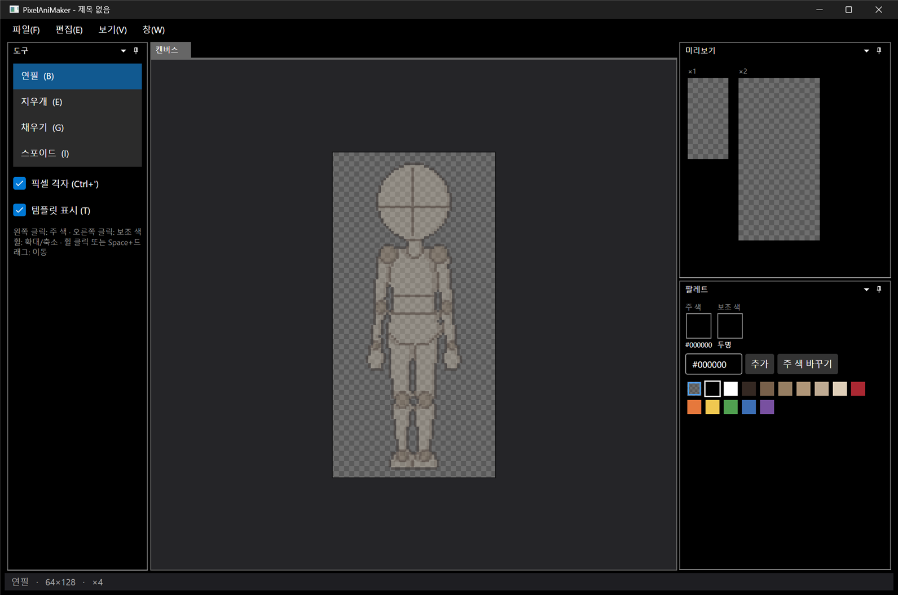
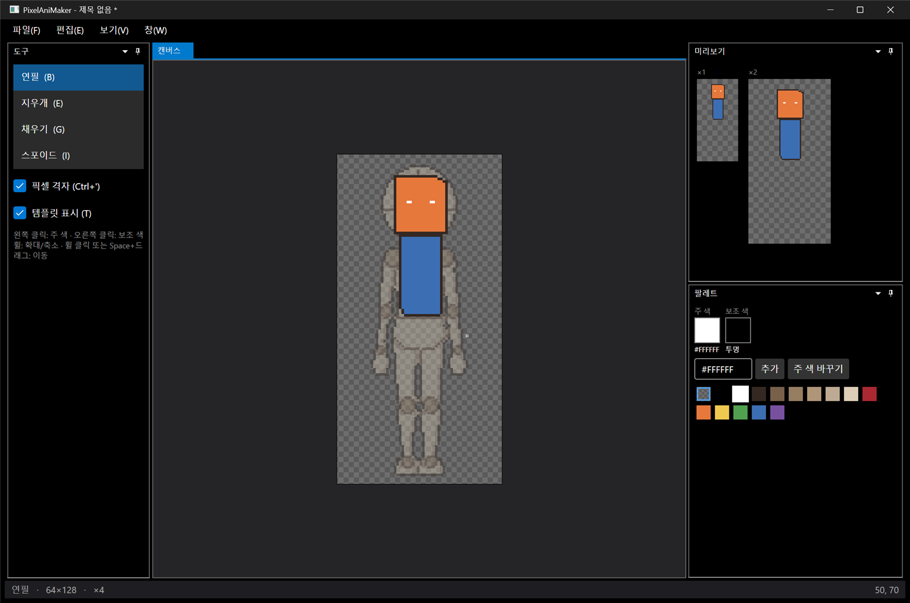

# 패치노트 — 1단계: 도트 편집기 기초

날짜: 2026-09-24 · 브랜치: `feature/stage1-pixel-editor`

C# .NET 8 + Avalonia UI로 프로젝트 뼈대를 만들고, 도킹 창이 있는 도트 편집기 기초를 구현했다.

## 스크린샷

처음 실행한 화면. 4등신 마네킹 템플릿이 캔버스 뒤에 반투명으로 깔린다.

연필로 테두리를 그리고 채우기로 색을 넣은 결과. 오른쪽 미리보기(×1, ×2)가 그리는 즉시 갱신된다.

## 추가된 기능

| 영역 | 내용 |
| --- | --- |
| 도킹 창 | 도구(왼쪽), 캔버스(가운데), 미리보기(오른쪽 위), 팔레트(오른쪽 아래). 창을 끌어서 옮기거나 떼어낼 수 있음. 창 → 창 배치 초기화 |
| 캔버스 | 64×128, 반투명 마네킹 템플릿(T로 켜고 끄기), 체커보드 배경, 6배 이상에서 픽셀 격자, 커서 위치 픽셀 강조 |
| 확대·이동 | 휠로 커서 기준 확대·축소(×1~×48), 휠 클릭 또는 Space+드래그로 이동, Ctrl+= / Ctrl+- |
| 도구 | 연필(B), 지우개(E), 채우기(G), 스포이드(I). 왼쪽 클릭은 주 색, 오른쪽 클릭은 보조 색 |
| 팔레트 | 인덱스 팔레트(색 수 제한 없음), 마네킹 색 포함 기본 18색, `#RRGGBB`로 색 추가, 주 색 바꾸기(그 색을 쓰는 픽셀도 함께 변경) |
| 되돌리기 | Ctrl+Z / Ctrl+Y(또는 Ctrl+Shift+Z). 한 번 긋기·한 번 채우기가 되돌리기 한 단위 |
| 상태 표시 | 제목 옆 `*`(저장 안 한 변경), 아래 상태줄에 도구·캔버스 크기·배율·커서 좌표 |

## 구조

| 프로젝트 | 내용 |
| --- | --- |
| `src/PixelAniMaker.Core` | `IndexedImage`, `Palette`, `EditorDocument`(도구 입력 처리), `UndoHistory`, `PixelEditAction` |
| `src/PixelAniMaker.App` | Avalonia 12.1.3 + Dock.Avalonia 12.1.0.6. `PixelCanvas`, `PixelPreview` 컨트롤, 도킹 레이아웃 |
| `tests/PixelAniMaker.Core.Tests` | 단위 테스트 13개 (선 그리기, 채우기 경계, 되돌리기, 저장 표시 등) — 모두 통과 |
| `scripts/capture-window.ps1` | 패치노트용 앱 창 캡처 스크립트 |

## 수정한 문제

- 마우스를 빠르게 움직이다 떼면 선이 뗀 위치까지 그려지지 않던 문제: 버튼을 뗄 때 그 위치까지 선을 이어서 긋도록 수정

## 알려진 제한

- 주 색 바꾸기는 아직 되돌리기 대상이 아님
- 픽셀 퍼펙트 선 보정, 선·도형·선택 도구 없음
- 저장·불러오기 없음 (개발 계획 5단계)

## 문서

- 설계 문서의 기술 스택을 WPF에서 Avalonia로 변경 (맥·리눅스 지원)
- README에 실행·테스트 방법 추가
