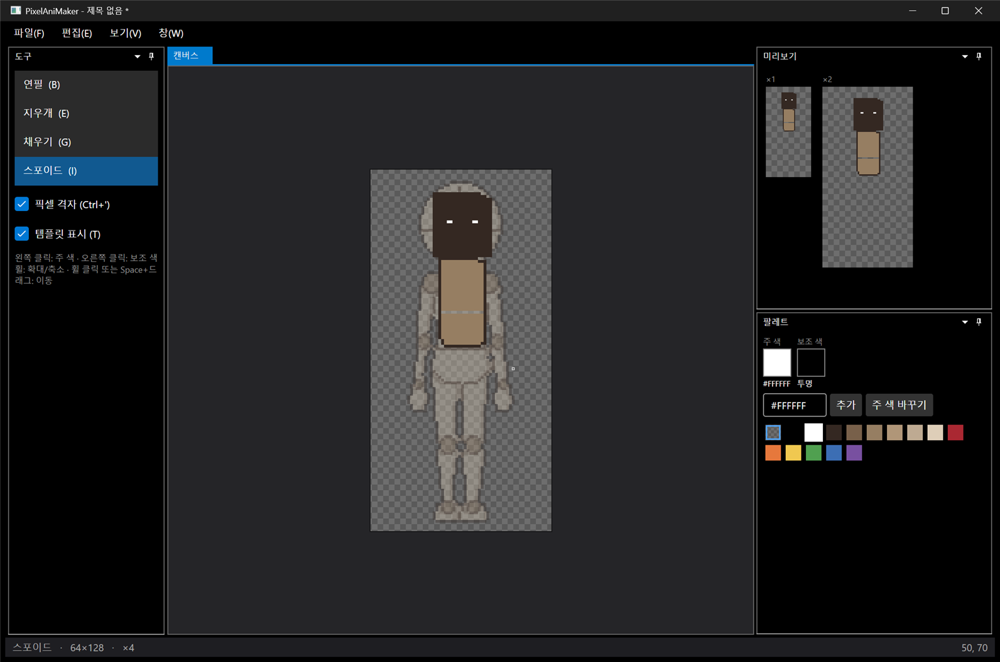

# 패치노트 — 1단계 정리: SOLID·KISS·DRY 적용

날짜: 2026-09-24 · 브랜치: `feature/stage1-pixel-editor` → `main` 병합

1단계 코드를 SOLID·KISS·DRY 원칙으로 점검하고 정리했다. 기능은 그대로이고, 새 도구를 추가할 때 고칠 곳이 한 군데로 줄었다.

## 스크린샷

단축키(G → E → B → I)로 도구를 바꿔 가며 채우기·지우개·연필을 쓴 결과. 도구 창과 상태줄이 단축키에 맞춰 바뀐다.

## 변경 내용

| 원칙 | 이전 | 이후 |
| --- | --- | --- |
| 개방-폐쇄 (OCP) | `EditorDocument`가 `switch (ToolKind)`로 모든 도구를 직접 처리 | 도구마다 `ITool` 구현(`PencilTool`, `FillTool`, `EyedropperTool`). 문서는 `ITool`/`IStroke`만 앎 |
| 단일 책임 (SRP) | 선 그리기·영역 채우기 알고리즘이 문서 클래스 안에 있음 | `Raster` 정적 클래스로 분리 (`Line`, `FloodRegion`) |
| 단일 책임 (SRP) | 16진수 색 파싱이 팔레트 뷰모델 안에 있음 | `Rgba.TryParseHex`로 이동, 테스트 6개 추가 |
| DRY | 도구 이름·단축키가 도구 창과 상태줄에 따로 정의 | `ToolCatalog` 한 곳에서 정의. 새 도구는 여기에 한 줄 추가 |
| DRY | 캔버스와 미리보기가 세션 연결·재그리기 코드를 각각 가짐 | 공통 부모 `SessionControl`로 이동, 체커보드+이미지 그리기도 공유 |
| DRY | 팔레트 입력 오류 처리가 명령마다 반복 | `TryReadInput` 하나로 통합 |
| KISS | 도구 창이 선택 도구를 별도 속성으로 동기화 | 목록 선택을 `Session.CurrentTool`에 직접 바인딩 |
| KISS | 지우개가 별도 분기 | 투명 색으로 고정된 연필(`PencilTool.Eraser`) |

이름 변경: `PixelEditAction` → `PixelEdit`

## 검증

- 빌드 경고 0개, 오류 0개
- 단위 테스트 19개 통과 (이전 13개 + 16진수 파싱 6개)
- 실행해서 단축키 전환, 채우기, 지우개, 연필 동작 확인 (스크린샷)
