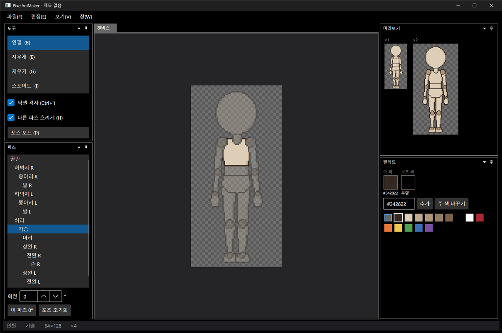
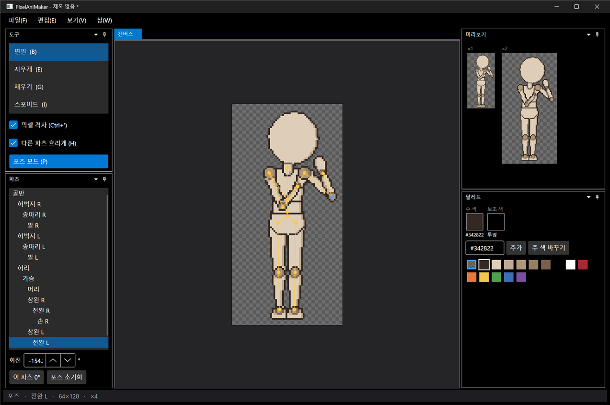
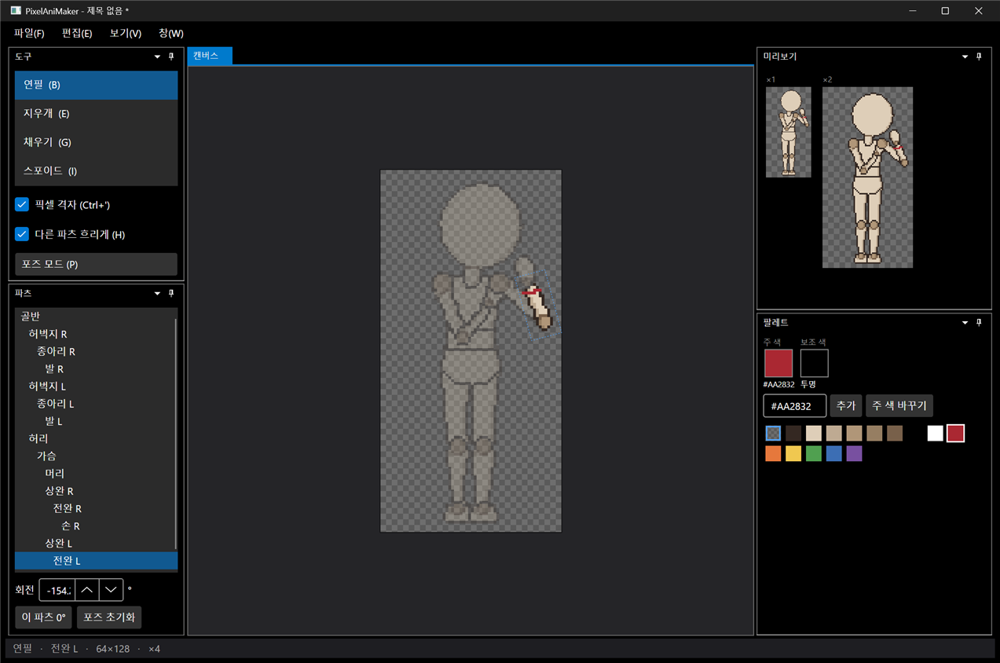

# 패치노트 — 2단계: 파츠·스켈레톤

날짜: 2026-09-24 · 브랜치: `feature/stage2-parts-skeleton`

4등신 마네킹을 16개 파츠로 나누고 관절로 연결했다. 포즈 모드에서 파츠를 끌어 관절 기준으로 돌리고, 그리기 모드에서는 돌아간 파츠 위에 바로 도트를 찍는다. 합성 결과는 도트 전용 회전(Scale2x ×3 샘플링)으로 만든다.

## 스크린샷

시작 화면. 왼쪽 아래 파츠 창에 스켈레톤 계층이 보이고, 선택한 파츠(가슴)만 또렷하게, 나머지는 흐리게 보인다. 점선은 선택한 파츠의 이미지 범위.

포즈 모드(P). 관절 점과 뼈대가 표시되고, 파츠를 끌어서 돌린다. 오른팔은 가슴 쪽으로 접고, 왼팔은 들어 올린 상태. 미리보기에 포즈가 바로 반영된다.

그리기 모드(B)로 돌아와, 돌아간 전완 L 위에 빨간 띠를 그린 결과. 캔버스 좌표가 파츠 원본 이미지 좌표로 역변환되어 원본에 찍힌다.

## 추가된 기능

| 영역 | 내용 |
| --- | --- |
| 템플릿 | 마네킹을 16개 파츠 PNG + `skeleton.json`(부모, 그리기 순서, 관절 위치)으로 분리. 생성 스크립트 `mannequin/make_chibi_parts.py` |
| 스켈레톤 | 골반이 루트인 트리. 부모가 돌면 자식이 따라 돈다 (순운동학) |
| 합성 | 90° 배수 회전은 픽셀 그대로, 그 외 각도는 8배 Scale2x 이미지에서 샘플링 → 팔레트 밖 색이 생기지 않음. 파츠 편집 시 캐시 자동 갱신 |
| 파츠 창 | 계층 목록에서 편집할 파츠 선택, 회전 각도 숫자 입력(5° 단위), "이 파츠 0°", "포즈 초기화" |
| 포즈 모드 (P) | 파츠를 클릭하면 선택, 끌면 관절 기준 회전, Shift로 15° 단위. 뼈대·관절 점 표시 |
| 그리기 모드 | 선택한 파츠에만 그려짐. 캔버스 → 파츠 원본 좌표 역변환이라 돌아간 상태에서도 그릴 수 있음 |
| 다른 파츠 흐리게 (H) | 그리기 모드에서 선택 외 파츠를 반투명으로 |
| 되돌리기 | 파츠 그리기, 관절 회전, 포즈 초기화가 하나의 히스토리 (Ctrl+Z / Ctrl+Y) |

## 구조

| 위치 | 내용 |
| --- | --- |
| `Core/Rigging` | `Part`, `Character`(파츠·팔레트·히스토리 공유, 순운동학), `Pose`, `PartTransform`(캔버스 ↔ 파츠 좌표), `Compositor`, `CharacterSpec`(skeleton.json), `PoseChange`(되돌리기) |
| `Core/Imaging/Scale2x` | 도트 확대(EPX), 회전 샘플링용 8배 이미지 |
| `Core/Editing/ColorSelection` | 주 색·보조 색을 모든 파츠가 공유하도록 분리 |
| `App/Controls/CanvasInteractions` | 그리기(`DrawInteraction`)와 포즈(`PoseInteraction`) 입력을 캔버스에서 분리 |
| `App/ViewModels/PartsViewModel` | 파츠 창 |
| `scripts/ui-input.ps1` | 패치노트 데모용 마우스·키 입력 함수 |
| 테스트 | 36개 통과 (스켈레톤·합성·좌표 변환·포즈 되돌리기 17개 추가) |

## 수정한 문제

- 이미 선택된 도구의 단축키를 누르면 포즈 모드가 꺼지지 않던 문제: 도구 선택은 항상 포즈 모드를 끄도록 수정
- 캡처 스크립트가 창이 뜨기 전에 실행되면 실패하던 문제: 창 제목으로 찾고 최대 30초 기다림

## 변경된 동작

- 캔버스 뒤에 깔던 반투명 템플릿 그림을 없앴다. 템플릿이 이제 실제 파츠라서 그 위에 바로 그린다. `T` 단축키 대신 `H`(다른 파츠 흐리게), `P`(포즈 모드)

## 알려진 제한

- 64×128 캔버스에서는 팔을 옆으로 크게 벌리면 캔버스 밖으로 나간다 (어깨~손끝 약 47px, 어깨~캔버스 가장자리 약 20px). 캔버스 폭을 늘릴지 결정 필요
- 회전된 파츠의 외곽선·음영은 아직 다시 그리지 않음 (4단계 프레임 생성에서 처리)
- 도구 목록에서 이미 선택된 도구를 다시 클릭하는 경우에는 포즈 모드가 유지됨 (단축키·포즈 버튼으로 전환)
