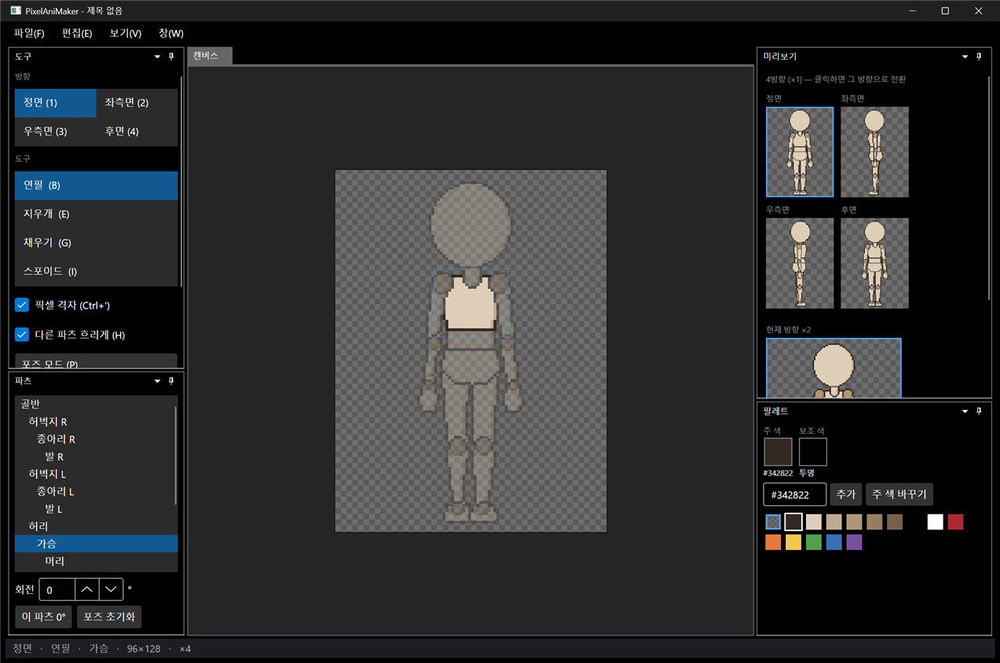
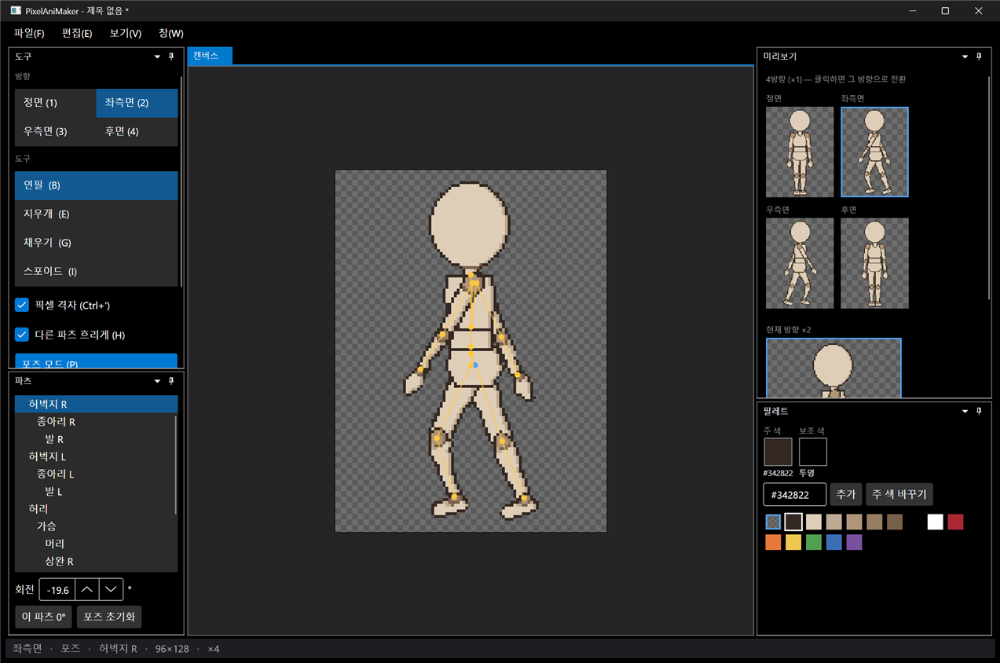
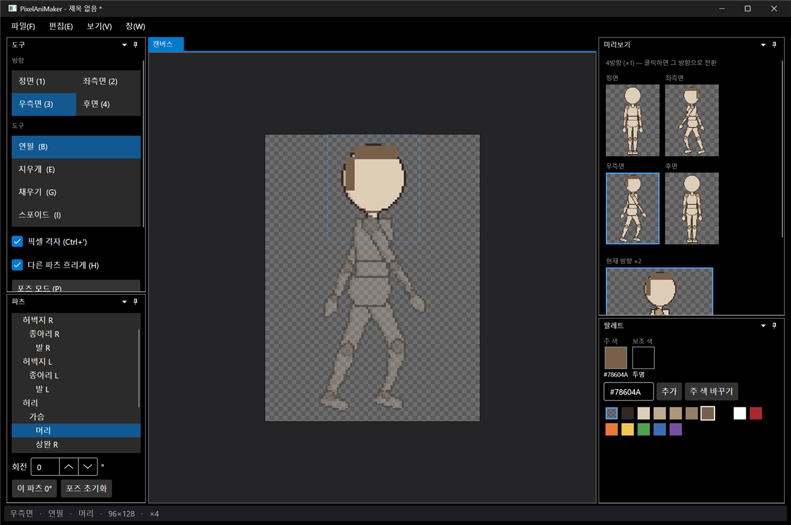

# 패치노트 — 3단계: 4방향

날짜: 2026-09-24 · 브랜치: `feature/stage3-four-directions`

캐릭터를 정면·좌측면·우측면·후면 4방향으로 그리고 포즈를 잡을 수 있다. 우측면은 좌측면을 좌우 반전해 보여주고, 우측면에서 그리거나 포즈를 바꾸면 좌측면 데이터에 반전되어 들어간다. 캔버스는 96×128로 넓혔다.

## 스크린샷

정면. 오른쪽 미리보기 창에 4방향이 ×1로 동시에 보이고, 파란 테두리가 현재 방향이다. 미리보기를 클릭하면 그 방향으로 바뀐다.

좌측면(2)에서 포즈 모드로 걷는 자세를 잡은 결과. 몸통 뒤에 가려진 먼 쪽 팔은 정면에서 선택해 두고 Alt+드래그로 돌렸다. 우측면 미리보기는 반전된 같은 자세이고, 정면·후면 포즈는 따로라 그대로다.

우측면(3)에서 머리 뒤쪽에 머리카락을 그린 결과. 좌측면 미리보기에도 좌우가 뒤집혀 나타난다.

## 추가된 기능

| 영역 | 내용 |
| --- | --- |
| 캔버스 | 64×128 → **96×128**. 캐릭터 크기(4등신, 머리 약 30px)는 그대로, 양옆 여백 16px씩 추가 |
| 템플릿 | 정면·좌측면·후면 파츠를 따로 생성 (`Assets/Templates/chibi96/{front,left,back}/`). 측면은 먼 쪽 팔다리를 몸 뒤에 그리는 순서 |
| 방향 전환 | 도구 창의 방향 목록, 단축키 1~4, 미리보기 클릭 |
| 우측면 | 좌측면을 좌우 반전해 표시. 그리기·포즈 입력도 반전해서 좌측면 데이터에 기록 |
| 방향별 포즈 | 정면·좌측면(=우측면)·후면이 각자 포즈를 가짐 |
| 방향별 그리기 순서 | 파츠마다 방향별 z순서 (측면에서 먼 쪽 팔은 몸통 뒤) |
| 4방향 미리보기 | ×1 네 방향(2×2) + 현재 방향 ×2 |
| Alt+드래그 (포즈) | 커서 아래 파츠 대신 선택한 파츠를 돌림 — 다른 파츠에 가려진 파츠용. 빈 곳을 끌어도 선택한 파츠가 돎 |

## 구조

| 위치 | 내용 |
| --- | --- |
| `Core/Rigging/Direction` | 방향 enum, `Source()`(우측면 → 좌측면), `IsMirrored()` |
| `Core/Rigging/Part` | 방향별 모습 `PartView`(이미지, 위치, 관절, 그리기 순서) |
| `Core/Rigging/Character` | 방향별 `Pose`, `ComputeTransforms(direction)`, `DrawOrder(direction)` |
| `Core/Rigging/Compositor` | 방향별 합성, 우측면은 결과를 좌우 반전 |
| `App/Services/EditorSession` | 현재 방향, 4방향 미리보기 비트맵, `ToSource`/`FromSource`(반전 좌표 변환) |
| `App/Controls/CanvasInteractions` | 입력을 `CanvasInput`(좌표, 오른쪽 버튼, Shift, Alt) 하나로 묶음 |
| 테스트 | 41개 통과 (방향별 배치·그리기 순서, 우측면 반전, 방향별 포즈, 우측면 그리기 → 좌측면 이미지 5개 추가) |

## 수정·개선

- 캡처 스크립트: 막 켠 앱은 도킹 창이 그려질 때까지 기다린 뒤 캡처
- 도구 창에 스크롤 추가, 미리보기를 2×2 배치로 바꿔 좁은 창에서도 4방향이 보이게 함

## 알려진 제한

- 우측면을 좌측면과 다르게 따로 그리는 기능(반전 끊기)은 아직 없음. 지금은 항상 반전
- 정면과 후면은 이미지가 따로라 한쪽에 그린 것이 다른 쪽에 반영되지 않음 (의도된 동작)
- 파츠 창 목록은 선택된 항목으로 자동 스크롤됨
