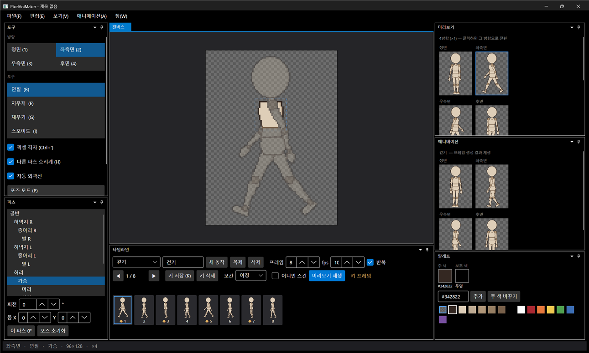
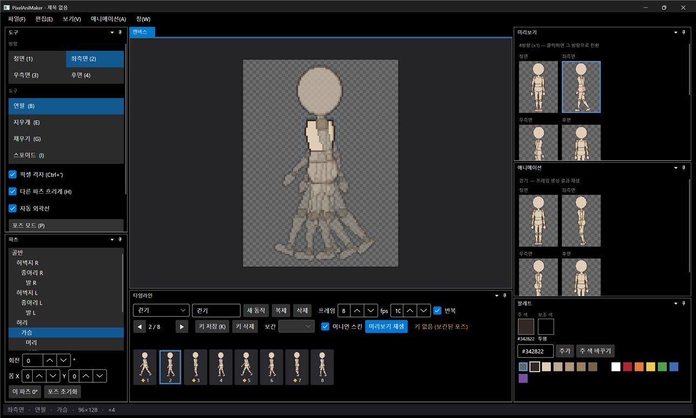
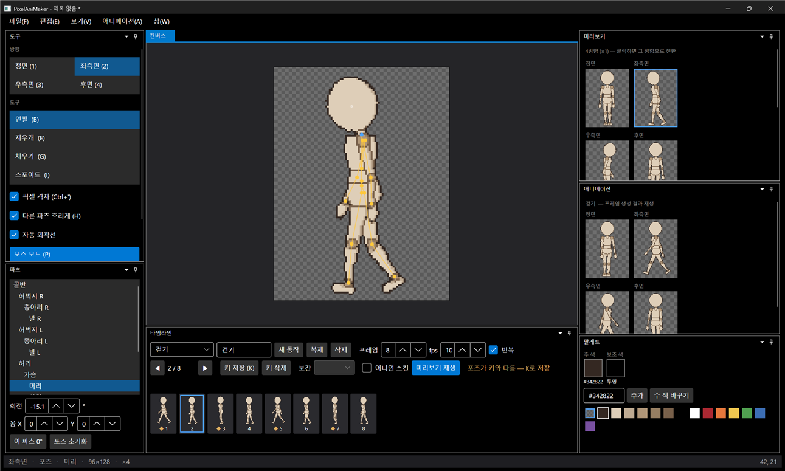

# 패치노트 — 4단계: 애니메이션

날짜: 2026-09-24 · 브랜치: `feature/stage4-animation`

키프레임 애니메이션을 만들고, 프레임마다 보간·도트 회전 보정·자동 외곽선을 거친 결과를 바로 재생해 볼 수 있다. 기본 동작 6종(대기·걷기·달리기·점프·공격·피격)이 4방향으로 들어 있다.

## 결정 사항 (이번 단계)

| 항목 | 결정 |
| --- | --- |
| 외곽선 | **자동 외곽선 켜기·끄기**. 켜면 회전 후 1px 외곽선과 파츠 경계선을 다시 그림. 엔진 셰이더로 외곽선을 넣을 경우 끄면 파츠를 그린 그대로 출력 |
| 기본 보간 | **이징**. 키마다 이징·선형·계단으로 바꿀 수 있음 |
| 방향별 키프레임 | 정면·측면·후면 각각 키를 잡음 (우측면은 측면 반전). 기본 동작 6종은 세 방향 모두 채워 둠 |

## 스크린샷

걷기, 좌측면. 아래 타임라인의 프레임 바에 프레임별 썸네일과 키(◆)가 보이고, 오른쪽 가운데 애니메이션 창에서 4방향이 동시에 재생된다.

어니언 스킨(O). 앞뒤 프레임이 반투명하게 겹쳐 보인다.

키가 없는 2번 프레임에서 포즈 모드로 머리를 기울이면 "포즈가 키와 다름 — K로 저장"이 뜬다.

K를 누르면 2번 프레임에 키(◆)가 생기고, 프레임 썸네일과 애니메이션 재생에 바로 반영된다.

## 추가된 기능

| 영역 | 내용 |
| --- | --- |
| 타임라인 창 (아래) | 동작 선택·이름 변경·새 동작·복제·삭제, 프레임 수, fps, 반복 |
| 프레임 바 | 프레임별 썸네일(현재 방향), 키 표시 ◆, 클릭해서 프레임 선택 |
| 키 편집 | 키 저장(K), 키 삭제, 키별 보간 선택, 이전/다음 프레임(, .). 저장 안 된 포즈 경고 |
| 보간 | 키 사이 각도는 가까운 방향으로, 몸 위치는 선형 보간 후 정수 px로 맞춤 |
| 프레임 생성 | 모든 프레임 × 4방향을 합성(보간 → 도트 회전 → 자동 외곽선). 편집 후 0.12초 뒤 자동 갱신 |
| 애니메이션 창 | 생성된 프레임을 fps대로 4방향 동시 반복 재생, "미리보기 재생"으로 멈춤·재개 |
| 어니언 스킨 (O) | 앞뒤 프레임을 반투명으로 캔버스에 표시 |
| 몸 위치 | 파츠 창에 몸 X/Y(px) 입력. 점프·숨쉬기·피격 밀림에 사용 |
| 자동 외곽선 | 도구 창 체크박스 |
| 기본 동작 6종 | 대기 4f · 걷기 8f · 달리기 6f · 점프 5f · 공격 5f · 피격 3f (생성 스크립트 `mannequin/make_animations.py`) |
| 되돌리기 | 키 저장·삭제·보간 변경, 몸 위치도 같은 히스토리 |
| 창 | 시작 시 최대화. 레이아웃: 도구·파츠 | 캔버스·타임라인 | 미리보기·애니메이션·팔레트 |

## 구조

| 위치 | 내용 |
| --- | --- |
| `Core/Animation/AnimationClip` | 방향별 키 트랙, `Evaluate`(보간), `Easing`, `KeyframeChange`(되돌리기) |
| `Core/Animation/SpriteBaker` | 클립 × 4방향 프레임 합성 |
| `Core/Animation/AnimationJson` | 기본 동작 JSON 읽기 |
| `Core/Rigging/Outline` | `OutlineSettings`(켜기·색), `OutlinePass`(실루엣 → 외곽선, 겹침 → 경계선) |
| `Core/Rigging/Pose` | 몸 위치 추가, 불변 스냅샷 `PoseData`. `PoseChange`를 스냅샷 기반 하나로 통합 |
| `App/Services/AnimationSession` | 동작 목록, 현재 프레임, 키 저장, 프레임 생성, 재생 타이머 |
| `App/Services/CompositeBitmap` | 합성 결과 → 비트맵 (캔버스·미리보기·프레임이 공유) |
| `App/ViewModels/DockFactory` | 창 생성 도우미(`Panel`, `Column`, `Split`)로 정리 |
| 테스트 | 53개 통과 (보간·반복·계단·짧은 경로 회전·방향별 트랙·키 되돌리기·JSON 9개, 외곽선 3개 추가) |

## 알려진 제한

- 스프라이트 시트 파일로 내보내기와 프로젝트 저장은 5단계
- 프레임을 줄이면 범위 밖 키는 지워지지 않고 재생에서만 빠짐 (다시 늘리면 돌아옴)
- 기본 동작의 포즈는 마네킹 기준의 초안이라 캐릭터에 맞게 손볼 필요가 있음
