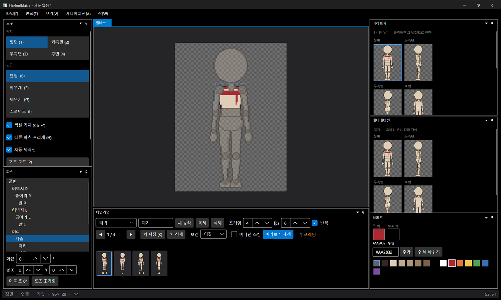
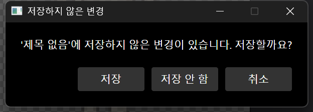
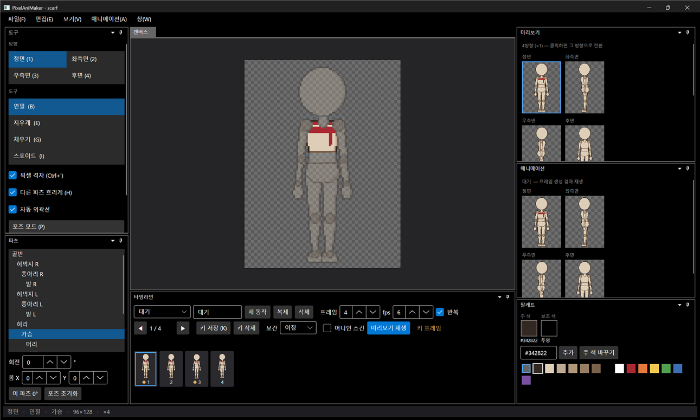
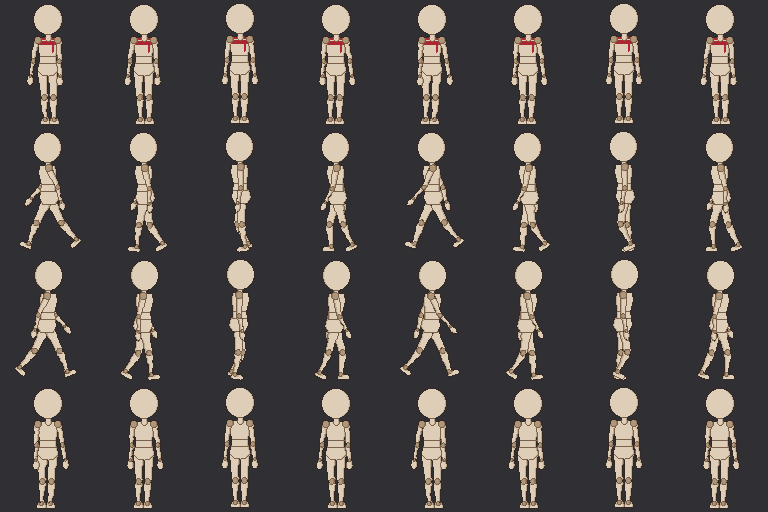
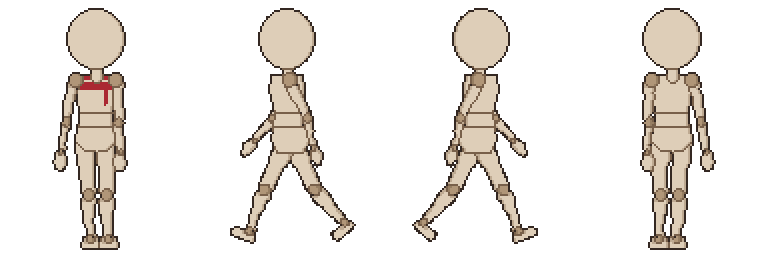

# 패치노트 — 5단계: 저장·불러오기·내보내기

날짜: 2026-09-24 · 브랜치: `feature/stage5-save-export`

프로젝트를 `.dotchar` 파일로 저장하고 다시 열 수 있고, 동작을 스프라이트 시트 PNG(+ 메타데이터 JSON)와 GIF로 내보낸다. 이로써 첫 버전 범위(1~5단계)의 기능이 모두 들어갔다.

## 스크린샷

가슴 파츠에 빨간 스카프를 그린 상태 (제목에 저장 안 됨 `*`).

새로 만들기(Ctrl+N)를 누르면 저장하지 않은 변경을 확인한다. 열기·창 닫기에서도 같은 창이 뜬다.

저장한 `scarf.dotchar`를 다시 연 화면. 제목이 파일 이름으로 바뀌고 스카프와 동작 목록이 그대로 복원된다.

내보낸 전체 시트 중 걷기 부분(행: 정면·좌측면·우측면·후면, 열: 프레임). 스카프는 정면에만 그렸으므로 정면 행에만 보이고, 우측면 행은 좌측면 행의 반전이다.

내보낸 걷기 GIF (4방향, ×2, 10fps, 무한 반복).

## 추가된 기능

| 영역 | 내용 |
| --- | --- |
| 프로젝트 파일 `.dotchar` | zip: `project.json`(포맷 버전, 팔레트, 외곽선), `skeleton.json`, `animations.json`, `parts/<방향>/<파츠>.png`. 다른 도구로도 열어볼 수 있음. 새 버전 포맷은 거부 |
| 저장 | 저장(Ctrl+S), 다른 이름으로 저장(Ctrl+Shift+S). 임시 파일에 쓴 뒤 교체해 저장 실패 시 기존 파일 보존 |
| 열기 | 열기(Ctrl+O), 최근 파일 8개(설정 `%AppData%/PixelAniMaker/settings.json`) |
| 저장 확인 | 새로 만들기·열기·닫기 전에 저장/저장 안 함/취소. 동작 이름·프레임 수·fps·반복·추가·삭제도 변경으로 인식 |
| 시트 PNG | 현재 동작(Ctrl+E) 또는 전체 동작 통합. 동작마다 4행, 칸 96×128 |
| 메타데이터 JSON | 칸 크기, 발 위치 원점(48, 125), 동작별·방향별 프레임 좌표와 지속시간. 엔진 무관. 메뉴에서 켜고 끔 |
| GIF | 현재 동작, 4방향 가로 배치, ×2, 투명 배경, 반복 여부는 동작 설정을 따름 |
| 명령줄 | `PixelAniMaker 파일.dotchar` — 파일 열기. `PixelAniMaker --export 파일.dotchar [--out 폴더]` — 창 없이 전체 시트(+JSON)와 동작별 GIF를 쓰고 종료 (종료 코드 0/1) |

## 구조

| 위치 | 내용 |
| --- | --- |
| `Core/Project/ProjectFile` | .dotchar 저장·불러오기. 이미지는 `IImageCodec`으로만 다룸 (Core는 UI 라이브러리에 의존하지 않음) |
| `Core/Imaging/RgbaImage` | `RgbaImage`, `IImageCodec` 인터페이스 |
| `Core/Export/SpriteSheet` | 시트 배치, 원점 계산, 메타데이터 JSON |
| `Core/Export/GifEncoder`, `AnimationGif` | GIF89a 인코더(LZW 직접 구현), 동작 GIF |
| `App/Services/AvaloniaImageCodec` | Avalonia(Skia) PNG 인코딩·디코딩. 템플릿 로딩도 공유 |
| `App/Services/ProjectService` | 새로 만들기·열기·저장·내보내기 |
| `App/Services/AppSettings` | 최근 파일, 메타데이터 여부, GIF 배율 |
| `App/Services/CommandLine`, `BatchExporter` | 명령줄 열기·일괄 내보내기 |
| `App/Views/MessageDialog` | 확인·오류 창 |
| 테스트 | 63개 통과 (저장→불러오기 왕복, 포맷 버전, 시트 배치·반전·메타데이터, LZW 왕복(클리어 코드 포함), GIF 헤더·팔레트 제한·크기, 키 순서 10개 추가) |

## 검증

- 앱에서 편집 → 저장 확인 창 → 저장: 51개 항목(JSON 3 + PNG 48) 확인
- 저장 파일을 명령줄 인자로 열기: 제목·스카프·동작 목록 복원, 최근 파일 기록 확인
- 명령줄 내보내기 결과를 Python(PIL)으로 검사: 시트 768×3072, 모든 정면 프레임에 스카프, 우측면 행 = 좌측면 행 반전, GIF 8프레임·100ms·무한 반복

## 수정한 문제

- **저장한 파일이 다시 열리지 않던 문제**: Skia가 zip 안의 압축 스트림(앞뒤 이동 불가)에서 이미지를 읽지 못함 → 코덱이 메모리로 복사한 뒤 읽도록 수정. 읽기 실패는 `InvalidDataException`으로 바꿔 앱이 멈추지 않고 오류 창을 띄움
- `AnimationClip.Keys()` 형변환 오류 (4단계부터 존재, 타임라인 "복제"에서 멈춤) — 테스트로 발견해 수정

## 알려진 제한

- 창 닫기 확인은 새로 만들기와 같은 로직이지만 앱에서 직접 확인하지 않음
- 로그 출력(명령줄)의 한글은 콘솔 인코딩에 따라 깨져 보일 수 있음 (파일 이름은 정상)
