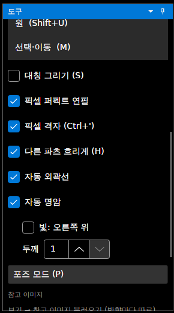
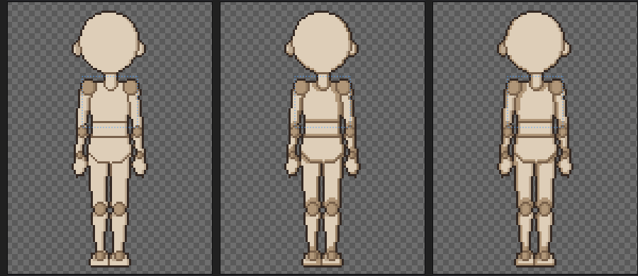
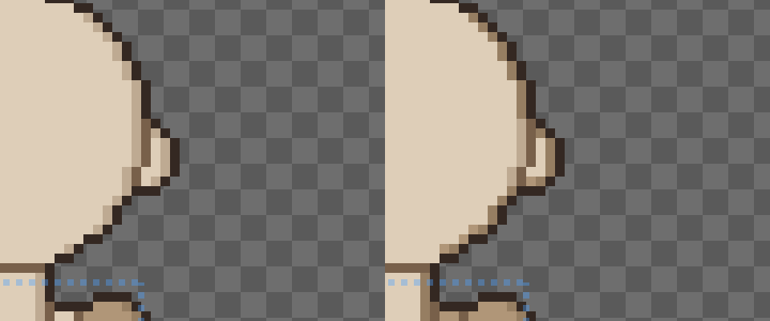

# 패치노트 — 자동 명암

날짜: 2026-09-25 · 브랜치: `claude/work-environment-setup-a3u93e` · 다음 루트: [progress.md](../progress.md) 3.5절 8번

도구 창의 **자동 명암**을 켜면, 파츠마다 빛 반대쪽 가장자리(아래와 옆)를 팔레트에 있는 한 단계 어두운 색으로 칠한다. 파츠가 돌아가도 매 프레임 다시 계산하므로, 회전한 팔다리에도 그림자 쪽이 유지된다. 기본은 꺼짐.

## 스크린샷

도구 창: 자동 외곽선 아래에 자동 명암, 빛 방향(끄면 왼쪽 위, 켜면 오른쪽 위), 두께(1~3px).

왼쪽부터: 끔, 켬(빛 왼쪽 위 → 오른쪽·아래 가장자리가 어두움), 켬(빛 오른쪽 위 → 왼쪽·아래).

머리 오른쪽 가장자리 확대 (왼쪽 끔, 오른쪽 켬): 외곽선 안쪽 1px이 한 단계 어두운 색이 된다.

## 규칙

| 항목 | 내용 |
| --- | --- |
| 칠하는 곳 | 파츠 안에서, 빛 반대쪽 가로 방향과 아래쪽으로 두께만큼 가면 그 파츠 밖(빈 곳이나 다른 파츠)이 나오는 픽셀 |
| 외곽선과 함께 | 가장 바깥 1px은 외곽선이 되므로, 명암은 그 안쪽부터 두께만큼 |
| 세부 파츠(눈) | 부모(머리)와 한 덩어리로 봐서, 눈과 얼굴이 만나는 곳에는 명암이 생기지 않음 |
| 어두운 색 고르기 | 그 색을 3/4 밝기로 만든 색에 가장 가까운 팔레트 색. 분명히 더 어둡고(밝기 차 8 이상) 너무 멀지 않을 때만 — 없으면 그 색은 그대로 (예: 팔레트에 어두운 빨강이 없으면 빨강은 안 칠함) |
| 제외 | 외곽선 색·파츠 경계선 색 (외곽선을 켰을 때) |
| 반영 | 편집 캔버스, 미리보기, 애니메이션, 시트·GIF·프레임별 PNG 내보내기 모두. 손본 픽셀은 그 위에 그대로 |
| 파츠 이미지 | 바뀌지 않음 (그릴 때마다 계산) |

## 저장과 호환

- 켰을 때만 `project.json`에 `"shading": {"enabled": true, "light": "TopLeft", "width": 1}`을 쓴다. 끄면 파일이 이전과 같다 (기준 파일 테스트 그대로 통과).
- 형식 버전은 그대로. 이전 버전은 이 항목을 무시하고 명암 없이 보여 준다.
- 자동 외곽선·자동 명암 설정을 바꾸면 "저장 안 한 변경"(`*`)으로 표시되고, 닫을 때 저장 확인도 묻는다 (전에는 자동 외곽선을 켜고 끄기만 하면 표시되지 않았음 — 이번에 같이 고침). 앱에서 확인: 켜기 → `*`, 저장 → 없어짐, 외곽선 끄기 → `*`.

## 구조

| 위치 | 내용 |
| --- | --- |
| `Core/Rigging/Shading` | `ShadingSettings`(켜기·빛 방향·두께), `ShadingPass`(명암 칠하기, 어두운 색 표) |
| `Core/Rigging/Compositor` | 파츠를 그린 뒤, 외곽선 전에 명암 |
| `Core/Rigging/Character` | `Shading` |
| `Core/Project/ProjectFile` | `shading` 읽기·쓰기 (켰을 때만) |
| `App/Services/EditorSession`, `Views/ToolboxView.axaml` | 자동 명암·빛 방향·두께, 설정 변경을 저장 안 한 변경으로 (`HasUnsavedSettings`) |
| `App/Services/ProjectService`, `ViewModels/MainWindowViewModel` | 저장 안 한 변경 판단·제목 `*`에 설정 변경 포함 |

## 테스트

- `ShadingTests`: 어두운 색 고르기(한 단계 어두운 색, 없으면 그대로, 제외 색), 켜면 파츠 안의 픽셀만 바뀌고 빛 방향에 따라 달라지며 끄면 그대로, 켰을 때만 저장·불러오기.
- 앱에서 확인: 위 스크린샷.
- 전체 164개 통과, 번역 누락 증가 없음.
