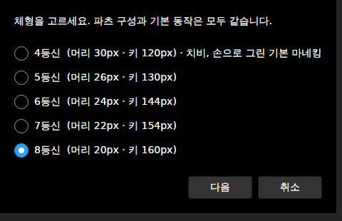
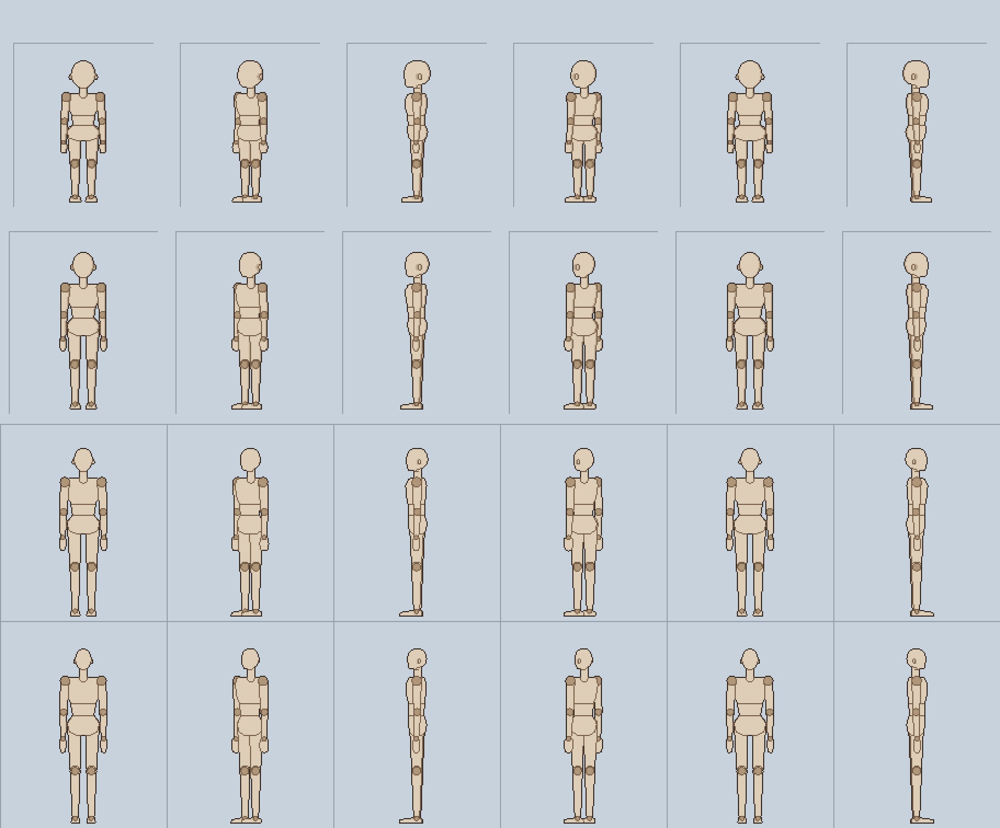
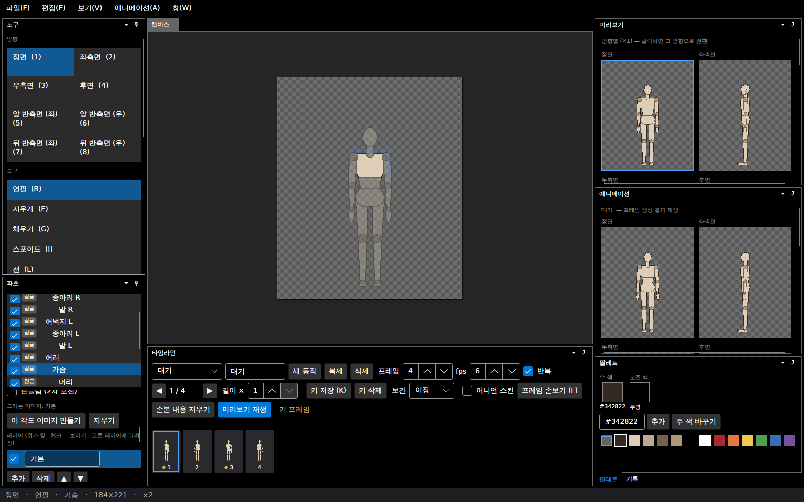
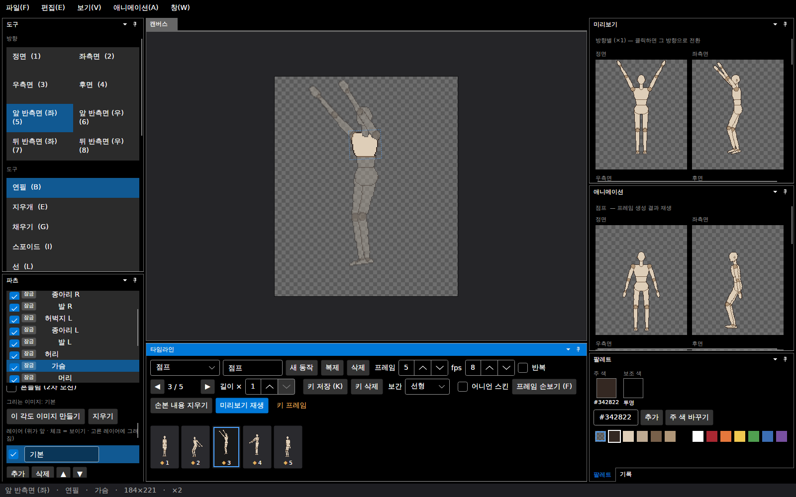
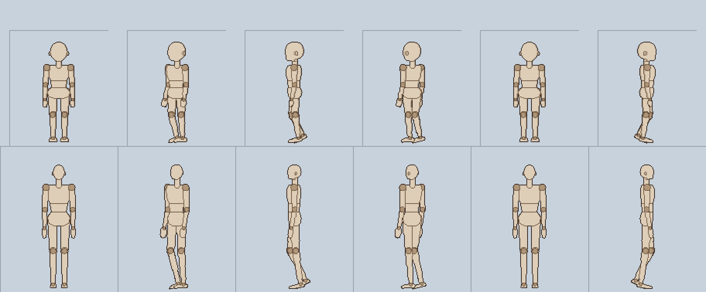

# 패치노트 — 등신 선택 (4~8등신 마네킹)

날짜: 2026-09-25 · 브랜치: `claude/work-environment-setup-a3u93e` · 계획: [plan-body-proportions.md](../plan-body-proportions.md)

## 1. 새로 만들기에서 체형 고르기

**파일 → 새로 만들기**가 먼저 체형을 묻는다: **4등신**(치비, 손으로 그린 기본 마네킹) · **5 · 6 · 7 · 8등신**. 그다음은 전과 같이 기본 동작과 반측면 포함을 고른다. 관절 원 없는 마네킹(새로 만들기 (관절 원 없는 마네킹))도 모든 체형에 적용된다.

| 체형 | 머리 | 키 | 새 프로젝트 캔버스 |
| --- | --- | --- | --- |
| 4등신 (기본) | 30px | 120px | 128×160 (전과 같음) |
| 5등신 | 26px | 130px | 160×182 |
| 6등신 | 24px | 144px | 168×199 |
| 7등신 | 22px | 154px | 184×212 |
| 8등신 | 20px | 160px | 184×221 |

## 2. 만들어진 마네킹

5~8등신은 프로그램이 그린다. 몸을 3D 관절로 잡고 방향마다 돌려서(정면 0° · 앞 반측면 45° · 좌측면 90° · 뒤 반측면 135° · 후면 180°) 투영하므로 모든 방향의 비율이 맞는다. 윤곽선·겹침선·음영·관절 원 색은 4등신 마네킹과 같다.

위에서부터 5 · 6 · 7 · 8등신, 왼쪽부터 정면 · 앞 반측면 · 좌측면 · 뒤 반측면 · 후면 · 우측면(반전).

- 파츠 16개의 이름·부모·순서 규칙이 4등신과 같아서 기본 동작, 눈·가슴 볼륨·임의 파츠, 그리는 순서 편집이 그대로 동작한다.
- 등신이 클수록 다리 비중이 커지고(4등신 40% → 8등신 50%), 머리는 좁아지고, 어깨는 넓어진다.

8등신, 반측면 포함으로 만든 프로젝트 (184×221):

## 3. 기본 동작

같은 동작을 쓰되 몸 이동(점프 높이 등)은 키에 비례해 늘린다 (8등신은 4등신의 1.33배). 캔버스는 팔을 머리 위로 드는 점프·앞으로 뻗는 공격이 들어가게 잡았다 — 5~8등신 모두 기본 동작 전 방향에서 캔버스 끝 경고 없음 (테스트로 확인).

점프 3프레임, 앞 반측면:

걷기 3프레임 (위 5등신, 아래 8등신):

## 4. 확장하는 법

`BodyProportions.Table`에 한 줄(등신, 목, 몸통, 다리, 기본 머리 px)을 더하면 그 체형이 새로 만들기 목록에 나온다. 표 사이 값(예: 6.5등신)은 보간해서 만들 수 있다 (코드에서 `BodyProportions.For(6.5)`).

## 5. 코드

| 파일 | 내용 |
| --- | --- |
| `Core/Rigging/Body/BodyProportions.cs` | 비율 표, 보간, 머리 단위 길이·너비·굵기 |
| `Core/Rigging/Body/BodyLayout.cs` | 3D 관절 위치, 파츠별 모양(몸통·머리 단면 투영, 팔다리 캡슐, 손·발 볼록 껍질) |
| `Core/Rigging/Body/LabelRaster.cs` | 모양 채우기(절반 이상 덮인 픽셀), 마네킹 색 규칙 |
| `Core/Rigging/Body/MannequinBuilder.cs` | 방향별 투영, 파츠 자르기, 그리는 순서, `CharacterSpec` + 이미지 |
| `Core/Animation/AnimationClip.cs` | `ScaleOffsets` — 키의 몸 이동을 배율만큼 (정수 픽셀) |
| `App/Services/TemplateLoader.cs` | `LoadMannequin(heads, …)`, `BodyTypes`, 기본 동작 배율 |
| `App/Views/MainWindow.axaml.cs` | `PickOneAsync` — 하나 고르기 창 |

## 6. 테스트

16개 추가 (전체 215개 통과): 표의 합 = 등신, 보간, 범위 밖 거부 · 파츠 이름·라벨·부모가 4등신 템플릿과 같음, 모든 방향에 그림 · 키 = 등신 × 머리 px · 모든 관절이 부모 그림 위 · 그리는 순서(정면 팔이 가슴 앞, 측면 먼 팔이 맨 뒤) · 기본 동작이 5~8등신 모두 캔버스 안 · 이동 배율 반올림 · 같은 입력 같은 그림, 관절 원 끄기.
