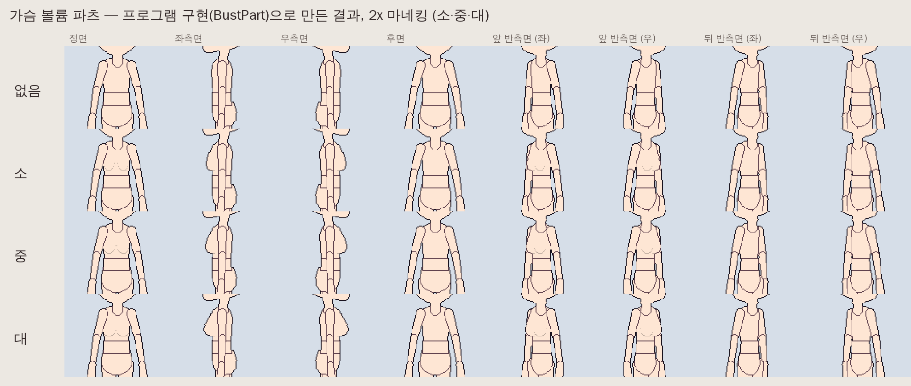
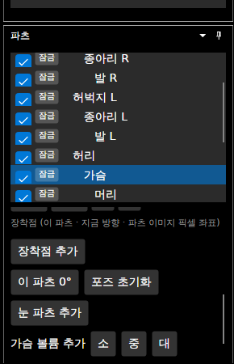
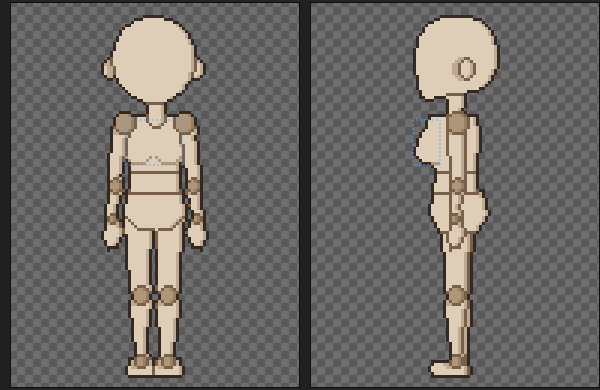
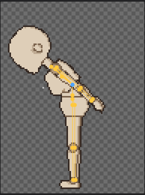

# 패치노트 — 가슴 볼륨 파츠

날짜: 2026-09-25 · 브랜치: `claude/work-environment-setup-a3u93e` · 계획: [plan-bust-part.md](../plan-bust-part.md)

여성 캐릭터용 선택 파츠 **가슴 볼륨**(`bust`)을 추가했다. 가슴의 세부 파츠라 가슴과 외곽선·명암을 공유하고, 가슴을 따라 움직인다. 모양은 시작 그림이며, 추가한 뒤 직접 다듬는 것을 전제로 한다.

## 스크린샷

프로그램 구현(`BustPart`)으로 2x 마네킹에 붙인 결과 — 없음·소·중·대 × 8방향. 쇄골부터 갈비뼈까지의 물방울 모양.

파츠 창: 눈 파츠 버튼 아래 **가슴 볼륨 추가 [소] [중] [대]** (추가하면 "가슴 볼륨 삭제"로 바뀜).

앱에서 기본 마네킹(1x)에 "중"을 추가한 모습 — 정면(아래 곡선)과 좌측면(몸통 윤곽 밖으로).

포즈 모드에서 가슴 볼륨을 잡고 끌면 가슴이 돈다 (상태 표시줄의 파츠가 "가슴"으로 바뀜). 볼륨은 가슴을 따라 움직인다.

## 동작

| 항목 | 내용 |
| --- | --- |
| 추가 | 파츠 창 **가슴 볼륨 추가** 소·중·대 — 되돌리기 한 번. 추가하면 가슴 볼륨이 선택됨 |
| 삭제 | **가슴 볼륨 삭제** — 되돌리기 한 번 |
| 모양 | 정면 가슴 이미지의 폭 W·높이 H를 재서, 쇄골(0.10 H)부터 아래 갈비뼈(0.86 H)까지. 가장 큰 곳은 68% 지점. 방향별 규칙은 [계획 4절](../plan-bust-part.md) |
| 크기 | 소 0.85 · 중 1.0 · 대 1.2 (정면 반폭 0.19 W, 측면 두께 0.22 W 기준) |
| 색 | 가슴 이미지에서 가장 많이 쓴 색. 아래 곡선은 팔레트의 한 단계 어두운 색 (없으면 3/4 밝기 색을 팔레트에 추가) |
| 그리기 순서 | 가슴 바로 다음 (머리·가까운 팔보다 먼저) |
| 위치 | 파츠 창의 **위치 X / 위치 Y** (전에는 "눈 X / 눈 Y" — 세부 파츠 공통으로 바꿈). 방향마다, 되돌리기 가능 |
| 포즈 | 캔버스에서 세부 파츠(가슴 볼륨·눈)를 잡아 돌리면 **부모**(가슴·머리)가 돈다. 전에는 눈을 잡으면 눈만 따로 돌았음 |

## 저장·호환

- `skeleton.json`에 파츠 하나(`"detail": true`, 부모 `chest`)가 늘 뿐, 형식 버전은 그대로다.
- 이전 버전에서는 일반 파츠로 보여 가슴과 경계선이 생긴다 (눈 파츠와 같음).
- 가슴 볼륨이 없는 프로젝트는 결과가 이전과 같다 (기준 파일 테스트 통과).

## 구조

| 위치 | 내용 |
| --- | --- |
| `Core/Rigging/DetailParts` (새로, 이후 `OptionalParts`로 이름 바꿈) | 세부 파츠 추가·삭제 공통 (눈 파츠에서 뺌), `PartsChange` |
| `Core/Rigging/EyeParts` | 공통 코드를 쓰도록 정리 (결과 같음) |
| `Core/Rigging/BustPart` (새로) | `Add(character, BustSize)`, `Remove`, 물방울 곡선 `Profile`, 방향별 시작 그림 |
| `App/Services/EditorSession` | `HasBust`, `CanAddBust`, `AddBust`, `RemoveBust` |
| `App/ViewModels/PartsViewModel`, `Views/PartsView.axaml` | 추가(소·중·대)·삭제 버튼, 위치 X/Y 문구 |
| `App/Controls/CanvasInteractions` | 포즈 드래그: 세부 파츠 → 부모 |

## 테스트

- `BustPartTests`:
  - 가슴의 세부 자식으로 모든 방향에 생기고, 후면은 빈 그림이며, 가슴 바로 다음에 그려진다. 되돌리기·다시 하기·삭제가 된다.
  - 측면 두께가 소 < 중 < 대로 커지고, 모양은 쇄골·갈비뼈 범위 안에서 68% 부근이 가장 두꺼운 물방울이다 (위쪽 절반이 아래쪽 절반보다 얇음).
  - 측면 실루엣은 넓어지고 후면은 그대로다. 가슴과 만나는 곳에는 안쪽 선이 없다.
  - 저장한 뒤 불러와도 세부 파츠로 남는다.
- 눈 파츠 테스트, 기준 파일(golden) 테스트는 그대로 통과한다 (공통 코드로 옮긴 뒤에도 결과가 같음).
- 앱에서 확인한 것: 위 스크린샷.
- 전체 168개 통과, 번역 누락 증가 없음.
