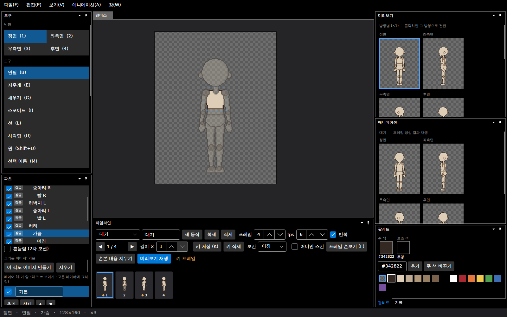
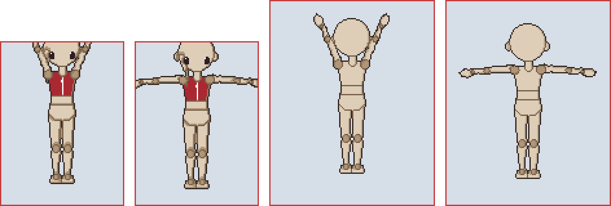
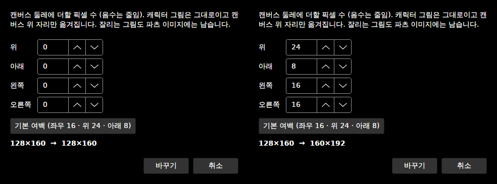
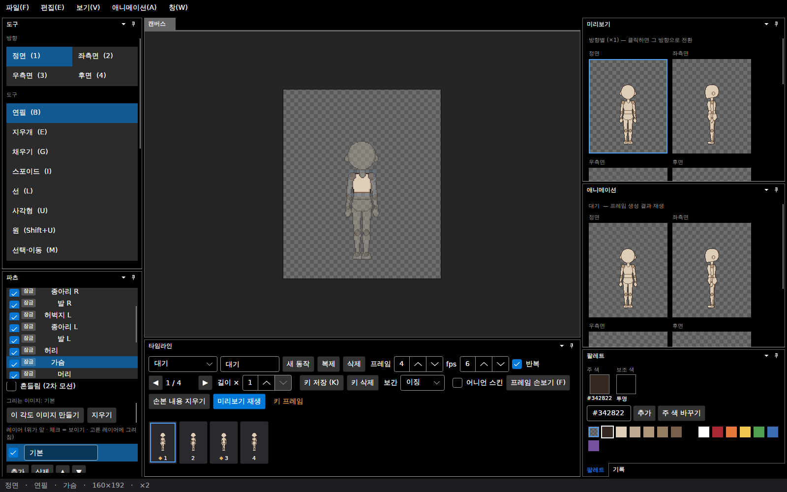

# 패치노트 — 캔버스 여백 (기본 128×160, 캔버스 크기 바꾸기)

날짜: 2026-09-25 · 브랜치: `claude/work-environment-setup-a3u93e`

기본 동작부터 캔버스 끝에서 잘리고 있었다. 96×128 캔버스에서 내보낸 시트를 세어 보니 **점프 26프레임, 공격 6프레임**이 캔버스 끝에 닿았다 (가만히 선 마네킹이 높이 128px 중 3~126px을 차지). 캐릭터 크기는 그대로 두고 둘레에 여백을 늘렸다.

1. **새 프로젝트의 기본 캔버스를 128×160으로**: 96×128 마네킹 둘레에 좌우 16 · 위 24 · 아래 8px.
2. **편집 → 캔버스 크기**: 이미 있는 프로젝트의 여백을 위·아래·왼쪽·오른쪽으로 더하거나(양수) 줄인다(음수).

## 스크린샷

새로 만든 프로젝트 (128×160, 상태 줄). 마네킹 둘레에 여유가 생겼다.

점프 3·4프레임 (정면, 3배 확대, 빨간 선 = 캔버스 끝). 왼쪽 둘은 96×128 — 머리·들어 올린 팔·벌린 손이 잘린다. 오른쪽 둘은 128×160 — 모두 들어온다.

**편집 → 캔버스 크기...**: 네 방향 여백과 바뀐 크기. **기본 여백** 버튼은 좌우 16 · 위 24 · 아래 8을 채운다.

기본 여백을 한 번 더 넣은 결과 (128×160 → 160×192). 캔버스·미리보기·애니메이션 창이 새 크기로 바뀌고, 되돌리기(Ctrl+Z)로 128×160으로 돌아온다.

## 동작

| 항목 | 내용 |
| --- | --- |
| 자르지 않음 | 캔버스 크기만 바뀌고, 파츠 그림은 그대로 캔버스 위 자리만 옮겨진다. 줄여서 캔버스 밖으로 나간 그림도 파츠 이미지에 남아, 다시 넓히면 돌아온다 |
| 함께 옮겨지는 것 | 모든 방향의 파츠 그림과 관절 (반측면·따로 그린 우측면 포함), 모든 동작의 손본 픽셀 |
| 반전 방향 | 우측면·오른쪽 반측면은 프레임 전체를 좌우 반전해 만들므로, 그 방향의 손본 픽셀은 **오른쪽** 여백만큼 옮겨진다 |
| 그대로인 것 | 포즈(회전·몸 위치는 상대값), 장착점(파츠 이미지 기준) |
| 범위 | 가로·세로 8~1024px. 벗어나면 안내 |
| 되돌리기 | 한 번 |
| 저장 | 캔버스 크기는 원래 skeleton.json의 `width`·`height`에 저장되던 값 그대로 — 형식 변화 없음. 예전 96×128 프로젝트는 그대로 열린다 |

## 확인

- 테스트 187개 통과 (새로 5개: 모든 방향에서 그림이 왼쪽/반전 방향은 오른쪽 여백만큼 옮겨지고 되돌리면 같음, 줄였다 늘리면 그림이 그대로, 손본 픽셀 이동, 범위 밖·변화 없음 거부, 저장·불러오기와 되돌리기 없는 적용).
- 앱: 새 프로젝트 128×160 → 캔버스 크기 대화상자 → 기본 여백 → 160×192 → 되돌리기 → 128×160 → 저장.
- 명령줄로 내보낸 새 프로젝트 시트: 모든 동작에서 캔버스 끝에 닿는 프레임 **0개** (점프는 위 10px, 좌우 10px, 아래 5px 여유).

## 구조

| 위치 | 내용 |
| --- | --- |
| `Core/Rigging/CanvasResize` (새로) | `CanvasMargins`(기본 여백), `Apply`(되돌리기), `ApplyUnrecorded`(새 템플릿), `CanvasResizeChange` |
| `Core/Rigging/Character` | 크기 바꾸기, `CanvasSizeChanged` |
| `App/Services/TemplateLoader` | 새 프로젝트에 기본 여백 |
| `App/Services/EditorSession` | `CanvasSize`, `ResizeCanvas`, 크기가 바뀌면 캔버스·미리보기 이미지를 새로 만듦 |
| `App/Views/MainWindow` | 편집 → 캔버스 크기 메뉴, 대화상자 |

## 알려진 제한

- ~~참고 이미지는 옮겨지지 않는다~~ → [다듬기 묶음](2026-09-25-polish.md)에서 함께 옮겨지게 고침.
- (가져온 동작의 손본 픽셀 제한은 잘못 적었던 것: 동작을 가져올 때 손본 픽셀은 복사되지 않는다.)
