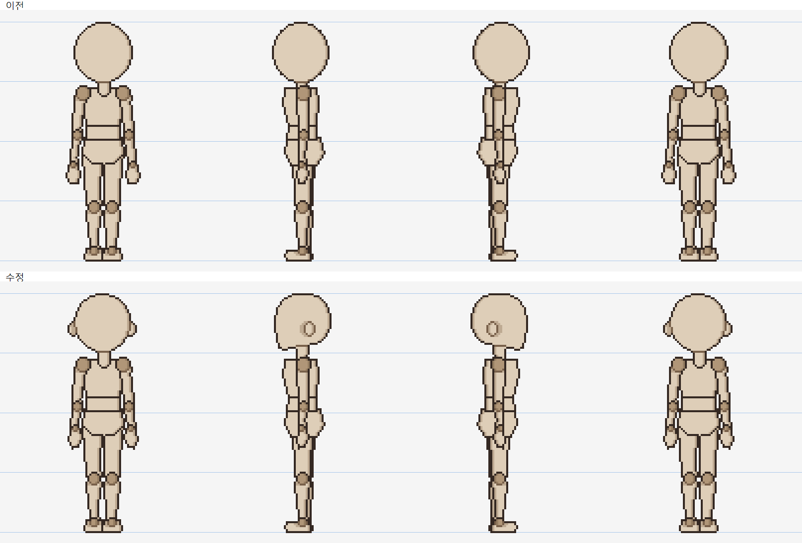
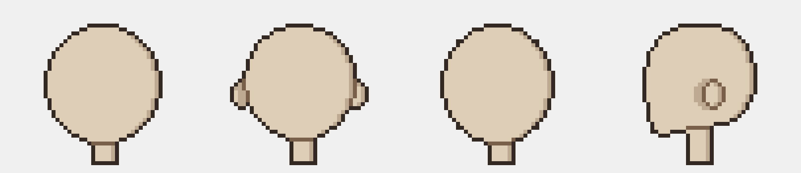
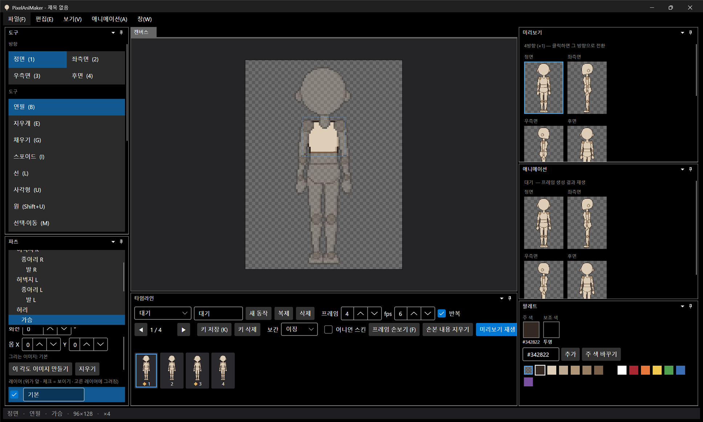

# 패치노트 — 마네킹 템플릿 머리 모양·팔 길이 수정

날짜: 2026-09-25 · 브랜치: `feature/chibi-head`

머리가 완전한 원(타원)이라 어색하던 기본 마네킹을 4등신 인체 비율 참고 자료에 맞춰 고쳤다.

## 스크린샷

위: 이전, 아래: 수정 (정면 · 좌측면 · 우측면 · 후면, 파란 선은 머리 1개 간격).

머리만 확대 (왼쪽부터 이전 정면, 수정 정면, 이전 측면, 수정 측면).

앱에서 새 템플릿을 연 화면.

## 바뀐 점

| 부위 | 이전 | 수정 (참고 자료 기준) |
| --- | --- | --- |
| 머리 정면·후면 | 57×60 타원 | 둥근 두개골(귀 높이에서 가장 넓음) 아래로 볼이 좁아지며 둥근 턱으로 이어짐, 양쪽에 귀 |
| 머리 측면 | 타원 | 뒤통수가 목 뒤로 크게 나오고, 앞은 이마·턱이 있는 옆얼굴, 가운데 귀(안쪽 선) |
| 팔 길이 | 손끝이 가랑이보다 한참 아래 | 전완·손을 3.5px 올려 손끝이 가랑이 바로 아래 |
| 비율 | 4등신 | 그대로 (머리 1 : 몸통 약 1.4 : 다리 약 1.6) |

- 관절 원 있는 마네킹(`chibi96`)과 없는 마네킹(`chibi96_plain`) 모두 적용
- 기본 동작 6종은 관절 회전만 저장하므로 그대로 동작
- 이미 저장된 프로젝트의 그림은 바뀌지 않는다 (새로 만들기부터 적용)
- 30px 머리에서 코는 1px 미만이라 측면에서 따로 보이지 않는다

## 구조

| 위치 | 내용 |
| --- | --- |
| `mannequin/make_chibi.py` | `head_front`, `head_side`(제어점 → 부드러운 닫힌 곡선), `Figure.smooth_poly`(8배로 그린 뒤 절반 이상 덮인 칸만 남겨 곡선 외곽선에 튀는 1px 없음) |
| `mannequin/make_chibi_parts.py` | 머리를 위 함수로 그림, 팔 길이 조정 |
| 템플릿 PNG·skeleton.json | 스크립트로 다시 생성 |

## 검증

- 템플릿을 정면·측면·반전·후면으로 조립해 4등신 기준선과 비교 (위 비교 이미지)
- 앱 실행 → 새 템플릿·애니메이션 미리보기 정상, 테스트 121개 통과
