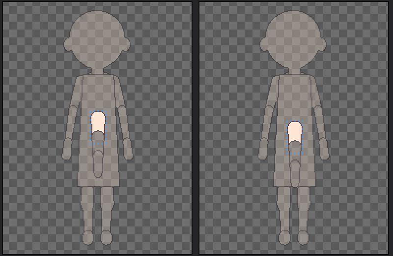

# 패치노트 — 코드 정리 (임의 파츠 이후)

날짜: 2026-09-25 · 브랜치: `claude/work-environment-setup-a3u93e`

기능 변화 없음. 겹치던 코드를 한곳으로 모으고, 기능이 넓어지면서 맞지 않게 된 이름을 바꿨다.

## 스크린샷

정리 뒤 앱에서 확인: 저장한 프로젝트(망토·꼬리 추가)를 다시 열고, 후면에서 꼬리 1의 **위치 Y**를 119 → 129로 올리면 세 마디가 함께 10px 내려간다 (이름을 바꾼 위치 X/Y 연결이 그대로 동작).

## 바뀐 것

| 항목 | 전 | 후 |
| --- | --- | --- |
| 되돌리기 기록 | 14곳에서 `change.Redo(); history.Push(change);` | `UndoHistory.Do(change)` 한 줄 |
| 파츠 그림의 칠한 픽셀 | 눈·가슴 볼륨·임의 파츠가 각자 이미지를 훑음 | `PartView.DrawnPixels()` (캔버스 좌표), `PartView.MainColour()` (가장 많이 쓴 색) |
| 파츠와 그 아래 | 임의 파츠 삭제·옮기기가 각자 재귀 | `Part.SelfAndDescendants()` |
| 선택 파츠 추가·삭제 | `DetailParts` (세부 파츠 전용 이름) | `OptionalParts` — 눈·가슴 볼륨·임의 파츠 공통. 파츠 목록으로 지우는 `Remove` 추가 |
| 파츠 옮기기 | `DetailMove` | `PartMove` (세부 파츠와 추가한 파츠) |
| 세션·파츠 창 | `ActiveDetailPosition`, `MoveActiveDetailTo`, `IsDetailPart`, `DetailX/Y` | `ActivePartPosition`, `MoveActivePartTo`, `IsMovablePart`, `PositionX/Y` |
| 세션 알림 | 눈·가슴 볼륨 상태 알림 4줄이 두 곳에 | `RaiseOptionalPartsChanged()` |

예전 패치노트·설계 문서의 옛 이름에는 "이후 … 로 이름 바꿈"을 붙였다.

## 확인

- 테스트 182개 통과, 빌드 오류 0.
- 앱: 임의 파츠가 있는 프로젝트 열기 → 꼬리 선택 → 위치 X/Y 표시·변경 (위 스크린샷).
- 문서: 모든 패치노트·설계 문서의 링크와 이미지가 있음, 쓰이지 않는 이미지 없음, 패치노트 목록 누락 없음.
