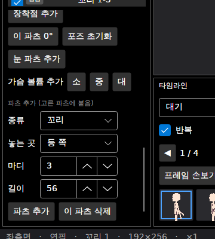
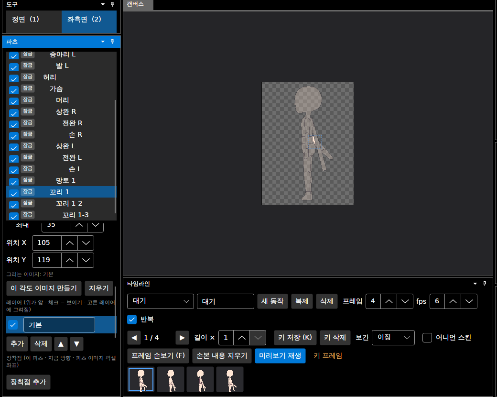
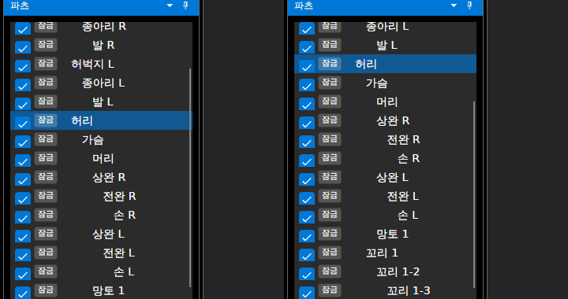
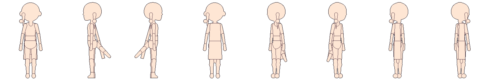
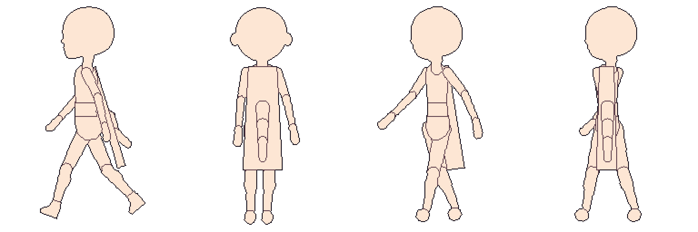

# 패치노트 — 임의 파츠 추가

날짜: 2026-09-25 · 브랜치: `claude/work-environment-setup-a3u93e` · 계획: [plan-custom-parts.md](../plan-custom-parts.md)

템플릿에 없는 **매달린 파츠**(머리카락 가닥, 꼬리, 망토 자락, 장신구)를 지금 고른 파츠의 자식으로 추가한다. 추가한 파츠는 다른 파츠처럼 그리고, 포즈로 돌리고, 키를 찍을 수 있다. 머리카락·꼬리·망토는 회전형 흔들림(2차 모션)이 켜진 채 추가된다.

## 스크린샷

파츠 창 아래의 **파츠 추가**: 종류, 놓는 곳, 마디, 길이. 종류를 바꾸면 놓는 곳·마디·길이가 그 종류의 기본값으로 바뀐다. 고른 파츠가 추가한 파츠면 **이 파츠 삭제**가 보인다.

2x 마네킹의 가슴에 망토 자락(등 쪽, 1마디), 허리에 꼬리(등 쪽, 3마디)를 추가하고 좌측면을 본 모습. 파츠 목록에 꼬리 1 → 1-2 → 1-3 사슬이 보이고, 위치 X/Y로 방향마다 옮길 수 있다.

꼬리 1을 **이 파츠 삭제** → 아래 마디까지 사라지고 부모(허리)가 골라짐 (왼쪽). 되돌리기 한 번 → 세 마디가 제자리로 돌아옴 (오른쪽).

네 종류의 시작 그림 (8방향): 머리 앞 머리카락 가닥(얼굴 옆), 귀 아래 장신구, 등 쪽 꼬리(측면에서 45° 뒤로), 등 쪽 망토 자락(정면에서 몸 뒤, 후면에서 맨 앞).

위 앱에서 저장한 프로젝트를 명령줄로 내보낸 걷기 (좌측면, 후면, 앞 반측면, 뒤 반측면). 꼬리와 망토가 회전형 흔들림으로 늦게 따라온다.

## 동작

| 항목 | 내용 |
| --- | --- |
| 종류 | 머리카락 가닥(끝이 가늘게, 2마디, 머리카락 흔들림) · 꼬리(3마디, 천·꼬리 흔들림) · 망토 자락(아래로 넓어짐, 1마디, 천·꼬리 흔들림) · 장신구(작은 원, 흔들림 없음) |
| 놓는 곳 | 부모 앞 · 부모 뒤 · 등 쪽 (정면·측면·앞 반측면에서 맨 뒤, 후면·뒤 반측면에서 맨 앞) |
| 마디 | 1~4. 마디마다 파츠가 생기고 다음 마디는 앞 마디의 자식. 흔들림이 마디마다 늦게 따라감 |
| 길이 | 모든 마디를 합친 길이 (기본: 캔버스 높이의 0.18·0.22·0.45·0.05배) |
| 시작 그림 | 방향마다 부모의 주 색으로. 붙는 곳은 부모 가운데 (머리카락·장신구는 얼굴 옆·귀, 망토는 어깨, 등 쪽은 측면에서 등 가장자리) |
| 이름 | `hair1`, `hair1_2`, `tail1`, `cape1`, `acc1` … / "머리카락 1", "머리카락 1-2" … 겹치지 않게 번호가 오름 |
| 위치 | 위치 X/Y로 방향마다 옮김 (첫 마디를 옮기면 아래 마디도 함께) |
| 삭제 | 추가한 파츠만, 아래 마디까지. 템플릿 파츠는 지울 수 없음 |
| 되돌리기 | 추가·삭제·옮기기 각각 한 번. 삭제를 되돌리면 파츠 목록의 원래 자리로 (그리는 순서가 같은 파츠끼리의 앞뒤가 유지됨) |

## 저장·호환

- `skeleton.json`의 파츠에 `"custom": true` (추가한 파츠만). 이전 버전은 이 항목을 무시하고 보통 파츠로 읽는다.
- 추가한 파츠가 없는 프로젝트는 파일이 이전과 같다 (기준 파일 테스트 통과).

## 구조

| 위치 | 내용 |
| --- | --- |
| `Core/Rigging/CustomParts` (새로) | 종류·놓는 곳·옵션, 추가(마디 전부 한 번에), 삭제(아래 마디까지), 이름, 시작 모양 |
| `Core/Rigging/Part` | `IsCustom`, `IsMovable` |
| `Core/Rigging/DetailMove` | 추가한 파츠도 옮김, 아래 마디를 함께 |
| `Core/Rigging/DetailParts` (`PartsChange`) | 삭제를 되돌리면 파츠 목록의 원래 자리로 |
| `Core/Rigging/Character` | `AddPart(..., index)` |
| `Core/Rigging/CharacterTemplate` | `custom` 읽기·쓰기 |
| `App/Services/EditorSession`, `ViewModels/PartsViewModel`, `Views/PartsView` | 파츠 추가 영역, 이 파츠 삭제, 위치 X/Y를 추가한 파츠에도 |

## 확인

- 테스트 182개 통과 (새로 7개: 사슬·방향별 그림·흔들림 설정, 되돌리기·이름, 그리는 순서, 삭제·템플릿 보호·자리 복원, 사슬 옮기기, 저장·불러오기, 몸을 흔들 때 꼬리 각도).
- 앱: 망토 자락·꼬리 추가 → 좌측면 확인 → 삭제·되돌리기 → 저장 → 명령줄 `--export --directions 8`로 다시 열어 내보내기 (skeleton.json에 `custom` 4개).

## 알려진 제한

- 추가한 파츠의 표시 이름("꼬리 1")은 영어로 바꾸지 않는다.
- 이름·종류는 추가한 뒤 바꿀 수 없다 (지우고 다시 추가).
