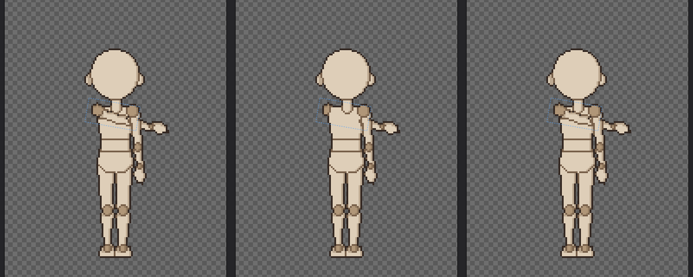
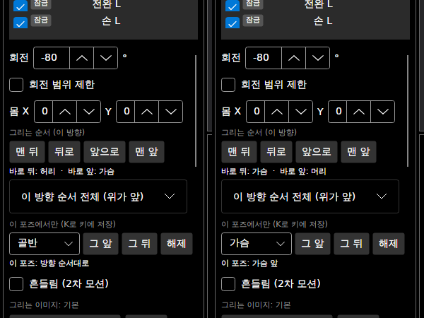
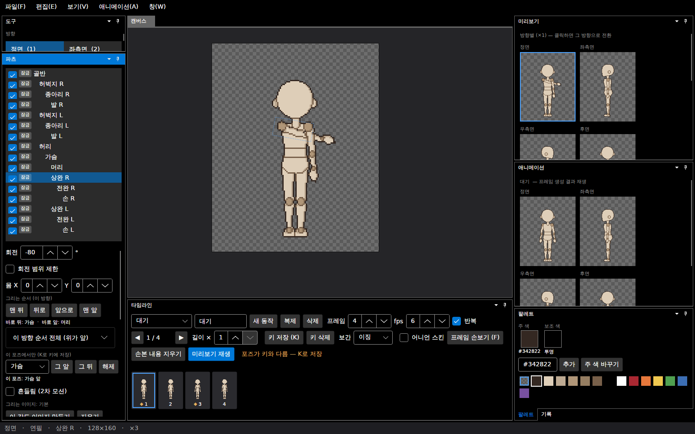
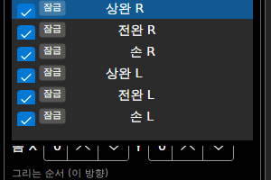

# 패치노트 — 그리는 순서 (겹치는 파츠의 앞뒤)

날짜: 2026-09-25 · 브랜치: `claude/work-environment-setup-a3u93e` · 계획: [plan-draw-order.md](../plan-draw-order.md)

겹치는 파츠 중 어느 쪽을 앞에 그릴지 정할 수 있다. 지금까지는 템플릿에서 정한 순서 그대로였다.

- **① 방향별 순서**: 이 방향 전체(모든 동작, 모든 프레임)의 앞뒤 순서를 바꾼다.
- **② 이 포즈에서만**: 한 포즈(키)에서만 한 파츠를 다른 파츠의 앞이나 뒤로 옮긴다. 회전처럼 포즈의 일부라 K로 키에 저장하고, 그 키부터 다음 키 전까지 적용된다.

## 스크린샷

오른팔 상완을 가슴 쪽으로 돌린(-80°) 정면. 왼쪽: 기본 순서 (팔이 가슴 앞). 가운데: ① **뒤로** 두 번 → 이 방향에서 팔이 머리·가슴 뒤. 오른쪽: ② **이 포즈에서만** 가슴 **그 앞** → 이 포즈에서만 다시 가슴 앞 (전완·손은 따로인 파츠라 처음부터 앞).

파츠 창의 새 영역. 왼쪽: ①을 한 뒤 (바로 뒤: 가슴 · 바로 앞: 머리). 오른쪽: ② 가슴 그 앞 → "이 포즈: 가슴 앞".

②를 한 직후의 화면. 타임라인에 "포즈가 키와 다름 — K로 저장"이 떠서, K를 누르면 키에 들어간다.

**이 방향 순서 전체 (위가 앞)**: 지금 방향에서 실제로 그려지는 순서 (이 포즈의 변경 포함, ▶ = 고른 파츠). 아래는 ②로 상완 R을 가슴 뒤로 보낸 때.

## 동작

| 항목 | ① 방향별 순서 | ② 이 포즈에서만 |
| --- | --- | --- |
| 조작 | 맨 뒤 · 뒤로 · 앞으로 · 맨 앞 | 기준 파츠 고르기 → 그 앞 · 그 뒤 · 해제 |
| 적용 | 이 방향의 모든 프레임 | 이 포즈. 키에 저장하면 그 키부터 다음 키 전까지 (순서는 섞이지 않고 바로 바뀜) |
| 함께 옮겨짐 | 세부 파츠(눈·가슴 볼륨)는 부모와 한 덩어리로 옮겨지고, 직접 옮길 수 없다 | 같음 |
| 반전 방향 | 우측면·오른쪽 반측면에서 바꾸면 원래 방향의 순서가 바뀌고, 따로 그린 우측면 그림도 같은 순서를 받는다 | 반전 방향은 원래 방향의 포즈를 쓰므로 함께 |
| 되돌리기 | 한 번 | 한 번 (포즈 변경) |
| 저장 | 기존 `order` 값을 0, 1, 2 … 로 다시 매겨 저장 (형식 변화 없음) | 키에 `"order": { "upper_arm_r": { "anchor": "chest", "front": true } }` — 쓴 키에만. 이전 버전은 무시 |

- 순서는 외곽선에도 반영된다 (앞에 그려진 파츠가 겹치는 선을 가진다).
- 반측면 동작 초안은 순서 변경을 옮기지 않는다 (정면과 측면의 앞뒤가 다를 수 있어서).

## 함께 고친 것

- **파츠 창이 저절로 스크롤되던 문제**: 포즈나 기록이 바뀔 때마다 레이어 목록을 새로 만들고 다시 고르면서, 목록이 고른 레이어를 보이게 하려고 파츠 창 전체를 스크롤했다. 레이어가 실제로 바뀔 때만 새로 만들게 고쳤다 (이번 기능의 버튼을 누를 때마다 창이 튀던 원인).

## 확인

- 테스트 194개 통과 (새로 7개: 이웃과 자리 바꾸기·세부 파츠 함께·맨 앞/맨 뒤·되돌리기, 끝·세부 파츠는 못 옮김, 반전 방향은 원래 방향에, 순서 저장, 포즈 순서로 앞뒤 바꾸기·모르는 기준은 무시, 합성 결과와 포즈 되돌리기, 키 사이는 앞 키의 순서·JSON 저장, 순서 없는 동작은 파일 그대로). 기준 파일 테스트 통과.
- 앱: 상완 R 회전 → 뒤로 → 가슴 그 앞 → K. 버튼을 눌러도 파츠 창이 튀지 않음.

## 구조

| 위치 | 내용 |
| --- | --- |
| `Core/Rigging/DrawOrderEdit` (새로) | 덩어리(파츠+세부 파츠), `Move`/`CanMove`(①), `WithOverrides`(②), `DrawOrderChange` |
| `Core/Rigging/Pose` | `OrderOverride`, `PoseData.Order`, `Pose.SetOrder` |
| `Core/Rigging/Compositor` | 포즈의 순서 변경을 적용한 순서로 그림 |
| `Core/Animation/AnimationClip`, `AnimationJson` | 키 사이는 앞 키의 순서, 키에 `order` 저장 |
| `App` 세션·파츠 창 | 버튼·이웃 표시·전체 순서 목록·이 포즈 순서, 레이어 목록 스크롤 수정 |
