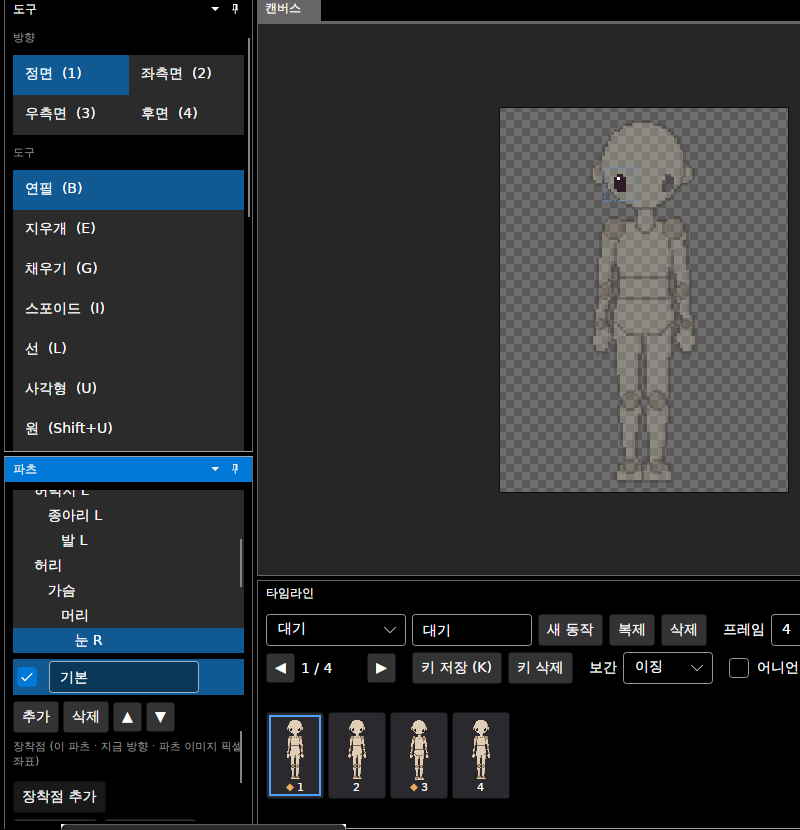
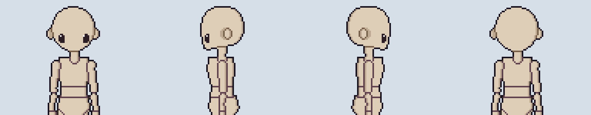
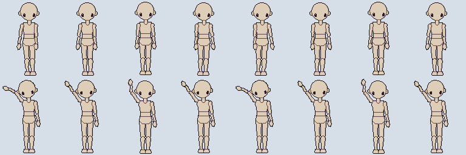
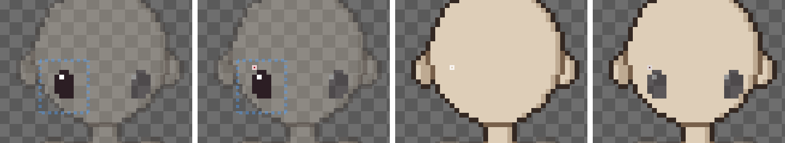

# 패치노트 — 눈 파츠 따로 추가

날짜: 2026-09-25 · 브랜치: `claude/work-environment-setup-a3u93e`

머리에 붙는 눈 파츠(눈 R·눈 L)를 따로 만들 수 있다. 눈을 얼굴과 따로 그리고, 지우고 다시 그리거나 바꿀 수 있다. 머리를 따라 움직이고, 머리와 만나는 곳에는 선이 생기지 않는다.

## 스크린샷

파츠 창 아래 **눈 파츠 추가** → 파츠 목록의 머리 밑에 눈 R·눈 L이 생기고, 눈 R이 골라져 바로 그릴 수 있다 (점선 = 눈 파츠 이미지 영역).

방향별 기본 눈: 정면은 두 눈, 측면은 얼굴 쪽 가까운 눈 하나(우측면은 반전), 후면은 빈 이미지.

동작에서도 머리를 따라간다 (위: 걷기 정면, 아래: 손 흔들기 — 머리가 기울면 눈도 함께). 눈과 얼굴 사이에 선이 없다.

앱에서 추가 → 눈에 점 찍기 → 되돌리기 두 번 → 다시 실행 두 번.

## 동작

| 항목 | 내용 |
| --- | --- |
| 추가 | 파츠 창 **눈 파츠 추가** (눈이 없을 때만 보임). 되돌리기 가능 |
| 삭제 | **눈 파츠 삭제** (눈이 있을 때만 보임). 되돌리기 가능, 되돌리면 그린 눈 그대로 복구 |
| 구조 | `eye_r`·`eye_l`, 머리의 자식 파츠, 관절 = 눈 가운데 |
| 위치·크기 | 머리 크기에서 계산 — 머리 윗줄부터 목 관절까지 높이 H, 눈은 관절 위 0.36H, 좌우 0.24H, 이미지 0.30H×0.33H (96px 캐릭터 약 10×11, 2배 캐릭터 약 20×22) |
| 기본 그림 | 정면 두 눈·측면 가까운 눈에 어두운 타원 + 하이라이트 1px, 나머지는 빈 이미지 (필요하면 그려 넣음) |
| 그리는 순서 | 머리 바로 위, 팔보다 아래 (팔을 얼굴 앞에 들면 팔이 눈을 가림) |
| 외곽선 | 눈은 "세부 파츠"라 머리의 외곽선을 따름 — 눈과 머리 사이에 안쪽 선이 생기지 않음 |
| 대칭 그리기 | 정면·후면에서 눈 R ↔ 눈 L 짝으로 동작 (`_r`/`_l` 이름 규칙) |
| 저장 | `skeleton.json`에 일반 파츠로 저장, 세부 파츠 표시는 `"detail": true` |

## 호환성

- 눈이 없는 프로젝트·템플릿은 바뀌지 않는다 (파일 내용 그대로).
- 눈이 있는 파일도 형식 버전은 1 그대로다. 이전 버전 프로그램에서도 열리며, 이전 버전은 `detail` 표시를 몰라 눈 둘레에 안쪽 선이 그려질 뿐이다.
- 눈 파츠를 돌리는 키가 있는 동작을 눈 없는 캐릭터로 가져오면, 기존 규칙대로 "없는 파츠"로 알려 주고 무시한다.

## 구조

| 위치 | 내용 |
| --- | --- |
| `Core/Rigging/EyeParts` | 눈 만들기(위치·크기·기본 그림), 추가·삭제, `PartsChange`(파츠 추가·삭제 되돌리기) |
| `Core/Rigging/Character` | `AddPart`·`RemovePart`(자식 없는 파츠만), `PartsChanged` 이벤트 |
| `Core/Rigging/Part` | `IsDetail`, `Detach` |
| `Core/Rigging/Compositor` | 세부 파츠는 부모와 같은 순위로 외곽선 계산 |
| `Core/Rigging/CharacterTemplate` | `PartSpec.Detail` 읽기·쓰기 |
| `App/Services/EditorSession` | 눈 추가·삭제, 파츠가 없어지면 머리를 고름, `PartsChanged` |
| `App/ViewModels/PartsViewModel`, `Views/PartsView` | 버튼 2개, 파츠 목록 다시 만들기 |
| 테스트 | 126개 통과 (새 5개: 추가·되돌리기, 방향별 위치·빈 이미지, 눈-머리 사이 선 없음, 저장·불러오기, 삭제·자식 있는 파츠 삭제 거부) |

## 검증 (앱 자동 조작, 리눅스 Xvfb)

- 눈 파츠 추가 → 파츠 목록에 눈 R·눈 L, 눈 R 선택, 얼굴에 두 눈
- 빨간색으로 눈 R에 점 → 되돌리기 두 번(점, 눈 파츠) → 눈 사라지고 머리 선택 → 다시 실행 두 번 → 눈 복구
- Core 합성으로 4방향·걷기·손 흔들기 확인 (위 스크린샷)
