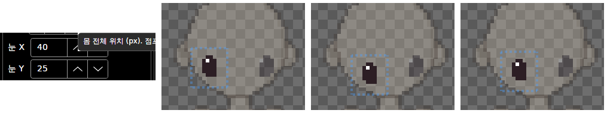

# 패치노트 — 눈 위치 옮기기

날짜: 2026-09-25 · 브랜치: `claude/work-environment-setup-a3u93e`

눈 파츠를 고르면 파츠 창에 **눈 X / 눈 Y**가 나온다. 방향마다 따로 눈의 위치를 정할 수 있다 (정면의 눈 간격, 반측면의 먼 눈 등).

## 스크린샷

왼쪽: 눈 R을 골랐을 때의 파츠 창. 오른쪽 세 칸: 처음 → 눈 X +3, 눈 Y +2 → 되돌리기 한 번 (마지막 Y +1만 되돌아감). 점선은 눈 파츠 이미지 영역으로, 눈과 함께 움직인다.

## 동작

| 항목 | 내용 |
| --- | --- |
| 대상 | 세부 파츠(눈)만. 뼈대 파츠의 관절은 템플릿 위치 그대로 |
| 값 | 눈 가운데(관절)의 캔버스 좌표, 1px 단위 (소수는 반올림) |
| 방향 | 지금 방향의 눈만 움직임. 우측면처럼 반전되는 방향에서는 화면에서 보이는 대로 옮기면 원본(좌측면)이 반대로 움직여 같은 결과가 됨 |
| 되돌리기 | 한 번 바꿀 때마다 한 단계 (`파츠 위치`) |
| 저장 | 파츠 위치는 원래 `skeleton.json`에 저장되므로 파일 형식 변화 없음 (형식 1 그대로) |

## 구조

| 위치 | 내용 |
| --- | --- |
| `Core/Rigging/DetailMove` (이후 `PartMove`로 이름 바꿈) | 세부 파츠 이동 (이미지·관절 함께, 정수 px), 되돌리기 |
| `Core/Rigging/Part` (`PartView`) | 위치·관절을 내부에서만 옮길 수 있게 (`MoveBy`) |
| `App/Services/EditorSession` | `ActiveDetailPosition`, `MoveActiveDetailTo` (이후 `ActivePartPosition`, `MoveActivePartTo`) (반전 방향 좌표 변환) |
| `App/ViewModels/PartsViewModel`, `Views/PartsView` | 눈 X / 눈 Y (눈 파츠를 골랐을 때만) |
| 테스트 | 143개 통과 (새 3개: 이동·되돌리기·다른 방향 불변, 반전 방향 이동, 뼈대 파츠 거부·저장 후 유지) |

## 검증 (앱 자동 조작, 리눅스 Xvfb)

- 눈 파츠 추가 → 눈 R 선택 → 눈 X 40, 눈 Y 25 표시
- 키보드로 X +3, Y +2 → 캔버스의 눈이 정확히 (+3, +2) 이동 (스크린샷 픽셀 측정), 되돌리기 한 번 → Y만 1 되돌아감
- 예외 없음
