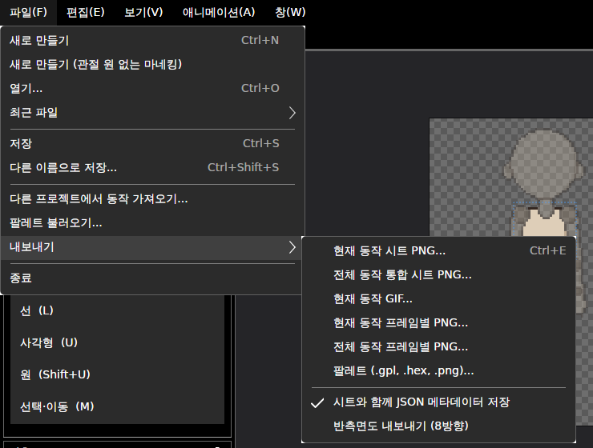
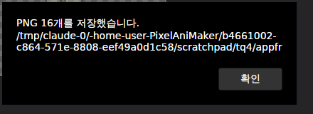
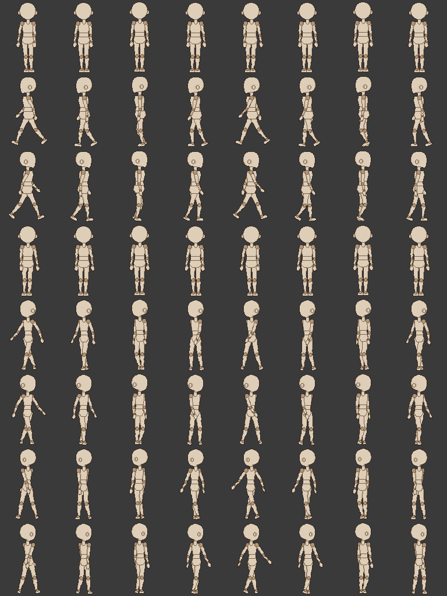

# 패치노트 — 프레임별 PNG 내보내기

날짜: 2026-09-25 · 브랜치: `claude/work-environment-setup-a3u93e` · 다음 루트: [progress.md](../progress.md) 3.5절 2번

프레임마다 캔버스 크기 PNG를 한 장씩 저장한다. 시트를 잘라 쓰지 않아도 되어, 파일 목록으로 애니메이션을 만드는 게임 엔진·도구에 바로 넣을 수 있다.

## 스크린샷

파일 → 내보내기에 두 항목이 생겼다.



저장 창에서 폴더와 이름 앞부분(예: `hero.png`)을 고르면, 저장한 파일 수와 폴더를 알려 준다 (대기 4프레임 × 4방향 = 16장).



반측면 마네킹 프로젝트를 `--directions 8 --frames`로 내보낸 걷기 파일 64장을 이름 순서대로 붙여 본 것 (줄: 정면·좌측면·우측면·후면·앞 반 (좌)·앞 반 (우)·뒤 반 (좌)·뒤 반 (우), 칸: 01~08).



## 파일 이름

`이름_동작_방향_번호.png` — 예: `hero_걷기_frontleft_03.png`

| 부분 | 규칙 |
| --- | --- |
| 이름 | 저장 창에서 고른 파일 이름 (확장자 뺌). 명령줄은 프로젝트 파일 이름 |
| 동작 | 동작 이름. 파일 이름에 못 쓰는 글자는 `_`. 같은 이름의 동작이 있으면 뒤의 것에 `_2`, `_3`… |
| 방향 | `front`, `left`, `right`, `back`, 반측면을 내보낼 때 `frontleft`, `frontright`, `backleft`, `backright` (시트 JSON의 방향 이름과 같음) |
| 번호 | 타임라인처럼 1부터. 이름 순서가 재생 순서가 되도록 두 자리(100프레임 이상이면 세 자리)로 채움 |

- 방향 수는 시트·GIF와 같은 설정(**반측면도 내보내기 (8방향)**)을 따른다.
- 그림은 시트의 같은 칸과 픽셀까지 같다 (손본 픽셀·외곽선 포함, 테스트로 확인).
- 이미 같은 이름의 파일이 있으면 덮어쓴다.

## 명령줄

`--frames`를 붙이면 일괄 내보내기에 프레임별 PNG가 더해진다. 붙이지 않으면 결과가 이전과 같다 (파일 8개, 시트 바이트 단위로 같음을 확인).

```
PixelAniMaker --export hero.dotchar --out out --directions 8 --frames
```

반측면 마네킹 프로젝트: 동작 6종 31프레임 × 8방향 = 248장 (`frames: 248 files in …`).

## 구조

| 위치 | 내용 |
| --- | --- |
| `Core/Export/FrameFiles` | 프레임 이미지와 파일 이름 만들기, `SafeName` (명령줄 GIF 이름에서 쓰던 것을 옮겨 함께 씀) |
| `App/Services/ProjectService` | `ExportFrames(path, allClips)` — 고른 파일 옆에 저장, 시트와 같은 "내보낼 동작" 규칙 |
| `App/Services/BatchExporter`, `CommandLine`, `App.axaml.cs` | `--frames` |
| `App/ViewModels/MainWindowViewModel`, `Views/MainWindow.axaml` | 메뉴 두 항목, 완료 안내 |

## 테스트

- `FrameFilesTests`: 8방향 프레임 파일이 시트의 같은 칸과 픽셀까지 같음, 번호·자릿수·같은 이름 동작·못 쓰는 글자 처리.
- 전체 152개 통과, 번역 누락 증가 없음.
