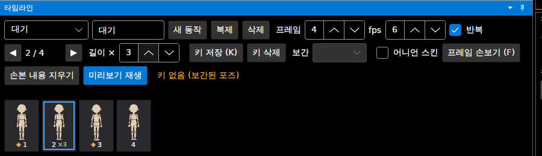

# 패치노트 — 프레임별 길이

날짜: 2026-09-25 · 브랜치: `claude/work-environment-setup-a3u93e` · 다음 루트: [progress.md](../progress.md) 3.5절 4번

프레임마다 보여주는 시간을 따로 정할 수 있다. 공격 직전의 준비 자세나 착지 프레임을 조금 더 길게 보여줄 때 쓴다.

## 스크린샷

타임라인의 **길이 ×** 칸: 2번 프레임을 ×3으로 정한 모습. 프레임 칸에 `×3`이 표시된다. 타임라인이 좁으면 칸들이 다음 줄로 넘어간다 (전에는 오른쪽 끝의 "미리보기 재생" 등이 잘려 보였음).

## 규칙

| 항목 | 내용 |
| --- | --- |
| 단위 | 칸 (1칸 = 1/fps초). 기본 ×1, 최대 ×16 |
| 적용 범위 | 그 동작의 그 프레임 — 모든 방향에 같이 |
| fps를 바꾸면 | 칸 수는 그대로라 길이가 같은 비율로 바뀜 |
| 미리보기 재생 | 늘린 프레임에서 그만큼 오래 머묾 |
| 시트 JSON | `durationMs` = 칸 × 1000 / fps (예: 6 fps에서 ×3 → 500) |
| GIF | 프레임마다 다른 지연 (1/100초 단위로 반올림: 6 fps ×1 → 17, ×3 → 50) |
| 프레임별 PNG | 파일은 그대로 (길이 정보 없음) |
| 되돌리기 | fps·프레임 수와 같이 동작 설정이라 되돌리기 기록에 남지 않음 (저장 안 한 변경으로는 표시) |

## 저장과 호환

- 늘린 프레임이 있는 동작만 `animations.json`에 `"holds": {"1": 3}` (프레임 번호는 0부터 → 2번 프레임)을 쓴다. 없으면 파일이 이전과 같다.
- 파일 형식 버전은 그대로(1 또는 2). 이전 버전 프로그램도 이 파일을 열고 내보낼 수 있다 — 길이는 모두 ×1로 나온다 (체크포인트 빌드로 확인: `[166, 166, 166, 166]`, 새 빌드는 `[166, 500, 166, 166]`).
- 단, 이전 버전에서 다시 저장하면 길이 정보는 빠진다.
- 프레임 수를 줄여 범위 밖이 된 프레임의 길이는 저장하지 않는다.

## 구조

| 위치 | 내용 |
| --- | --- |
| `Core/Animation/AnimationClip` | `Hold`, `SetHold`, `Holds`, `DurationMs`, `MaxHold`; 복제·가져오기에서 함께 복사 |
| `Core/Animation/AnimationJson` | `holds` 읽기·쓰기 (있을 때만) |
| `Core/Export/SpriteSheet`, `AnimationGif`, `GifEncoder` | 프레임별 `durationMs`·GIF 지연 |
| `App/Services/AnimationSession` | 재생 타이머가 프레임마다 길이를 따름 |
| `App/ViewModels/TimelineViewModel`, `Views/TimelineView.axaml` | 길이 × 칸, 프레임 칸의 `×N`, 타임라인 줄 바꿈 |

## 테스트

- `FrameHoldTests`: 칸 단위 길이·최대값·×1로 되돌리면 지워짐·복제, JSON에 있을 때만 쓰고 범위 밖은 안 씀, 시트 `durationMs`와 GIF 지연.
- 기존 기준 파일(golden) 테스트 그대로 통과 — 길이를 안 쓰면 결과가 바이트 단위로 같다.
- 앱에서 확인: ×3 설정 → 저장 → 명령줄 내보내기 JSON·GIF 지연 확인, 체크포인트 빌드로 같은 파일 열기.
- 전체 156개 통과, 번역 누락 증가 없음.
