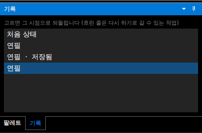
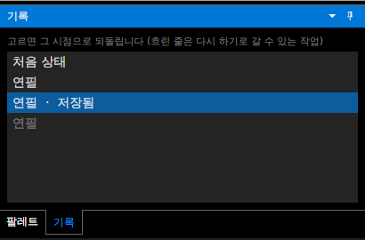
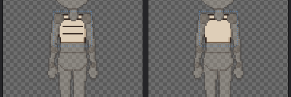

# 패치노트 — 기록 창

날짜: 2026-09-25 · 브랜치: `claude/work-environment-setup-a3u93e` · 다음 루트: [progress.md](../progress.md) 3.5절 7번

오른쪽 아래 팔레트 옆에 **기록** 탭이 생겼다. 되돌리기 목록을 보고, 줄을 고르면 그 시점으로 한 번에 되돌리거나 다시 한다.

## 스크린샷

연필 두 번 → 저장 → 연필 한 번. 저장한 시점에 "저장됨"이 붙는다.

"저장됨" 줄을 고르면 마지막 작업이 되돌려지고(흐린 줄 = 다시 하기로 갈 수 있음), 제목의 `*`도 사라진다.

다른 예: 가슴에 그은 선이 있는 상태(왼쪽)에서 첫 줄 "연필"을 고르면 그 뒤의 선이 한꺼번에 사라진다(오른쪽).

## 규칙

| 항목 | 내용 |
| --- | --- |
| 목록 | 맨 위 "처음 상태"(열었거나 새로 만든 그대로), 그 아래 한 작업씩. 되돌리기 이름 그대로 (연필, 키 저장, 반측면 추가 …) |
| 고르기 | 그 줄까지 적용된 상태로 이동 — 사이의 작업을 모두 되돌리거나 다시 함 (Ctrl+Z / Ctrl+Y 여러 번과 같음) |
| 흐린 줄 | 지금 이후의 작업 (다시 하기로 갈 수 있음). 이 상태에서 새로 작업하면 흐린 줄은 사라짐 |
| 저장됨 | 마지막으로 저장한 시점. 그 줄로 가면 저장 안 한 변경 표시(`*`)가 없어짐 |
| 대상 | 캐릭터의 되돌리기 기록 하나 (그림·포즈·키·손보기·파츠·레이어 등 모두) |

- 새로 만들기·열기를 하면 목록도 새로 시작한다 (되돌리기 기록과 같음).
- 탭은 창 배치 저장을 따른다. 전에 저장된 배치가 있어도 기록 탭은 기본 자리(팔레트 옆)에 생긴다.

## 구조

| 위치 | 내용 |
| --- | --- |
| `Core/History/UndoHistory` | `Undone`(다시 할 작업, 다음 것 먼저), `SavePoint`, `MoveTo(개수)` — 여러 단계를 옮기고 변경 알림은 한 번 |
| `App/Services/EditorSession` | `JumpInHistory` (그리던 획을 끝낸 뒤 이동) |
| `App/ViewModels/HistoryViewModel`, `Views/HistoryView` | 기록 탭 |
| `App/ViewModels/DockFactory` | 한 영역에 여러 탭 (팔레트 + 기록) |

## 테스트

- `UndoHistoryTests`: 여러 단계 되돌리기·다시 하기가 한 번의 알림으로, 범위 밖 값은 끝으로, 제자리면 알림 없음, 저장 시점과 새 작업으로 갈 수 없게 된 저장 시점.
- 앱에서 확인: 위 스크린샷 순서 (저장 시점으로 이동하면 `*` 사라짐).
- 전체 161개 통과, 번역 누락 증가 없음.
