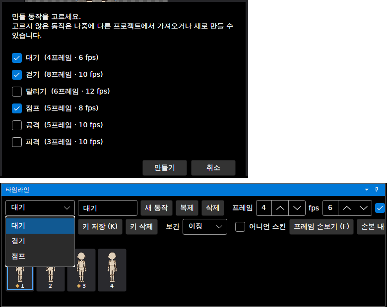
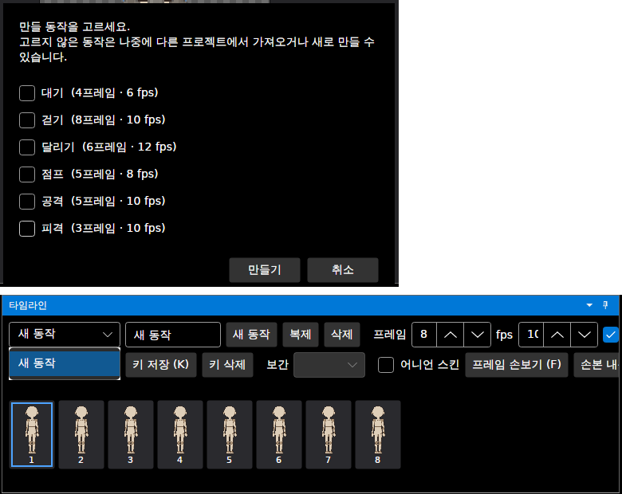

# 패치노트 — 새로 만들기에서 만들 동작 고르기

날짜: 2026-09-25 · 브랜치: `claude/work-environment-setup-a3u93e`

새 프로젝트를 만들 때 기본 동작 6종(대기·걷기·달리기·점프·공격·피격)을 모두 넣지 않고, 필요한 것만 골라서 시작한다.

## 스크린샷

파일 → 새로 만들기(Ctrl+N) → 동작 목록이 나온다 (처음엔 모두 체크). 대기·걷기·점프만 고르면 그 셋으로 시작한다.

하나도 고르지 않으면 빈 동작 하나(`새 동작`, 8프레임)로 시작한다.

## 동작

| 항목 | 내용 |
| --- | --- |
| 대상 | 새로 만들기, 새로 만들기(관절 원 없는 마네킹) 모두 |
| 순서 | 저장 확인 → 동작 고르기 → 새 프로젝트 |
| 취소 | 동작 고르기에서 취소하면 지금 프로젝트가 그대로 남음 |
| 아무것도 안 고름 | 빈 동작 1개로 시작 (타임라인은 동작이 최소 1개 있어야 해서) |
| 고르지 않은 동작 | 나중에 "다른 프로젝트에서 동작 가져오기"나 "새 동작"으로 추가 |
| 프로그램 시작 시 | 지금처럼 기본 동작 6종 모두 |

## 구조

| 위치 | 내용 |
| --- | --- |
| `App/Services/ProjectService.New` | 시작할 동작 목록을 받음 (없으면 기본 6종, 빈 목록이면 빈 동작 1개) |
| `App/ViewModels/MainWindowViewModel` | 두 새로 만들기 명령을 `NewAsync`로 합치고, 동작 고르기에 기존 체크 목록 창(`PickItemsAsync`)을 사용 |
| `Assets/Lang/en.json` | 새 문구 2개 번역 |

## 검증 (앱 자동 조작, 리눅스 Xvfb)

- Ctrl+N → 체크 목록 창 표시, 6개 모두 체크된 상태
- 달리기·공격·피격 체크 해제 → 만들기 → 타임라인 동작 목록이 대기·걷기·점프 3개
- 모두 체크 해제 → 만들기 → 타임라인에 `새 동작` 1개, 8프레임
- 빌드 경고 없음(기존 경고 2개 제외), 테스트 121개 통과, 번역 누락 검사에서 새 문구 누락 없음
