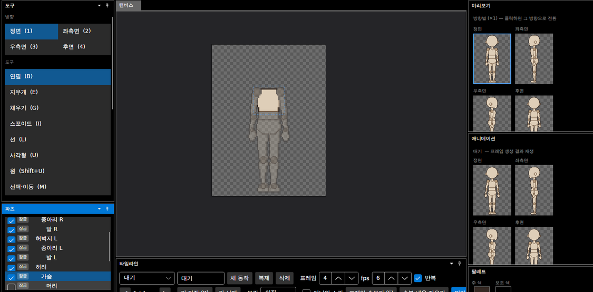
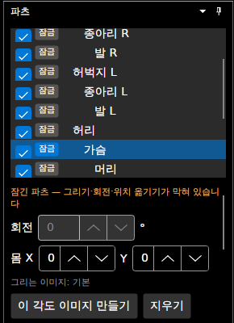
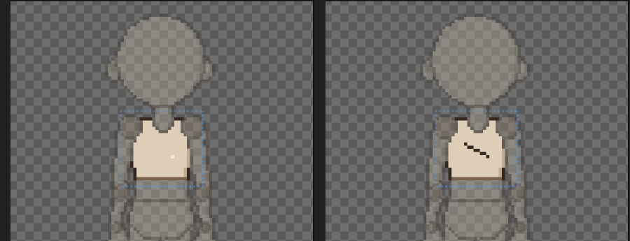

# 패치노트 — 파츠 숨기기·잠금

날짜: 2026-09-25 · 브랜치: `claude/work-environment-setup-a3u93e` · 다음 루트: [progress.md](../progress.md) 3.5절 3번

파츠 창의 파츠 줄마다 **보이기 체크**와 **잠금** 버튼이 생겼다. 겹친 파츠 뒤를 그리거나, 다 그린 파츠를 실수로 건드리지 않게 할 때 쓴다. 편집 보조 기능이라 **저장하지 않고**, 되돌리기 기록에도 남지 않는다 (다른 프로젝트를 열거나 새로 만들면 모두 풀림).

## 스크린샷

머리 숨기기: 편집 캔버스에서만 빠지고, 미리보기·애니메이션 창에는 그대로 나온다.

가슴 잠금: 줄의 잠금 버튼이 켜지고, 위에 안내가 나오며 회전 칸이 꺼진다.

왼쪽: 잠근 가슴 위에 연필로 그어도 바뀌지 않음 (제목에 `*` 없음). 오른쪽: 잠금을 풀고 같은 곳에 그으면 그려짐.

## 규칙

| | 숨기기 (보이기 끔) | 잠금 |
| --- | --- | --- |
| 편집 캔버스 | 그 파츠를 빼고 그림 (외곽선도 남은 파츠 기준) | 그대로 보임 |
| 미리보기·애니메이션·내보내기 | 그대로 나옴 | 그대로 나옴 |
| 캔버스에서 그리기·채우기·선택 | 막힘 (고른 파츠가 숨겨져 있을 때) | 막힘 |
| 캔버스에서 클릭해 고르기 (포즈 모드) | 숨긴 파츠는 클릭되지 않음 (뒤 파츠가 골라짐) | 골라지지만 돌아가지 않음 |
| 파츠 창 회전·이 파츠 0°·눈 X/Y | 됨 | 막힘 |
| 선택 영역 지우기 (Delete) | 막힘 | 막힘 |
| 대칭 그리기 | 짝 파츠가 숨겨지거나 잠겨 있으면 반대쪽에는 그리지 않음 | 같음 |
| 되돌리기·다시 하기, 포즈 초기화, 레이어·장착점 편집 | 영향 없음 | 영향 없음 |

- 부모를 숨기거나 잠가도 자식 파츠는 따로다 (파츠마다 각각).
- 막힌 이유는 파츠 창 위쪽에 주황색으로 나온다 ("잠긴 파츠 — …", "숨긴 파츠 — …").

## 구조

| 위치 | 내용 |
| --- | --- |
| `Core/Rigging/Compositor` | `Compose(..., hidden)` — 뺄 파츠 목록 (기본 없음, 기존 결과 그대로) |
| `App/Services/EditorSession` | 숨김·잠금 목록, `CanDrawActivePart`, `ActivePartBlockedReason`, 캔버스·클릭 판정에만 숨김 적용, 회전·눈 옮기기·대칭 막기 |
| `App/Controls/CanvasInteractions` | 그리기·포즈 드래그에서 막기 |
| `App/ViewModels/PartsViewModel` (`PartItem`), `Views/PartsView.axaml` | 줄마다 보이기 체크·잠금 버튼, 안내 문구, 회전 칸 끄기 |
| `App/ViewModels/MainWindowViewModel` | 선택 영역 지우기 막기 |

## 테스트

- `HiddenPartsTests`: 숨긴 파츠는 합성 결과에 없고, 빈 목록이면 결과가 이전과 같으며, 숨긴 파츠가 덮던 곳 말고는 그대로.
- 앱에서 확인: 숨기기(캔버스만), 잠금 상태에서 연필·포즈 드래그가 아무것도 바꾸지 않음(제목에 `*` 없음), 잠금을 풀면 그려짐.
- 전체 153개 통과, 번역 누락 증가 없음.
