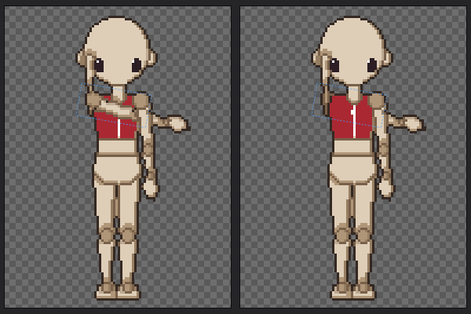
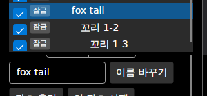
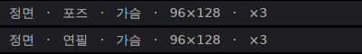
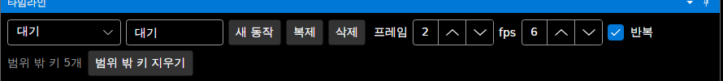
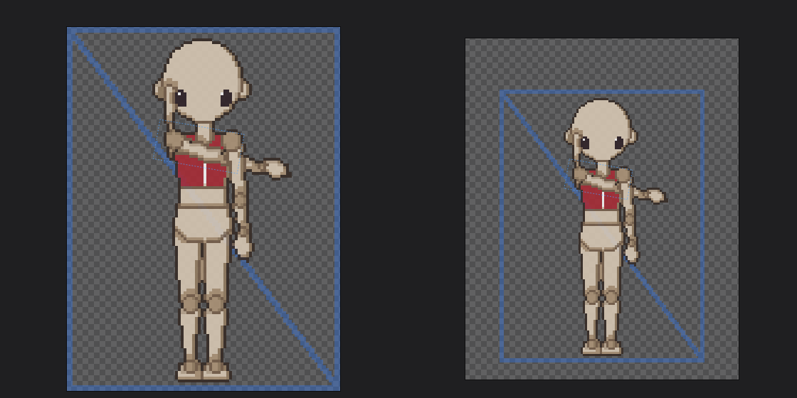

# 패치노트 — 다듬기 묶음 (팔 한 번에 옮기기, 잘림 경고, 파츠 이름, 버그 수정)

날짜: 2026-09-25 · 브랜치: `claude/work-environment-setup-a3u93e` · 체크포인트: [checkpoints.md](../checkpoints.md) `checkpoint-2026-09-25-draw-order`

## 1. 팔·다리를 한 번에 앞뒤로 (그리는 순서)

파츠 창 그리는 순서에 **아래 파츠도 함께 (상완 → 전완·손)** (기본 켬). 켜면 고른 파츠에 달린 아래 파츠(뼈대의 자식)도 한 덩어리로 옮긴다. 방향 순서와 이 포즈 순서 모두에 적용되고, 이 포즈 순서는 키에 `"children": true`로 저장된다 (켰을 때만). 바로 뒤·앞 표시는 함께 옮겨지는 파츠를 건너뛴다.

오른팔을 가슴 쪽으로 돌린 뒤 상완 R **맨 뒤** — 상완·전완·손이 모두 가슴 뒤로 (한 번에).

## 2. 캔버스 끝 경고

- **타임라인**: 지금 프레임의 그림이 캔버스 끝에 닿으면 "⚠ 캔버스 왼쪽 끝에 닿음 (편집 → 캔버스 크기)".
- **내보내기**: 시트·GIF·프레임별 PNG를 내보낸 뒤, 끝에 닿는 프레임이 있으면 동작별 개수와 방향을 알려 준다.
- **명령줄**: `warning: 캔버스 끝에 닿는 프레임이 35개 있습니다 (잘렸을 수 있음): 대기 3프레임 (왼쪽), 점프 26프레임 (위·아래·왼쪽·오른쪽), 공격 6프레임 (왼쪽·오른쪽). …` (설명서용 96×128 프로젝트). 새 128×160 프로젝트는 경고 없음.

## 3. 추가한 파츠 이름 바꾸기, 영어 표시

- 추가한 파츠를 고르면 **이름 칸 + 이름 바꾸기** (최대 40자, 되돌리기, 저장). 파일 이름(`tail1`)은 그대로.
- 영어 화면에서 "꼬리 1-2" → "Tail 1-2"처럼 종류 이름을 번역해 보여 준다.
- 종류 바꾸기는 넣지 않았다: 종류에 따라 시작 그림을 새로 만들어야 해서, 그린 그림이 지워진다. 흔들림 설정은 파츠 창에서 바꿀 수 있다.

## 4. 버그 수정

| 문제 | 수정 |
| --- | --- |
| 이미 고른 도구를 다시 누르면 포즈 모드가 안 꺼짐 | 도구 목록을 누르면 언제나 포즈 모드를 끔 (아래: 포즈 모드 → 연필 다시 누름) |
| 프레임 수를 줄이면 범위 밖 키가 보이지 않게 남음 | 타임라인에 "범위 밖 키 N개" + **범위 밖 키 지우기** (되돌리기). 그대로 두면 프레임을 늘릴 때 돌아옴 |
| 캔버스 크기를 바꾸면 참고 이미지가 제자리 | 참고 이미지도 그림과 함께 옮겨짐 (되돌리기 포함, 반전 방향은 오른쪽 여백만큼) |
| 다른 프로젝트에서 가져온 동작의 순서 변경 | 없는 파츠를 가리키면 "없는 파츠" 안내에 포함 |

캔버스 크기에 기본 여백을 넣기 전(왼쪽)과 뒤(오른쪽). 파란 참고 이미지가 그림을 따라 옮겨졌다.

### 확인했지만 버그가 아니었던 것

- **창 배치 초기화**: 다시 확인하니 파츠 창 크기까지 원래대로 돌아온다. 설명서를 찍을 때 메뉴를 닫는 클릭이 먼저 들어가 명령이 실행되지 않았던 것.
- **가져온 동작의 손본 픽셀 위치**: 동작을 가져올 때 손본 픽셀은 원래 복사하지 않는다 (다른 캐릭터의 픽셀이므로). 캔버스 여백 패치노트의 해당 제한은 지웠다.

## 확인

- 테스트 199개 통과 (새로 5개: 아래 파츠 함께 옮기기, 포즈 순서의 아래 파츠·저장, 캔버스 끝 찾기, 이름 바꾸기, 범위 밖 키 지우기).
- 앱: 경고 표시, 포즈 모드에서 연필 다시 누름, 프레임 4 → 2 → 범위 밖 키 지우기 → 되돌리기, 이름 바꾸기, 팔 맨 뒤(아래 파츠 함께), 창 배치 초기화, 참고 이미지 + 캔버스 크기.
- 명령줄: 예전 96×128 프로젝트 경고 35프레임, 새 프로젝트 경고 없음.
