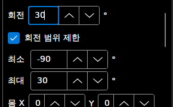
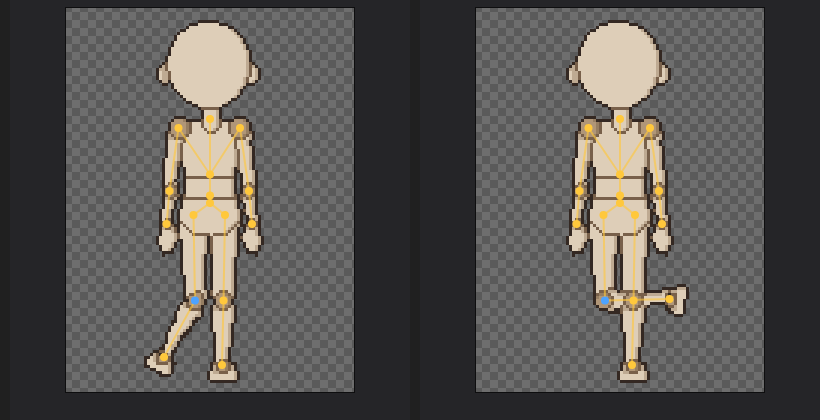

# 패치노트 — 회전 범위

날짜: 2026-09-25 · 브랜치: `claude/work-environment-setup-a3u93e` · 다음 루트: [progress.md](../progress.md) 3.5절 5번

파츠마다 돌아갈 수 있는 각도를 정할 수 있다. 무릎·팔꿈치처럼 한쪽으로만 꺾여야 하는 관절이 포즈를 잡다가 반대로 꺾이는 것을 막는다. 기본은 **제한 없음** (템플릿도 제한 없이 시작).

## 스크린샷

파츠 창: 종아리 R에 **회전 범위 제한**을 켜고 최소 -90°, 최대 30°. 회전 칸에 120을 넣으면 30으로 멈춘다.

포즈 모드에서 끌어 보기: 왼쪽은 한쪽 끝(30°), 오른쪽은 반대쪽으로 한참 더 끌어도 -90°에서 멈춘 모습.

## 규칙

| 항목 | 내용 |
| --- | --- |
| 범위 | 최소·최대 (-180° ~ 180°, 0° = 처음 자세). 최소가 최대보다 크면 서로 바꿈 |
| 켤 때 기본값 | ±90°, 지금 회전이 그 밖이면 지금 회전까지 넓힘 |
| 적용되는 곳 | 캔버스 포즈 드래그(Alt 드래그 포함), 파츠 창 회전 칸, "이 파츠 0°" |
| 범위 밖으로 가면 | 원을 따라 더 가까운 끝에서 멈춤 |
| 방향 | 파츠마다 하나 — 모든 방향에 같이 적용 (반전 방향은 원래 방향의 값 기준) |
| 이미 저장한 키·보간 | 바꾸지 않음 (키 사이 보간도 그대로) |
| 잠긴 파츠 | 범위 칸도 꺼짐 |
| 되돌리기 | 켜기·끄기·값 바꾸기 모두 되돌리기 가능 ("회전 범위") |

## 저장과 호환

- `skeleton.json`의 파츠에 `"limit": [-90, 30]`을 쓴다 (제한이 있는 파츠만). 없으면 파일이 이전과 같다 (기준 파일 테스트 그대로 통과).
- 파일 형식 버전은 그대로. 이전 버전은 이 항목을 무시하고 열며, 다시 저장하면 범위는 빠진다.

## 구조

| 위치 | 내용 |
| --- | --- |
| `Core/Rigging/RotationLimit` | `RotationLimit`(`Clamp`, `Contains`), 되돌리기용 `RotationLimitChange` |
| `Core/Rigging/Part` | `Limit`, `ClampRotation` |
| `Core/Rigging/CharacterTemplate` | `PartSpec.Limit` 읽기·쓰기 |
| `App/Services/EditorSession`, `Controls/CanvasInteractions` | 회전 칸·포즈 드래그에서 범위 적용 |
| `App/ViewModels/PartsViewModel`, `Views/PartsView.axaml` | 회전 범위 제한 체크, 최소·최대 칸 |

## 확인 중 고친 것

- 회전 칸에 범위 밖 값을 넣으면 포즈는 제한되는데 칸에는 넣은 값이 그대로 남던 문제 — 입력이 끝난 뒤 칸을 다시 채우도록 고침.

## 테스트

- `RotationLimitTests`: 범위 안은 그대로·밖은 가까운 끝, 360° 넘는 값, 최소·최대 바뀜, 제한 없는 파츠, 되돌리기·다시 하기, 저장 후 불러오기 (제한 없는 파츠는 없음 그대로).
- 앱에서 확인: 회전 칸 120 → 30, 포즈 드래그로 양쪽 끝에서 멈춤.
- 전체 159개 통과, 번역 누락 증가 없음.
