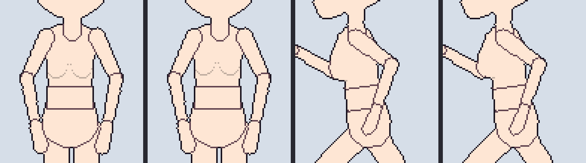
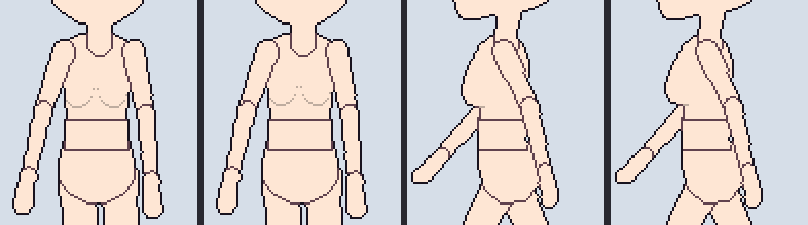
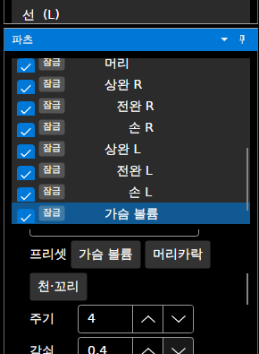
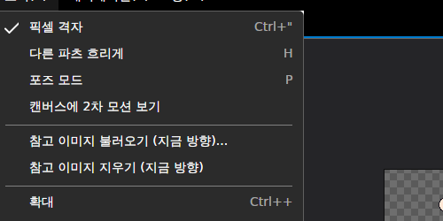
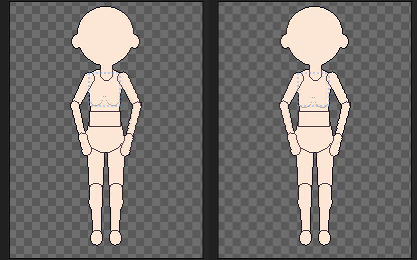

# 패치노트 — 2차 모션 (흔들림)

날짜: 2026-09-25 · 브랜치: `claude/work-environment-setup-a3u93e` · 계획: [plan-secondary-motion.md](../plan-secondary-motion.md)

몸이 움직일 때 **반 박자 늦게 따라오는 흔들림**을 키 없이 자동으로 넣는다. 파츠마다 켜고, 동작의 키는 바꾸지 않는다. 애니메이션 미리보기와 내보내기에서 프레임을 만들 때 더해진다.

## 스크린샷

앱 명령줄 내보내기(2x 마네킹 + 가슴 볼륨 중, 가슴 볼륨 프리셋)의 가슴 부분. 왼쪽부터 정면 끔·켬, 좌측면 끔·켬. 끔은 내보내기 메뉴의 "2차 모션 넣기"를 끈 같은 프로젝트다.

달리기:

걷기:

파츠 창의 **흔들림 (2차 모션)** (가슴 볼륨을 고른 모습): 방식, 프리셋, 주기·감쇠·세기·최대.

보기 메뉴 **캔버스에 2차 모션 보기**, 그리고 달리기 2프레임에서 켜기 전·후의 편집 캔버스 (가슴 볼륨 아래 곡선의 위치가 다름).

## 동작

| 항목 | 내용 |
| --- | --- |
| 방식 | **변형형**: 파츠 그림의 윗줄은 고정, 아래로 갈수록 늦게 따라와 출렁임 (가슴 볼륨). **회전형**: 관절을 중심으로 늦게 기울었다가 돌아옴 (머리카락·꼬리 — 지금 템플릿에는 전용 파츠가 없어 머리·손 등에 약하게 쓸 수 있음) |
| 계산 | 파츠(변형형은 관절, 회전형은 그림 가운데)를 목표로 스프링과 감쇠로 따라가는 점. 한 프레임을 16단계로 나눠 계산하고, 프레임별 길이(×2·×3)만큼 시간을 늘림 |
| 반복 동작 | 3바퀴를 미리 돌려 자리 잡은 뒤 4번째 바퀴를 씀 — 마지막→첫 프레임이 튀지 않음 |
| 결과 | 정수 픽셀·정수 각도로 반올림, 최대값으로 제한. 무작위 없음(항상 같은 결과). 방향마다 따로 계산 |
| 합성 | 변형형은 그림을 변형한 뒤(아래로 늘어나도 잘리지 않게 캔버스를 넓힘) **외곽선보다 먼저** 그림 — 외곽선이 새 모양을 따라감. 회전형은 추가 각도를 포즈에 더해 그림 |
| 적용 | 애니메이션 미리보기: 항상. 시트·GIF·프레임별 PNG: "2차 모션 넣기"(기본 켬)일 때. 편집 캔버스: "캔버스에 2차 모션 보기"를 켰을 때만. 장착점 JSON은 회전형의 추가 각도까지 반영 |
| 프리셋 | 가슴 볼륨(변형형, 주기 4·감쇠 0.4·세기 1·최대 2px), 머리카락(회전형, 3·0.3·1·20°), 천·꼬리(회전형, 5·0.25·1.2·35°) |
| 가슴 볼륨 | 추가할 때 가슴 볼륨 프리셋이 켜진 채로 들어감 |
| 되돌리기 | 켜기·끄기·값 바꾸기 모두 되돌리기 가능 ("흔들림 (2차 모션)"). "2차 모션 넣기"는 프로젝트 설정으로 저장 안 한 변경(`*`)에 표시됨 |

## 저장·호환

- `skeleton.json`: 흔들림이 있는 파츠에만 `"secondary": {"mode": "deform", "period": 4, "damping": 0.4, "strength": 1, "max": 2}`를 쓴다.
- `project.json`: "2차 모션 넣기"를 **끈 경우에만** `"secondaryInExport": false`를 쓴다.
- 형식 버전은 그대로다. 이전 버전은 두 항목을 무시하고 흔들림 없이 보여 준다.
- 흔들림이 없는 프로젝트는 결과가 이전과 같다 (기준 파일 테스트 통과).

## 구조

| 위치 | 내용 |
| --- | --- |
| `Core/Animation/SecondaryMotion` (새로) | `SecondaryMode`, `SecondarySettings`(프리셋·범위 제한), `SecondaryFrame`, `SecondaryMotion.Solve`(스프링·예열·프레임별 길이, 부모 먼저), `SecondaryChange`(되돌리기) |
| `Core/Rigging/Part`, `Character` | `Part.Secondary`, `Character.SecondaryInExport` |
| `Core/Rigging/Compositor` | `Compose(..., secondary)`: 추가 각도, 변형형 그림 변형(외곽선 전). 프레임마다 새로 만드는 변형 그림은 회전 캐시에 넣지 않음 |
| `Core/Animation/SpriteBaker`, `Export/SpriteSheet` | 구울 때 흔들림 더하기 (`secondary` 인자, 기본은 프로젝트 설정). 장착점은 흔들림 포즈로 |
| `Core/Rigging/CharacterTemplate`, `Project/ProjectFile`, `BustPart` | 저장·불러오기, 가슴 볼륨 프리셋 |
| `App/Services/EditorSession`, `AnimationSession` | 캔버스 표시(현재 프레임의 흔들림), 미리보기는 항상, 내보내기 설정 |
| `App/ViewModels/PartsViewModel`, `Views/PartsView.axaml`, `MainWindow` | 파츠 창 설정, 보기·내보내기 메뉴 |

## 테스트

- `SecondaryMotionTests`:
  - 가슴 볼륨 프리셋이 켜진 채 추가되고, 몸이 위아래로 움직이면 최대값 안에서 늦게 따라온다. 같은 입력이면 같은 결과가 나온다.
  - 정지 동작·세기 0·설정 없음에서는 아무것도 더해지지 않는다. 되돌리기가 된다.
  - 반복 동작의 이음새(마지막→첫 프레임) 차이가 다른 프레임 사이 차이보다 크지 않다.
  - 프레임 길이를 늘리면 그 뒤 프레임 값이 바뀐다.
  - 변형형은 윗줄이 그대로이고 아래가 움직인다.
  - 회전형은 몸이 좌우로 움직이면 최대 각도 안에서 양쪽으로 기운다.
  - 설정과 "2차 모션 넣기"가 저장·불러와지고, 끄면 내보내기 결과가 흔들림 없는 합성과 같다.
- 기준 파일(golden)·기존 테스트는 그대로 통과한다.
- 앱에서 확인한 것:
  - 명령줄 내보내기를 켬·끔으로 비교했더니 프레임이 달랐다 (대기 4/4, 걷기 8/8, 달리기 6/6, 점프 4/5).
  - 파츠 창 설정이 보였다.
  - 캔버스 표시를 켜니 달리기 2프레임에서 58픽셀이 바뀌었다.
- 전체 175개 통과, 번역 누락 증가 없음.
