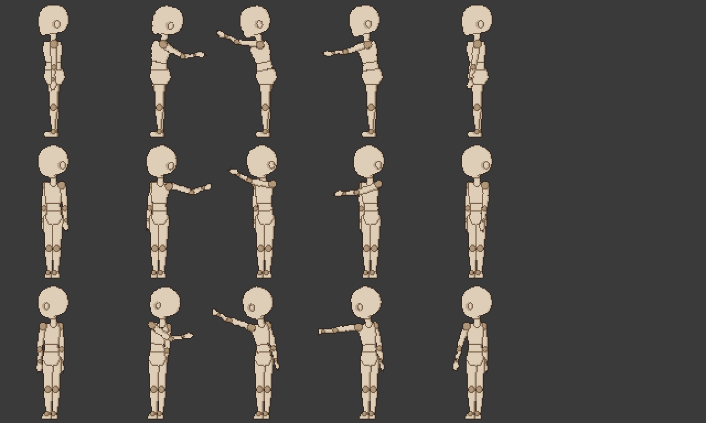
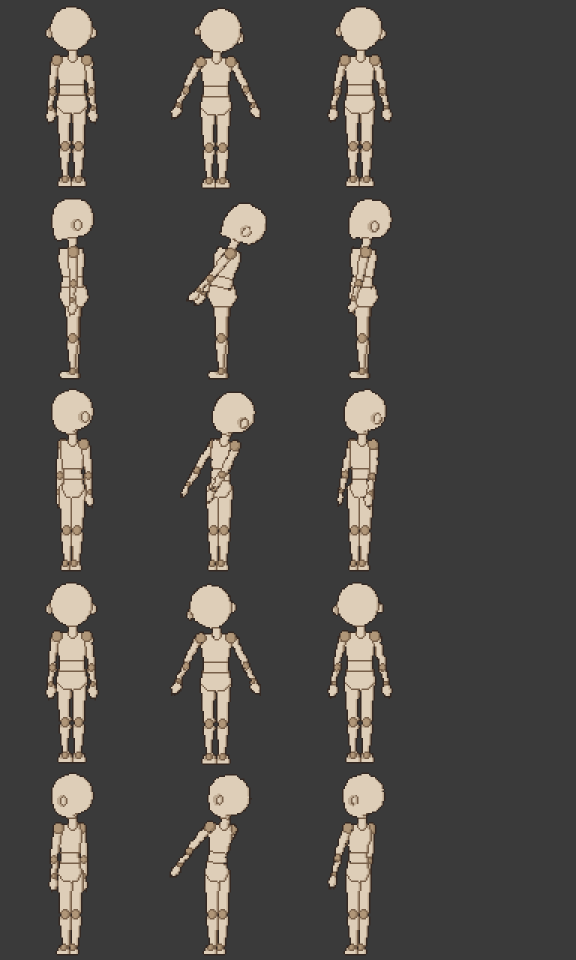

# 패치노트 — 반측면 기본 동작 검토

날짜: 2026-09-25 · 브랜치: `claude/work-environment-setup-a3u93e` · 다음 루트: [progress.md](../progress.md) 3.5절 6번

마네킹 기본 동작 6종의 반측면 트랙(자동 초안 규칙으로 만든 것)을 8방향 시트로 뽑아 하나씩 봤다. **손으로 고칠 곳은 찾지 못해 파일은 바꾸지 않았다.** 코드 변경 없음.

## 본 것

공격 — 위에서부터 좌측면, 앞 반측면 (좌), 뒤 반측면 (좌). 측면 뷰는 화면 왼쪽을 향한다 (머리 옆 동그라미는 귀).

피격 — 위에서부터 정면, 좌측면, 앞 반측면 (좌), 후면, 뒤 반측면 (좌).

## 판단

| 동작 | 반측면 트랙 | 판단 |
| --- | --- | --- |
| 대기·걷기·달리기·점프 | 정면(후면)과 측면이 같은 관절을 움직임 → 반씩 섞음 | 다리가 비스듬히 앞뒤로 움직여 자연스러움 (④ 패치노트의 걷기 시트) |
| 공격 | 팔은 측면 키 그대로 (뒤로 당김 → 위로 → 앞으로 뻗기) | 측면과 같은 방향으로 움직임. 앞 반측면 3프레임에서 가까운 팔이 얼굴 앞을 지나는데, 가까운 팔을 앞으로 든 자세라 실제로도 얼굴을 가리는 위치 — 그대로 둠 |
| 피격 | 몸 굽힘은 반, 팔은 측면 키 | 앞·뒤 반측면 모두 측면과 같은 쪽으로 굽고, 굽는 정도가 측면보다 작아 반측면답게 보임 |

- 동작 초안 규칙의 약점(정면과 측면이 다른 팔을 쓰는 동작)은 기본 6종에는 해당하지 않는다. 손 흔들기처럼 그런 동작을 직접 만들 때는 초안 뒤에 손봐야 한다 ([초안 패치노트](2026-09-25-three-quarter-draft.md)).
- 그래서 템플릿 테스트의 "기본 반측면 트랙 = 초안 규칙 결과" 확인도 그대로 둔다. 나중에 손으로 다듬으면 그 확인을 바꿔야 한다.
