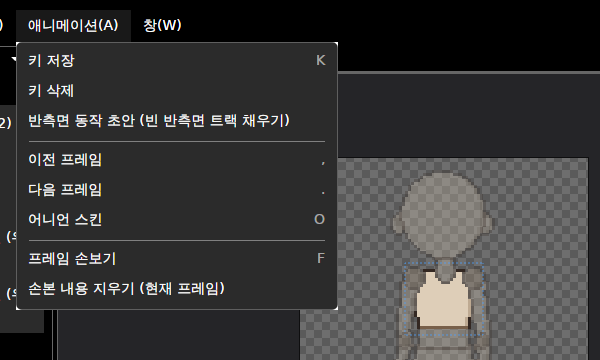
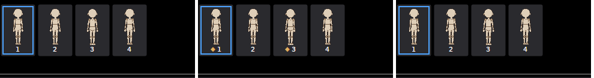
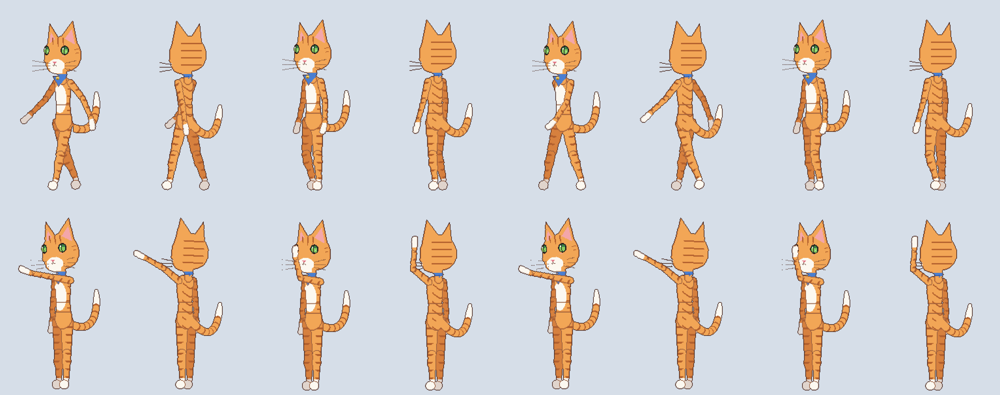

# 패치노트 — 반측면 동작 초안

날짜: 2026-09-25 · 브랜치: `claude/work-environment-setup-a3u93e` · 계획: [plan-three-quarter-view.md](../plan-three-quarter-view.md) 5.2

반측면을 켠 뒤 **애니메이션 → 반측면 동작 초안 (빈 반측면 트랙 채우기)** 를 누르면, 모든 동작의 비어 있는 반측면 트랙이 정면·후면과 측면 키로 채워진다.

## 스크린샷

애니메이션 메뉴 (반측면이 켜져 있을 때만 보임).

앞 반측면 (좌)의 대기 동작: 초안 전(키 없음) → 초안 후(1·3프레임에 키 ◆) → 되돌리기 한 번(다시 없음).

이 규칙(`ThreeQuarterDraft`)으로 만든 예시 — 고양이 캐릭터, 위: 걷기, 아래: 손 흔들기. 앞 반측면·뒤 반측면을 번갈아 배치. 걷기는 다리가 비스듬히 앞뒤로, 팔은 측면처럼 흔든다. 손 흔들기는 측면처럼 가까운 팔로 앞쪽을 향해 흔드는데, 앞 반측면에서는 손이 얼굴 앞을 지나는 프레임이 있어 손볼 수 있다 (초안이므로).

## 규칙

| 항목 | 내용 |
| --- | --- |
| 앞 반측면 키 | 정면 키와 측면 키의 중간 (회전은 가까운 쪽으로 반, 몸 위치도 반) |
| 뒤 반측면 키 | 후면 키와 측면 키의 중간 |
| 팔 (상완·전완·손) | **측면 키를 그대로** — 반측면은 측면과 가까운 팔·먼 팔이 같다. 정면에서 오른팔, 측면에서 왼팔을 쓰는 동작(손 흔들기, 공격)을 반씩 섞으면 두 팔이 반쯤 들린 모습이 되기 때문 (예시 캐릭터 시험에서 확인) |
| 키 위치 | 정면(후면)이나 측면에 키가 있는 모든 프레임 |
| 보간 | 그 프레임의 정면(후면) 키 보간, 없으면 측면 키 보간 |
| 이미 키가 있는 반측면 트랙 | 그대로 둠 |
| 되돌리기 | 모든 동작을 합쳐 한 번 |
| 채울 게 없을 때 | 안내 문구 |

## 구조

| 위치 | 내용 |
| --- | --- |
| `Core/Animation/ThreeQuarterDraft` | 규칙(`Make`), 여러 동작에 한 번에 적용·되돌리기(`Apply`) |
| `App/ViewModels/MainWindowViewModel`, `Views/MainWindow` | 애니메이션 메뉴 명령 |

## 검증

- 테스트 147개 통과 (새 2개: 팔은 측면·나머지는 중간·몸 위치·보간·뒤 반측면, 키 있는 트랙 유지·한 번 되돌리기·채울 게 없으면 false)
- 앱 자동 조작: 반측면 추가 → 앞 반측면 (좌) 대기 동작에 키 없음 → 초안 → 1·3프레임에 키 → 되돌리기 → 키 없음, 예외 없음
