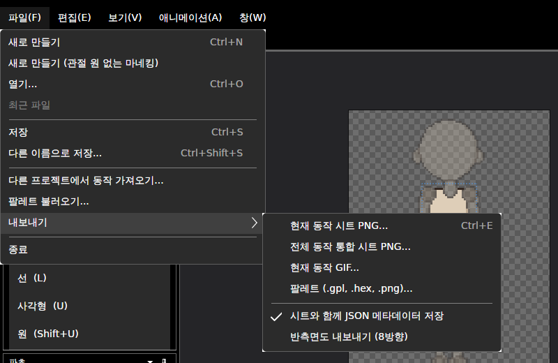
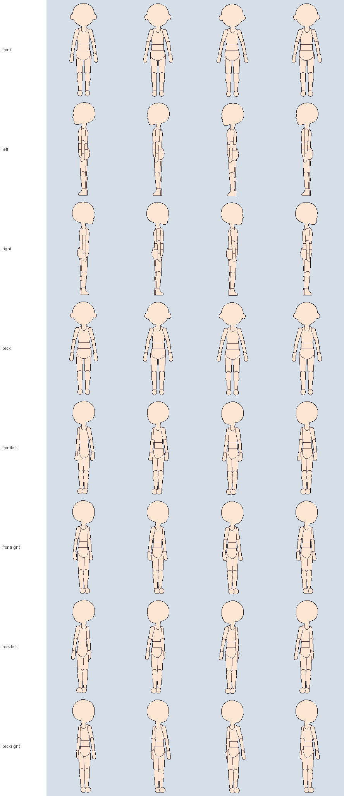

# 패치노트 — 반측면 ②: 8방향 내보내기

날짜: 2026-09-25 · 브랜치: `claude/work-environment-setup-a3u93e` · 계획: [plan-three-quarter-view.md](../plan-three-quarter-view.md) 9절 ②

반측면이 있는 캐릭터는 시트·JSON·GIF를 8방향으로 내보낼 수 있다. **기본은 지금처럼 4방향**이고, 켜도 기존 4줄의 위치는 그대로다.

## 스크린샷

파일 → 내보내기 → **반측면도 내보내기 (8방향)** (기본 꺼짐, 설정에 저장).

8방향 통합 시트의 첫 동작(대기) 부분 — 동작마다 기존 4줄(front·left·right·back) 뒤에 반측면 4줄이 붙는다. 2x 마네킹을 앱의 일괄 내보내기(`--directions 8`)로 뽑은 결과 (각 줄 앞 4프레임).

## 동작

| 항목 | 내용 |
| --- | --- |
| 기본 | 4방향 — 반측면이 있어도 설정을 켜기 전까지 결과물이 이전과 같음 |
| 8방향 시트 | 동작마다 8줄: `front, left, right, back`, 그다음 `frontleft, frontright, backleft, backright`. 앞 4줄은 4방향 시트와 픽셀 단위로 같음 |
| 메타데이터 JSON | 동작의 `directions`에 반측면 키 4개 추가. 기존 키·필드 그대로 |
| GIF | 방향 수만큼 옆으로 (4칸 또는 8칸) |
| 명령줄 | `--export 파일 [--out 폴더] [--directions 4\|8]`, 기본 4 |
| 반측면 없는 캐릭터 | 설정·옵션과 상관없이 4방향 |

## 구조

| 위치 | 내용 |
| --- | --- |
| `Core/Export/SpriteSheet.Build`, `AnimationGif.Write` | 내보낼 방향 목록 인자 (기본 4방향) |
| `Core/Rigging/Character.ExportDirections` | 켠 설정 + 반측면 있음 → 8방향, 아니면 4방향 |
| `App/Services/AppSettings` | `ExportThreeQuarter` (기본 꺼짐) |
| `App/Services/ProjectService` | 시트·GIF 내보내기에 방향 목록 전달 |
| `App/Services/CommandLine`, `BatchExporter` | `--directions 4\|8` |
| `Views/MainWindow` | 내보내기 메뉴 토글 |

## 검증

- 테스트 145개 통과 (새 2개: 8방향 시트의 동작별 앞 4줄이 4방향 시트와 같음·JSON 방향 키·반측면 행 위치, 반측면 없는 캐릭터는 4방향·GIF 폭)
- 기준 파일 회귀 테스트 통과 (기본 내보내기 결과 변화 없음)
- 앱 일괄 내보내기: 견습 마녀 기본 → 동작당 4줄(9184 px 높이), `--directions 8` → 8줄(18368 px), 두 시트의 기존 4줄 픽셀 동일, GIF 폭 1536 → 3072. 반측면 없는 파일에 `--directions 8` → 4줄 그대로
