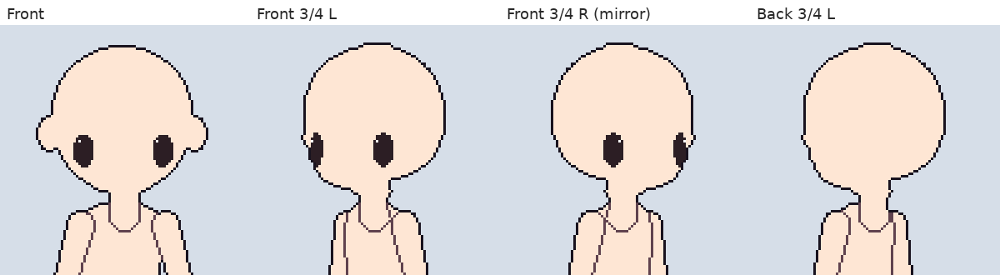

# 패치노트 — 반측면 눈 위치·되돌리기 이름, 설계 문서 정리

날짜: 2026-09-25 · 브랜치: `claude/work-environment-setup-a3u93e` · 커밋: `7b9dab8`, `15fdcb8`

## 반측면 눈 위치

반측면을 켠 캐릭터에 눈 파츠를 넣으면, 앞 반측면의 눈이 **얼굴이 향하는 쪽(화면 왼쪽)으로 옮겨 가고 먼 눈(눈 R)은 좁게** 시작한다. 뒤 반측면은 빈 이미지다. 이전에는 정면과 같은 위치·크기로 시작했다 (계획 문서와 달랐던 부분).

(2배 기본 캐릭터에 반측면을 켜고 눈 파츠를 추가해 Core 합성으로 그린 그림. 반측면을 켜는 화면은 ③단계에서 붙는다.)

| 방향 | 눈 |
| --- | --- |
| 정면 | 두 눈, 좌우 대칭 |
| 앞 반측면 (좌) | 두 눈을 얼굴 쪽으로 옮김, 먼 눈은 좁게 |
| 앞 반측면 (우) | 위를 좌우 반전 |
| 측면 | 가까운 눈 하나 |
| 후면·뒤 반측면 | 없음 (빈 이미지) |

자리는 [눈 위치 옮기기](2026-09-25-eye-position.md)로 방향마다 조정한다.

## 되돌리기 이름

반측면(우)의 반전을 끊거나 되돌릴 때 되돌리기 목록에 방향 이름이 나온다 — "앞 반측면 (우) 따로 그리기", "뒤 반측면 (우) 반전으로 되돌리기". 우측면은 전과 같다. 영어 UI 번역 패턴(`{0} 따로 그리기` 등)도 추가했다.

## 설계 문서 정리

코드와 문서를 대조해 맞췄다.

| 문서 | 내용 |
| --- | --- |
| [design.md](../design.md) | 눈(세부) 파츠, 선택 기능인 반측면, 파일 형식 버전 규칙, 새로 만들기 동작 고르기 반영. 6절 파일 구조를 실제 `.dotchar` 구조와 형식 버전 표로 교체. 처음부터 없던 6개 항목(관절 회전 범위, 프레임별 지속시간, 개별 프레임 PNG, 자동 음영, 히스토리 창, 파츠 숨기기·잠금)에 **(미구현)** 표시 |
| [plan-three-quarter-view.md](../plan-three-quarter-view.md) | 용어 "반측면"으로 통일, 눈 구현 반영, 동작 초안의 한계(정면·측면이 다른 팔을 쓰는 동작), 시험한 반측면 몸·머리 만드는 법, 실제 작업 브랜치 |
| [progress.md](../progress.md) | 반측면 단계 표, 눈 위치 옮기기 추가 |

## 검증

- 테스트 140개 통과 (새 2개: 반측면 눈 위치·너비, 되돌리기 이름)
- 기준 파일 회귀 테스트 그대로 통과 (4방향 결과물 변화 없음)
