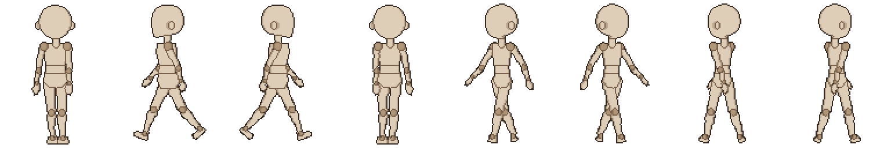

# 패치노트 — 반측면(3/4 뷰) 정리

날짜: 2026-09-25 · 브랜치: `claude/work-environment-setup-a3u93e` (`main`에는 아직 병합 안 됨) · 계획: [plan-three-quarter-view.md](../plan-three-quarter-view.md)

반측면 계획의 모든 단계(①~④와 동작 초안)가 끝났다. 이 문서는 단계별 패치노트를 한곳에 모은 정리다. 이번 정리에서 바뀐 코드는 없다.

## 결과물

"반측면 포함"을 켜고 새로 만든 마네킹을 8방향으로 내보낸 걷기 GIF (손대지 않은 결과). 왼쪽부터 정면·좌측면·우측면·후면·앞 반 (좌)·앞 반 (우)·뒤 반 (좌)·뒤 반 (우).

## 사용자가 할 수 있게 된 것

| 하는 일 | 방법 | 패치노트 |
| --- | --- | --- |
| 반측면 마네킹으로 시작 | 파일 → 새로 만들기 → "반측면 포함" (기본 끔) | [④](2026-09-25-three-quarter-template.md) |
| 기존 프로젝트에 반측면 켜기·끄기 | 편집 → 반측면 추가 / 반측면 지우기 (정면·후면 복사본에서 시작, 되돌리기 가능) | [③](2026-09-25-three-quarter-ui.md) |
| 반측면 방향 고르기 | 방향 목록, 미리보기 칸 클릭, 단축키 5~8 | [③](2026-09-25-three-quarter-ui.md) |
| 반측면 (우)를 따로 그리기 | 파츠 창 "반전 끊고 따로 그리기" | [③](2026-09-25-three-quarter-ui.md) |
| 반측면 동작 만들기 | 애니메이션 → 반측면 동작 초안 (빈 트랙만, 팔은 측면 키) | [초안](2026-09-25-three-quarter-draft.md) |
| 8방향으로 내보내기 | 내보내기 → 반측면도 내보내기 (8방향), 명령줄 `--directions 8` | [②](2026-09-25-three-quarter-export.md) |
| 눈 파츠 넣고 방향별로 옮기기 | 파츠 창 눈 추가, 눈 X·Y | [눈 파츠](2026-09-25-eye-parts.md), [눈 위치](2026-09-25-eye-position.md), [반측면 눈](2026-09-25-three-quarter-eyes-docs.md) |

## 호환 규칙

| 경우 | 결과 |
| --- | --- |
| 반측면 없는 프로젝트 | 버전 1 파일, 저장·내보내기 결과가 이전과 같음 (기준 파일 테스트로 확인) |
| 반측면 있는 프로젝트 | 버전 2 파일. 이전 프로그램은 "더 새 버전" 안내와 함께 열지 않음 |
| 반측면을 지운 프로젝트 | 다시 버전 1로 저장 |
| 반측면 없는 프로젝트로 동작 가져오기 | 반측면 트랙을 빼고 가져오며 안내 |
| 반측면 트랙이 비어 있을 때 | 앞 반측면은 정면, 뒤 반측면은 후면 트랙을 재생 |
| 내보내기 기본값 | 4방향 (8방향 줄은 기존 4줄 뒤에 붙음) |

## 남은 제한

- 기본 동작의 반측면 트랙은 자동 초안이다 — 캐릭터에 맞게 손볼 필요가 있다.
- 정면과 측면이 다른 팔을 쓰는 동작은 초안 규칙이 팔을 측면 키로 정하므로, 앞 반측면에서 손이 얼굴 앞을 지나는 프레임이 생길 수 있다.
- 대칭 그리기는 반측면에서 꺼진다 (측면과 같음).

## 확인

테스트 150개 통과, 번역 누락 증가 없음, 단계마다 앱을 띄워 스크린샷으로 확인 (각 패치노트).
