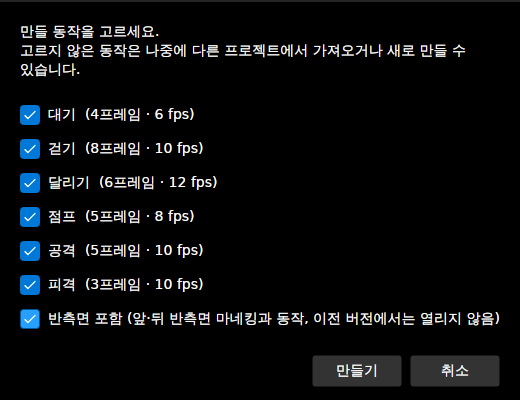
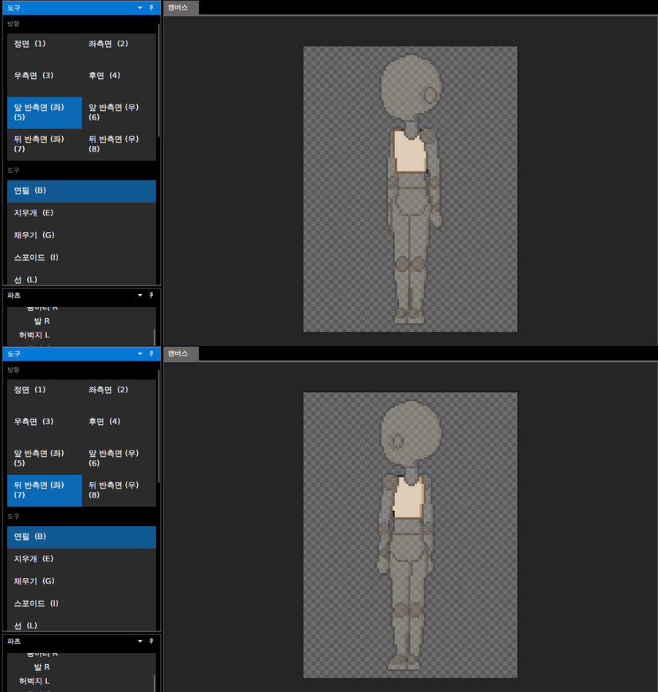
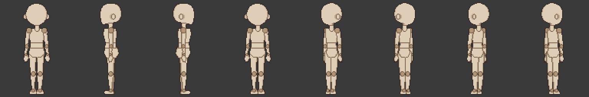
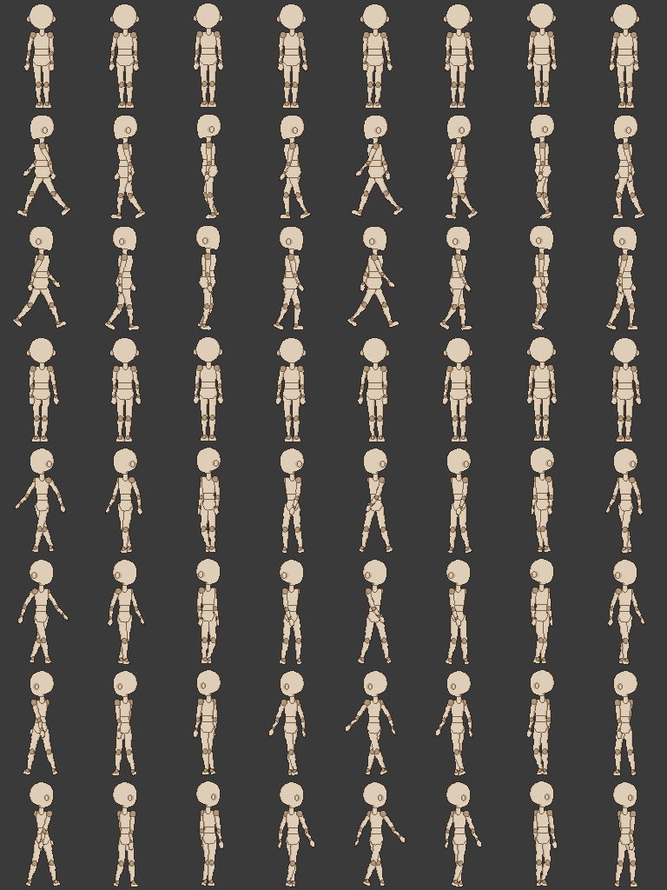

# 패치노트 — 반측면 ④: 반측면 마네킹과 기본 동작

날짜: 2026-09-25 · 브랜치: `claude/work-environment-setup-a3u93e` · 계획: [plan-three-quarter-view.md](../plan-three-quarter-view.md) 7절, 9절 ④

**파일 → 새로 만들기**의 동작 목록 맨 아래에 **반측면 포함** 체크가 생겼다. 켜고 만들면 마네킹이 앞·뒤 반측면 파츠를 가진 채로 시작하고, 기본 동작 6종에도 반측면 트랙이 들어 있다. 기본은 꺼져 있어, 끈 채로 만든 프로젝트는 지금까지와 같다 (4방향, 버전 1 파일).

## 스크린샷

새로 만들기 창 — "반측면 포함"은 기본으로 꺼져 있다 (스크린샷은 켠 상태).

켜고 만든 프로젝트: 방향 목록 8개, 캔버스는 앞 반측면 (좌)(위)와 뒤 반측면 (좌)(아래)의 마네킹.

그 프로젝트를 명령줄로 8방향 내보내기 (`--directions 8`) — 대기 첫 프레임, 왼쪽부터 정면·좌측면·우측면·후면·앞 반 (좌)·앞 반 (우)·뒤 반 (좌)·뒤 반 (우). (우)는 (좌)의 반전.

같은 시트의 걷기 (위에서부터 같은 방향 순서, 8프레임). 반측면 줄은 다리가 비스듬히 앞뒤로 움직이고 팔은 측면처럼 흔든다.

## 앱에서 확인한 것

| 확인 | 결과 |
| --- | --- |
| 새로 만들기 창 | 동작 6종 + "반측면 포함 (앞·뒤 반측면 마네킹과 동작, 이전 버전에서는 열리지 않음)", 기본 끔 |
| 켜고 만들기 → 저장 | `formatVersion` 2, `frontleft/`·`backleft/` 이미지 32개, 동작 6종 모두 `frontleft`·`backleft` 트랙 |
| 끄고 만들기 → 저장 | `formatVersion` 1, 반측면 이미지·트랙 없음 |
| 프로그램 시작 시 기본 프로젝트 | 4방향 (반측면 없음) |

## 마네킹 반측면 파츠

`mannequin/make_chibi_parts.py`의 `view_front_left`·`view_back_left`가 만든다. 관절 원 있는/없는 템플릿 모두.

| 항목 | 만드는 법 |
| --- | --- |
| 몸 돌리기 | 몸 중심선 기준으로 가까운 쪽 x는 정면 거리의 0.85배, 먼 쪽은 0.6배. 팔다리 굵기는 그대로 |
| 먼 쪽 | 앞 반측면(왼쪽을 향함)은 캐릭터 오른쪽(`_r`, 화면 왼쪽), 뒤 반측면은 화면 오른쪽 — 두 방향 모두 `_r`가 먼 쪽 |
| 가슴 | 앞 반측면은 향하는 쪽으로 2px 내밀기 |
| 머리 | 정면 머리(귀 없음)와 측면 머리의 가로 범위를 줄마다 반씩 섞고 3줄 평균으로 매끄럽게, 가까운 귀 하나 |
| 발 | 향하는 쪽으로 3px |
| 그리기 순서 (뒤→앞) | 먼 팔 → 먼 다리 → 가까운 다리 → 골반·허리·가슴·머리 → 가까운 팔 |

`skeleton.json`에는 `frontleft`·`backleft` 키만 추가했다 (기존 키·이미지는 그대로, 기존 PNG 96개는 픽셀이 같아 다시 저장하지 않음).

## 기본 동작의 반측면 트랙

`animations.json`의 6종 모두에 `frontleft`·`backleft` 트랙을 추가했다. 트랙은 [반측면 동작 초안](2026-09-25-three-quarter-draft.md) 규칙(`ThreeQuarterDraft`) 그대로의 결과다 — 손으로 다듬지는 않았다. 테스트가 "파일의 반측면 트랙 = 초안 규칙으로 다시 만든 트랙"을 확인하므로, 나중에 손으로 다듬으면 그 테스트를 바꿔야 한다.

## 호환

- 반측면을 끄고 만든 프로젝트는 불러온 템플릿에서 반측면 뷰(`CharacterSpec.WithoutThreeQuarter`)와 트랙(`ThreeQuarterViews.StripFrom`)을 빼므로 이전과 같다. 기존 기준 파일(golden) 테스트는 그대로 통과.
- 켜고 만든 프로젝트는 버전 2 — 이전 프로그램은 "더 새 버전" 안내와 함께 열지 않는다 (① 단계의 규칙). 나중에 **편집 → 반측면 지우기**로 끄면 다시 버전 1로 저장된다.

## 구조

| 위치 | 내용 |
| --- | --- |
| `mannequin/make_chibi_parts.py` | `turn`, `head_three_quarter`, `view_three_quarter` (앞·뒤) |
| `App/Assets/Templates/chibi96*/` | `frontleft/`·`backleft/` 파츠 이미지, `skeleton.json` 새 키, `animations.json` 반측면 트랙 |
| `Core/Rigging/CharacterTemplate` | `CharacterSpec.WithoutThreeQuarter()` |
| `App/Services/TemplateLoader` | `LoadChibi96(jointDiscs, threeQuarter)`, `LoadDefaultAnimations(threeQuarter)` — 기본은 반측면 빼기 |
| `App/Services/ProjectService` | `New(jointDiscs, clips, threeQuarter)` |
| `App/ViewModels/MainWindowViewModel`, `Services/IFileDialogs`, `Views/MainWindow` | 새로 만들기 창의 "반측면 포함" 줄 (항목별 처음 체크 상태 지정) |

## 테스트

- `TemplateTests`: 두 템플릿 모두 16개 파츠에 반측면 뷰·이미지가 있음, 앞 반측면 그리기 순서(먼 팔 < 가슴 < 가까운 팔), 반측면 빼면 4방향 캐릭터. 기본 동작 6종 모두 반측면 키가 있고 초안 규칙과 같으며, 빼면 반측면 데이터가 없음.
- 전체 150개 통과.
