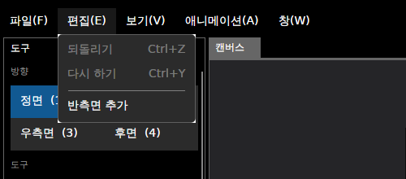
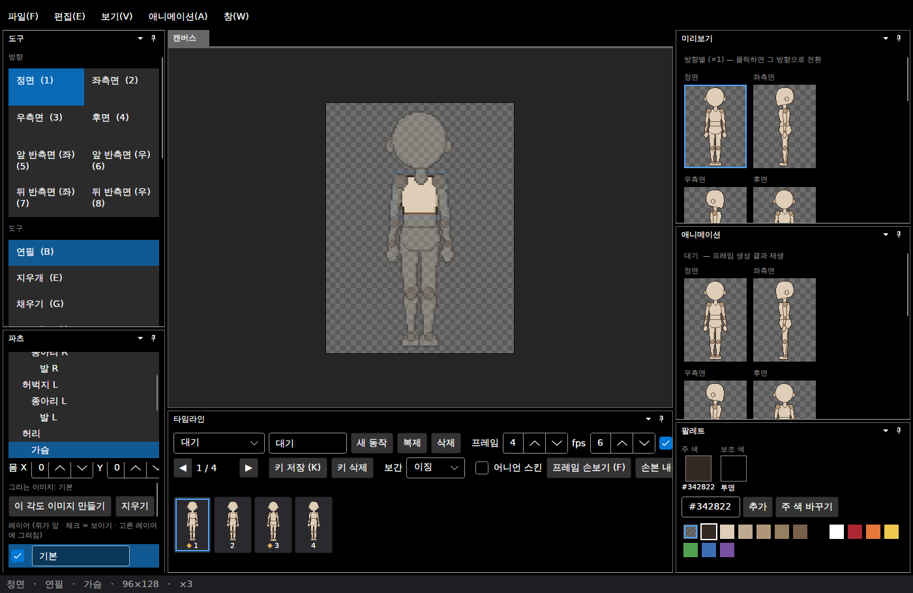
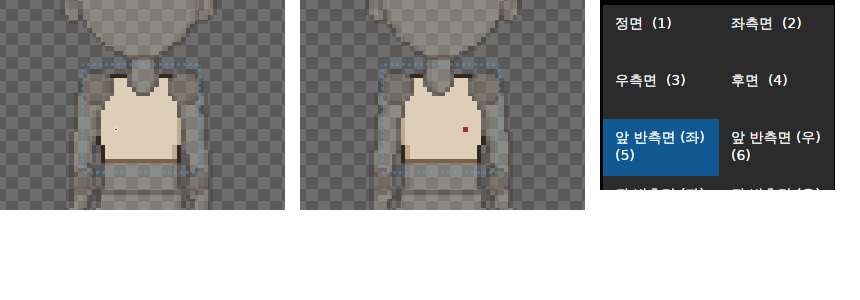
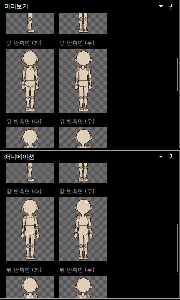
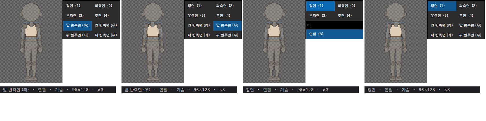

# 패치노트 — 반측면 ③: 화면

날짜: 2026-09-25 · 브랜치: `claude/work-environment-setup-a3u93e` · 계획: [plan-three-quarter-view.md](../plan-three-quarter-view.md) 9절 ③

앱에서 반측면을 켜고, 방향을 바꾸고, 그리고, 미리보기로 확인할 수 있다. 반측면을 켜지 않은 프로젝트는 화면·동작이 이전과 같다 (미리보기 제목만 "4방향" → "방향별").

## 스크린샷

편집 메뉴 → **반측면 추가** (켜져 있으면 **반측면 지우기**가 대신 보인다).

켜면 방향 목록이 8개가 되고, 단축키 5~8로 반측면 방향을 고른다.

앞 반측면 (좌)에서 가슴에 빨간 점을 찍고(왼쪽, 연필 커서에 가려 흰 점으로 보임) 6을 눌러 앞 반측면 (우)로 가면 반전된 자리에 보인다(가운데). 오른쪽: 줄바꿈된 방향 목록 — 반측면 이름이 길어 단축키가 둘째 줄에 표시된다.

미리보기·애니메이션 창도 8방향을 보여 준다 (막 켰을 때라 반측면은 정면·후면 복사본).

순서대로: 앞 반측면 (좌) → 앞 반측면 (우) → 반측면 지우기 (방향 목록 4개로, 지금 방향은 정면으로) → 되돌리기 (8개로 복구).

## 동작

| 항목 | 내용 |
| --- | --- |
| 켜기 | 편집 → 반측면 추가. 모든 파츠에 정면→앞 반측면, 후면→뒤 반측면 복사본을 만들고 그 위에 다시 그린다. 되돌리기 한 번 |
| 끄기 | 편집 → 반측면 지우기. 반측면 그림과 **모든 동작의** 반측면 키·손본 픽셀을 지운다. 되돌리기 한 번으로 모두 복구 |
| 방향 목록 | 캐릭터의 방향을 따라 4개 또는 8개. 끄거나 반측면 없는 파일을 열면 지금 방향이 정면·후면으로 바뀜 |
| 단축키 | 5 앞 반측면 (좌) · 6 앞 반측면 (우) · 7 뒤 반측면 (좌) · 8 뒤 반측면 (우). 반측면이 꺼져 있으면 아무 일도 안 함. 단축키 설정 창에서 바꿀 수 있음 |
| 미리보기 | 방향별 미리보기·애니메이션 창이 캐릭터의 방향을 모두 보여 줌. 애니메이션은 반측면 트랙이 비면 정면·후면 트랙으로 재생 |
| 반전 끊기 | 파츠 창 체크 이름을 "반전 끊고 따로 그리기"로 바꾸고, 우측면뿐 아니라 반측면 (우)에서도 동작 |
| 내보내기 | 아직 4방향 그대로 (8방향 내보내기는 ②단계) |

## 구조

| 위치 | 내용 |
| --- | --- |
| `Core/Animation/SpriteBaker` | 만들 방향 목록 인자 (기본은 4방향 — 시트·GIF 내보내기는 그대로) |
| `App/Services/EditorSession` | `Directions`·`HasThreeQuarter`, 반측면 추가·지우기, 방향이 없어지면 정면·후면으로, 캐릭터 방향만큼 합성·미리보기 비트맵, 반전 방향 따로 그리기 |
| `App/Services/AnimationSession` | 캐릭터 방향만큼 프레임 생성, 반측면 포즈 적용, `Directions` |
| `App/Services/Shortcuts`, `MainWindowViewModel` | 방향 단축키 5~8, 반측면 추가·지우기 명령 |
| `Views/ToolboxView`·`PreviewView`·`AnimationPreviewView` | 방향 목록 반복 (고정 4칸 → 방향 목록), 긴 이름 줄바꿈 |
| `Views/MainWindow`, `Views/PartsView` | 편집 메뉴 항목, 반전 끊기 체크 이름·설명 |
| `Assets/Lang/en.json` | 새 문구 번역 |

## 검증

- 테스트 143개 통과, 기준 파일 회귀 테스트 통과 (4방향 저장·내보내기 결과 변화 없음)
- 앱 자동 조작(리눅스 Xvfb): 반측면 추가 → 방향 8개·미리보기 8칸·애니메이션 8칸 → 5로 앞 반측면 (좌), 가슴에 점 → 6으로 앞 반측면 (우)에서 반전된 점 확인 → 반측면 지우기 → 방향 4개, 지금 방향 정면 → 되돌리기 → 8개 복구, 예외 없음
- 번역 누락 검사: 새 문구 누락 없음
