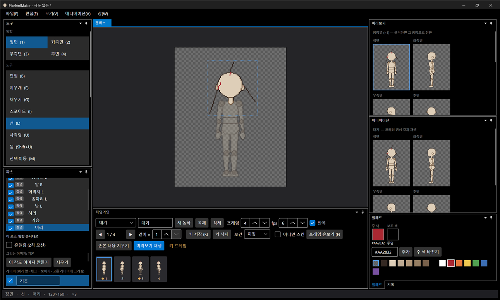
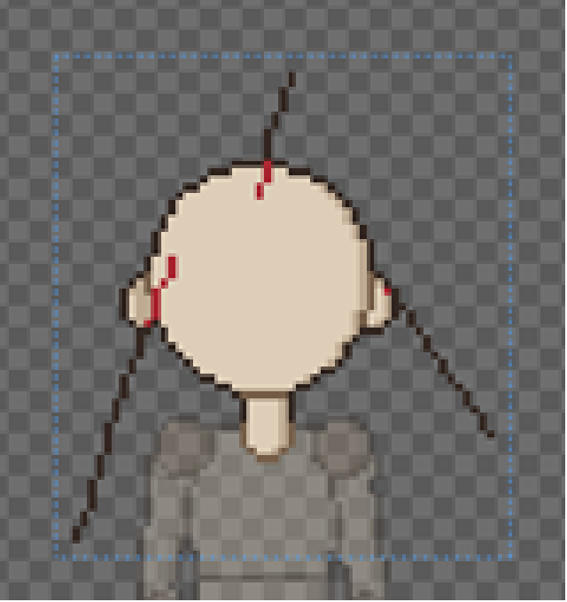
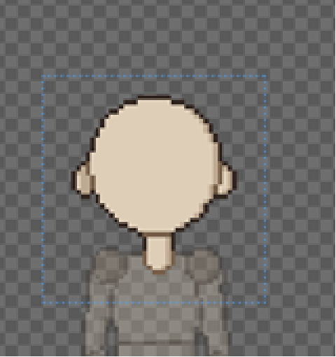

# 패치노트 — 파츠 바깥에 그리기

날짜: 2026-09-26 · 브랜치: `feature/draw-outside-part`

처음 마네킹 모양 바깥에는 색칠이 되지 않던 문제를 고쳤다. 머리카락이 머리 밖으로 나가거나 치마·옷이 몸 윤곽보다 넓어지는 그림을 그릴 수 있다.

## 원인

파츠마다 그림(이미지)이 마네킹 모양에 딱 맞게 잘려 있다 (둘레 2px, 머리는 6px 여유). 캔버스에 그리면 그 파츠 그림의 좌표로 바꿔 찍는데, 그림 밖 좌표는 무시되어 아무것도 그려지지 않았다.

## 바뀐 동작

- 연필·선·사각형·원으로 그릴 때, 그리는 동안 선택한 파츠의 그림 영역이 캔버스 전체로 늘어난다.
- 손을 떼면 실제로 그린 곳까지만(둘레 2px) 남기고 다시 줄어든다. 파츠 안에서만 그렸으면 크기는 그대로.
- 늘어나도 그림·관절·장착점의 캔버스 위치는 그대로다. 레이어가 여럿이면 모두 같은 크기로 늘어난다.
- 대칭 그리기를 켜면 짝 파츠도 같이 늘어난다.
- **되돌리기 한 번**에 그 획과 영역 변화가 함께 취소된다. 아무것도 안 그린 획은 기록에 남지 않는다.
- 채우기는 그대로 파츠 영역 안에서만 채운다 (바깥까지 채우면 캔버스 전체가 칠해지므로). 지우개·스포이드·선택·이동도 영역을 늘리지 않는다.
- 각도 이미지(45° 교체 이미지)에 그릴 때는 영역을 늘리지 않는다.

## 스크린샷

머리를 고르고 머리 밖으로 머리카락 가닥(연필 두 획)과 선 하나를 그린 화면. 파란 점선(머리 그림 영역)이 그린 곳까지 넓어졌다.

Ctrl+Z 세 번 — 획마다 한 번씩 취소되고 영역도 원래 크기로 돌아왔다.

## 참고: 자동 외곽선

위 확대 화면에서 머리 밖의 1px 선이 빨강이 아니라 진한 갈색으로 보이는 것은 **자동 외곽선** 때문이다. 자동 외곽선은 파츠 실루엣 가장자리 픽셀을 외곽선 색으로 바꾸므로, 굵기 1px 선은 전부 외곽선 색이 된다 (그림 자체는 빨강으로 저장됨). 도구 창의 "자동 외곽선"을 끄면 칠한 색 그대로 보인다. 머리카락처럼 면으로 칠하면 안쪽은 칠한 색, 가장자리만 외곽선이 된다.

## 구조

| 위치 | 내용 |
| --- | --- |
| `Core/Rigging/PartViewBounds` | 캔버스를 덮는 영역 계산, 그린 곳까지 줄이기, 영역 바꾸기(`PartViewResize`, 되돌리기 — 레이어 이미지 교체, 위치·장착점 보정) |
| `Core/History/UndoHistory` | 묶음 기록 `BeginGroup`/`EndGroup`/`CancelGroup` (`CompositeAction`) — 되돌리기·다시 하기 전에 열린 묶음은 닫힘 |
| `App/Services/ToolCatalog` | `DrawsOutside` (연필·선·사각형·원) |
| `App/Services/EditorSession` | `BeginStroke`/`EndStroke`: 늘리기 → 그리기 → 줄이기를 한 묶음으로 |
| 테스트 | 227개 통과 (+7: 늘었다 줄기, 위·왼쪽으로 늘 때 위치·장착점, 한 번에 되돌리기, 안쪽만 그리면 그대로, 레이어 함께, 취소, 회전한 파츠) |

## 검증 (앱 자동 조작)

- 머리 선택 → 연필로 머리 밖 두 획, 선 도구로 한 획 → 바깥에 그려지고 영역이 그린 곳까지 넓어짐
- Ctrl+Z 세 번 → 획마다 취소, 영역 원래 크기
