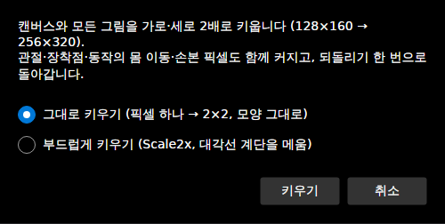
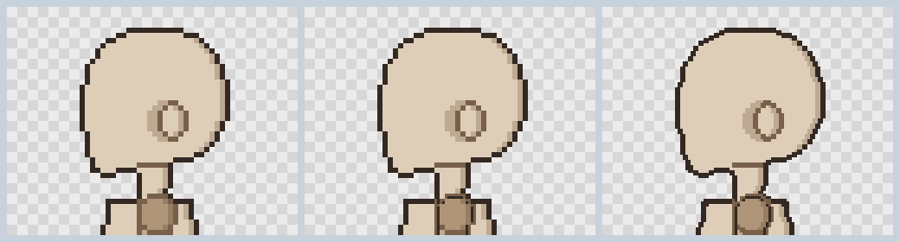
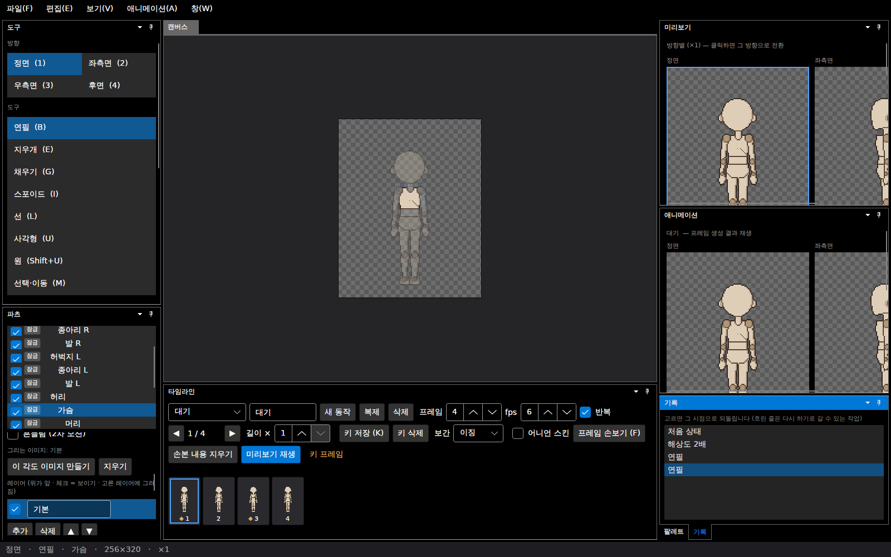
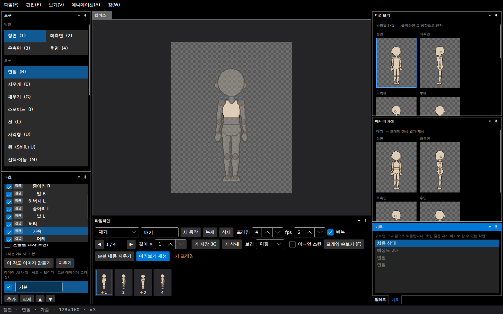

# 패치노트 — 해상도 2배

날짜: 2026-09-26 · 브랜치: `claude/work-environment-setup-a3u93e` · 계획: [plan-resolution-scale.md](../plan-resolution-scale.md)

## 1. 편집 → 해상도 2배

캔버스와 모든 그림을 가로·세로 2배로 키운다. 보기 배율(확대/축소)과 달리 **그림 자체**가 커져서, 작게 그린 캐릭터를 더 세밀하게 다시 그릴 수 있다. 되돌리기 한 번으로 원래대로 돌아간다.

| 방식 | 결과 |
| --- | --- |
| 그대로 키우기 | 픽셀 하나 → 2×2. 모양이 정확히 같다 (합성 결과가 원래 프레임을 2배로 키운 것과 같음, 테스트로 확인) |
| 부드럽게 키우기 | Scale2x. 대각선 계단을 메워 윤곽이 매끈해진다. 새 색은 생기지 않는다 |

원래(96×128) · 그대로 · 부드럽게 — 같은 크기로 보이게 맞춘 좌측면 머리:

## 2. 함께 커지는 것

- 캔버스, 모든 방향(따로 그린 우측면·반측면 포함)의 모든 레이어와 각도 이미지
- 그림 위치·관절·각도 이미지 관절·장착점
- 모든 동작 키와 지금 포즈의 몸 이동 (회전·그리는 순서는 그대로)
- 손본 픽셀 (하나 → 2×2)
- 자동 음영 폭 (×2, 최대 3), 변형형 흔들림(가슴 볼륨)의 최대 이동 (×2, 최대 6)
- 참고 이미지의 위치와 배율 (그림과 계속 겹침)

그대로: 팔레트, 외곽선 두께(1px), 회전 범위, 흔들림 각도.

128×160 → 256×320, 키운 뒤 가슴에 선 긋기 (기록 창: 해상도 2배 → 연필):

기록 창에서 **처음 상태**를 누르면 128×160으로 돌아가고 선도 사라진다. 여기서 다시 그려도 원래 그림에 그려진다:

## 3. 되돌리기 방식

그림 크기가 바뀌므로 레이어를 새 그림으로 바꿔 끼우고, 되돌리면 원래 레이어 객체를 다시 넣는다. 그래서 2배 전후의 그리기 기록이 모두 제 그림을 가리키고, 기록을 어느 시점으로 옮겨도 맞게 되돌려진다.

## 4. 알아둘 것

- 외곽선은 1px 그대로라서, 그림에 직접 그린 선(마네킹 윤곽 등)은 2px로 굵어진다. 세밀하게 다시 그릴 때 정리한다.
- 미리보기 창은 ×1 크기라 커진 캔버스는 창보다 클 수 있다 (스크롤).
- 캔버스가 1024px을 넘게 되면 거부한다 (512×512까지 2배 가능).
- 캔버스 화면 배율은 캔버스 크기를 바꿀 때처럼 창에 맞게 다시 정해진다.

## 5. 코드

| 파일 | 내용 |
| --- | --- |
| `Core/Rigging/ResolutionScale.cs` | `ResolutionScale.Apply`, `Upscale`(그대로·Scale2x), `ResolutionScaleChange`(되돌리기) |
| `Core/Rigging/CanvasResize.cs` | `CanvasShift.Scale` — 캔버스 위 물건(참고 이미지)이 따라 커지도록 |
| `Core/Rigging/PartLayers.cs` | 레이어 크기가 바뀌면 합친 그림을 새 크기로 |
| `App/…/MainWindowViewModel.cs`, `MainWindow.axaml` | 편집 메뉴, 방식 고르기 창 |
| `App/Services/ReferenceLayer.cs` | 참고 이미지 위치·배율 |

## 6. 테스트

5개 추가 (전체 220개 통과): 그대로 키운 합성 = 원래 합성의 2배 (5방향) · 부드럽게 = Scale2x · 키·포즈·손본 픽셀·각도 이미지·장착점·음영 폭·흔들림 이동과 되돌리기 · 되돌리면 같은 레이어 객체, 그 전의 그리기도 되돌려짐, 캔버스 이벤트 배율 · 크기 제한 거부, 저장·불러오기.
